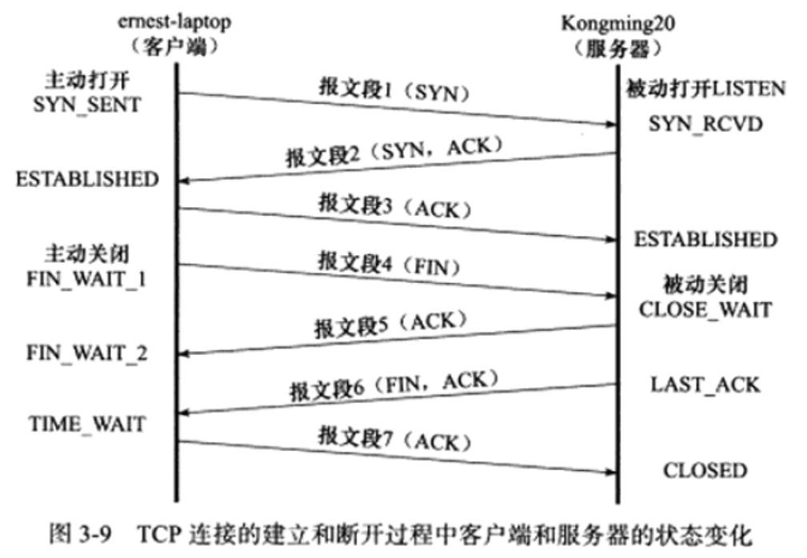

## Leetcode 编程

>**剑指offer 04.二维数组中的查找 = Leetcode 240.搜索二维矩阵 II**：在一个 n * m 的二维数组中，每一行都按照从左到右递增的顺序排序，每一列都按照从上到下递增的顺序排序。请完成一个高效的函数，输入这样的一个二维数组和一个整数，判断数组中是否含有该整数。  
>示例:  
>现有矩阵 matrix 如下：  
>[  
> [1,   4,  7, 11, 15],  
> [2,   5,  8, 12, 19],  
> [3,   6,  9, 16, 22],  
> [10, 13, 14, 17, 24],  
> [18, 21, 23, 26, 30]  
>]  
>给定 target = 5，返回 true。  
>给定 target = 20，返回 false。  
>限制：0 <= n <= 1000、0 <= m <= 1000  

给出的矩阵比较特殊，[Leetcode中的精选](https://leetcode-cn.com/problems/er-wei-shu-zu-zhong-de-cha-zhao-lcof/solution/mian-shi-ti-04-er-wei-shu-zu-zhong-de-cha-zhao-zuo/)给出的观点比较好，这个矩阵其实就像是一个Binary Search Tree。  
一共有两种解法：
- 暴力破解法：也就是逐行或逐列的进行查找
  - 时间O(nm)、空间O(1)
- 二分查找法：二分查找的根结点有两种选取方法——选右上角或选左下角。另外两个角不能作为根结点，因为从这两个结点出发无法让算法快速而又有效的收敛。
  - 时间O(n+m)、空间O(1)


```
class Solution {
public:
    bool findNumberIn2DArray(vector<vector<int>>& matrix, int target) {
        //方法一：从右上角开始搜寻，注意代码鲁棒性，判断矩阵是否为空
        /*if(!matrix.size())
            return false;
        int j = 0, i = matrix[0].size() - 1;
        while(i >= 0 && j < matrix.size())
            if(matrix[j][i] > target)
                i--;
            else if(matrix[j][i] < target)
                j++;
            else
                return true;
        
        return false;*/

        //方法二：从左下角开始搜寻，考虑这里为什么没有方法一中前两行代码
        int i = matrix.size() - 1, j = 0;
        while(i >= 0 && j < matrix[0].size())
            if(matrix[i][j] > target) i--;
            else if(matrix[i][j] < target) j++;
            else return true;
        return false;

    }
};
```

>**剑指offer 05.替换空格**：请实现一个函数，把字符串 s 中的每个空格替换成"%20"。  
>示例 1：  
>输入：s = "We are happy."  
>输出："We%20are%20happy."  
>限制：0 <= s 的长度 <= 10000

[Leetcode解析](https://leetcode-cn.com/problems/ti-huan-kong-ge-lcof/solution/mian-shi-ti-05-ti-huan-kong-ge-ji-jian-qing-xi-tu-/)，不是很喜欢剑指offer上面的代码风格，但是上面的分析还可以。  
这道题主要卡在两个关键点上：
- 不清楚 C++ 中 string 是「可变」的类型，[Stack Overflow参考资料](https://stackoverflow.com/questions/28442719/are-c-strings-mutable-unlike-java-strings)。
- 对C++中的string不熟悉，s.resize()可以修改s的长度  

这里一共有两种方法。这里仅介绍较好的一种方法的思路：先统计字符串s中空格的个数count，然后根据需求修改s的长度：len + 2 * count，(不是len + 3 * count，因为原字符串中空格本身就占有一个位置)，从尾开始遍历复制，这样能够保证**原地修改**，而不用另外开辟一块内存空间。（对，另外一种方法就是从头开始遍历复制，但是这种方法如果要保证原地修改，那么会对字符串中的元素进行不必要的挪动，时间复杂度较高；当然可以违背原地修改，计算替换后字符串的大小然后开辟一块内存空间进行复制替换，这样空间复杂度较高）。  

复杂度分析：
  - 时间O(N)：遍历统计、遍历修改皆使用 O(N) 时间。
  - 空间O(1)：由于是原地扩展 s 长度，因此使用 O(1) 额外空间。

```
class Solution {
public:
    string replaceSpace(string s) {
        int len = s.size();
        int count = 0;
        for(char ch : s)
            if(ch == ' ')
                count++;
        s.resize(len + 2 * count);
        for(int i = len - 1, j = len + 2 * count - 1; i < j;)
        {
            if(s[i] == ' ')
            {
                s[j--] = '0';
                s[j--] = '2';
                s[j--] = '%';
                i--;
            }
            else
            {
                s[j--] = s[i--];
            }
        }
        return s;
    }
};
```

---

## 基础知识学习

### 1、C++基础：《Effective C++》

> 条款 18：让接口容易被正确使用，不易被误用  
> - 好的接口很容易被正确使用，不容易被误用。你应该在你的所有接口中努力达成这些性质。
> - “促进正确使用”的办法包括接口的一致性，以及与内置类型的行为兼容。
> - “阻止误用”的办法包括建立新类型、限制类型上的操作，束缚对象值，以及消除客户的资源管理责任。
> - tr1::shared_ptr支持定制型删除器（custom deleter）。这可防范DLL问题，可被用来自动解除互斥锁（mutexex；见条款14）等等。

> 条款19：设计class犹如设计type
> - Class的设计就是type的设计。在定义一个新type之前，请确定你已经考虑过本条款覆盖的所有讨论主题。

> 条款20：宁以pass-by-reference-to-const替换pass-by-value
> - 尽量以pass-by-reference-to-const替换pass-by-value。前者通常比较高效，并可避免切割问题（slicing problem）。
> - 以上规则并不适用于内置类型，以及STL的迭代器和函数对象。对它们而言，pass-by-value往往比较适当。

> 条款21：必须返回对象时，别妄想返回其reference
> - 绝不要返回pointer或reference指向一个local stack对象，或返回reference指向一个heap-allocated对象，或返回pointer或reference指向一个local static对象而有可能同时需要多个这样的对象。条款4已经为“在单线程环境中合理返回reference指向一个local static对象”提供了一份设计实例。

> 条款22：将成员变量声明为private
> - 切记将成员变量声明为private。这可赋予客户访问数据的一致性、可细微划分访问控制、允诺约束条件获得保证，并提供class作者以充分的实现弹性。
> - protected并不比public更具封装性。


### 2、C++基础：typedef

> 1.参考《Essential C++》P122：typedef 可以为某个型别设定另一个不同的名称，其通用形式为：typedef existing_type new_name;  
> 2.参考 [C 语言 typedef：给类型起一个别名](http://c.biancheng.net/cpp/html/100.html)  
> 重点主要是弄明白  
> - 1.写法：哪一部分是别名，哪一部分是别名所代表的数据；
> - 与 #define 的区别。

写法简单点的如：

```
typedef int INTEGER;
INTEGER a,b;//等效于int a,b;
```

写法复杂点的如：

```
typedef char ARRAY20[20];//表示ARRAY20是类型为char[20]的别名
ARRAY20 a1,a2,a3;//等效于char a1[20],a2[20],a3[20]

typedef struct stu{
    char name[20];
    int age;
    char sex;
} STU;
STU body1,body2;//等效于struct stu body1, body2;
```
下面是参考2链接中提供的示例
```
#include <stdio.h>

typedef char (*PTR_TO_ARR)[30];
typedef int (*PTR_TO_FUNC)(int, int);

int max(int a, int b){
    return a>b ? a : b;
}

char str[3][30] = {
    "http://c.biancheng.net",
    "C语言中文网",
    "C-Language"
};

int main(){
    PTR_TO_ARR parr = str;
    PTR_TO_FUNC pfunc = max;
    int i;
   
    printf("max: %d\n", (*pfunc)(10, 20));
    for(i=0; i<3; i++){
        printf("str[%d]: %s\n", i, *(parr+i));
    }

    return 0;
}

运行结果：
max: 20
str[0]: http://c.biancheng.net
str[1]: C语言中文网
str[2]: C-Language
```
>typedef是赋予现有类型一个新的名字，而不是创建新的类型。

typedef与#define的区别体现为如下两点：  
- 可以使用其它类型说明符对宏类型名进行扩展，但对typedef所定义的类型名却不能这么做。例如：
```
#define INTERGE int
unsigned INTERGE n;  //使用unsigned类型说明符对宏进行扩展，没问题

typedef int INTERGE;
unsigned INTERGE n;  //错误，不能在 INTERGE 前面添加unsigned
```
- 在连续定义几个变量的时候typedef能够保证定义的所有变量均为同一类型，而#define则无法保证。例如：
```
#define PTR_INT int *
PTR_INT p1, p2;//等效为int *p1,p2; p1是int*型，而p2是int型

typedef int * PTR_INT
PTR_INT p1, p2;//等效为int *p1,p2; p1和p2都是int*型
```

这里又让我回忆起了数组指针和指针数组，一直都是模模糊糊的感觉。链接中也出现了<数组和指针绝不等价，数组是另外一种类型>的说法，针对这两个这里检索了重新整理下：
### 3、C++基础：sizeof(array)和sizeof(pointer)
>参考[数组和指针绝不等价，数组是另外一种类型](https://blog.csdn.net/qq_38325803/article/details/102751865)。  
这里主要是通过对数组和指针进行sizeof运算来说明数组与指针不等价。
```
#include <stdio.h>
 
int main(){
    int a[6] = {0, 1, 2, 3, 4, 5};
    int *p = a;
    int len_a = sizeof(a) / sizeof(int);
    int len_p = sizeof(p) / sizeof(int);
    printf("len_a = %d, len_p = %d\n", len_a, len_p);
    return 0;
}
运行结果：
len_a = 6, len_p = 1
```
先解析sizeof这个运算符，注意sizeof()并不是一个函数，而是一个操作符。编译器在编译的过程中会创建一张专门的表格，用来保存名字以及名字对应的数据类型、地址、作用域等信息。使用sizeof()这个操作符我们可以从这张表格中查询到符号的长度。  
那么上面代码中 **符号a** 和 **符号p** 在这个表格中的数据类型会是什么呢？  
对于**符号a**，它的类型是int[6]，表示这是一个拥有 6 个 int 数据的集合，1 个 int 的长度为 4，6 个 int 的长度为 4×6 = 24，sizeof 很容易求得；  
对于**符号p**，它的类型是int*，在 32 位环境下长度为 4，在 64 位环境下长度为 8；  
**数组类型**：这里就有一个我们经常忽视的细节：数组也是有类型的，它的类型不是数组名指针和数组长度的叠加。它是基本类型派生而来的稍微复杂点的类型，同样我们也不能认为这种派生是简单的叠加。  
**数组名**：与普通变量名相比，数组名既有一般性也有特殊性：一般性表现在数组名也用来代指特定的内存块，也有类型和长度；特殊性表现在数组名有时候会转化为指针。

### 4、C++基础：数组指针和指针数组
>参考[数组指针和指针数组的区别，C语言数组指针和指针数组区别详解](http://c.biancheng.net/view/335.html)。  
>重点是在如何记忆并快速的判断，方法当然因人而异。每次面对那些听得很熟的东西，要半天才能反应过来是一件令人烦躁的事情，这种事情能少一件是一件。

关于数组指针和指针数组的区别，链接里面的图例解释得非常清楚，这里就不贴图示了。
```
int *p1[5];//类型为数组，数组里面的元素是指针。
int (*p2)[5];//类型为指针，指向一个int[5]类型的元素。

int *p1[5];  //指针数组：(int*)   p1[5]：(int*)指针   p1[5]数组
int (*p2)[5];//数组指针：(int[5]) (*p2)：(int[5])数组 (*p2)指针
```

这里还有一个比较重要的点：
```
int arr[5]={1，2，3，4，5};
int (*p1)[5] = &arr;
/*下面是错误的*/
int (*p2)[5] = arr;
```
&arr是值整个数组的首地址，而arr是指数组首元素的首地址，所表示的意义不同，但是两者的值是一样的。  
但是在上面的代码片段中最后一个赋值语句在 Microsoft Visual Studio 2010 （以VS举例，其它编译器也会报错）中编译的时候，将会提示如下的错误信息：“a value of type"int*"cannot be used to initialize an entity of type"int(*)[5]"”。  
具体而言，在 C 语言中，赋值符号“ = ”两边的数据类型必须相同，不能只是值相同。如果数据类型不同，则需要显式或者隐式类型转换。在这里，p1 和 p2 都是数组指针，指向的是整个数组。p1 这个定义的“=”号两边的数据类型完全一致，而 p2 这个定义的“=”号两边的数据类型就不一致了（左边的类型是指向整个数组的指针，而右边的数据类型是指向单个字符的指针），因此会提示如上的错误信息。

### C++基础：C++对象模型

> [C++对象模型](https://www.cnblogs.com/skynet/p/3343726.html)

---

### Linux 高性能服务器编程：tcp 协议详解

> tcp 服务的特点
- 面向连接、字节流和可靠传输  
- tcp 的连接是一对一的，基于广播和多播的应用程序不能使用 tcp 服务，而无连接协议 udp 则非常适合于广播和多播

> tcp 头部结构  
> 用于指定通信的源端端号，目的端号，管理 tcp 的连接
- tcp 固定头部结构  
  **16 位源端口号/16 位目的端口号**：客户端通常使用系统自动选择的临时端口号，而服务器则使用知名服务端口号  
  **32 位序号**：一个传输方向上的字节流的每个字节的编号  
  **32 位确认号**：其值是收到的 tcp 报文段的 32 位序号值加 1  
  **4 位头部长度**：单位为字节，表示 tcp 头部的大小  
  **6 位标志位**：区分紧急指针、确认报文段、复位报文段、同步报文段、结束报文段  
  **16 为窗口大小**：告诉对方本端的 tcp 接收缓冲区还能容纳多少字节  
  **16 位校验和**：  
  **16 位紧急指针**：  
- tcp 头部选项  
  kind = 0 是选项表结束选项  
  kind = 1 是空操作，无含义  
  kind = 2 是最大报文段长度选项，通信双方使用该选项来协商最大报文段长度  
  kind = 3 是窗口扩大因子  
  kind = 4 是选择性确认选项  
  kind = 5 是选择性确认实际工作的选项  
  kind = 8 是时间戳选项  
- 使用 tcpdump 观测 tcp 头部信息  
  无

> tcp 连接的建立和关闭
- 使用 tcpdump 观测 tcp 连接的建立和关闭
- 半关闭状态  
  如果请求端关闭或者异常终止了连接，而对方没有接收到结束报文段，这时，对方仍然维持着原来的连接，而请求端将丢失这个连接的相关信息。这时这个连接就是半打开连接  
  使用半关闭的应用程序很少见
- 连接超时  
  每次重连的超时时间都增加一倍，在 5 次重连均失败的情况下，tcp 模块放弃连接并通知应用程序

> tcp 状态转移  
> tcp 端口的状态可以使用 netstat 命令查看
- tcp 状态转移总图  
  
- time_wait 状态  
  time_wait状态在经过2MSL时间后才进入close状态
  可靠地终止tcp连接：防止报文段7丢失后无法接收到服务端重新发送的报文段6  
  保证让迟来的tcp报文段有足够的时间被识别丢弃：若立即将该接口让给其它应用程序A使用，则可能让A接收到一个迟到的发送给上一个应用程序的报文段（例如网络比较拥堵，这个报文段走了很长的路程）

> 复位报文段  
> 通知对方关闭连接或重新建立连接
- 访问不存在的端口  
  访问不存在的端口或者访问的端口处于被time_wait状态的连接所占用时，目标端会回复一个复位报文段，收到该复位报文段后，请求端就应该关闭连接或者重新进行连接，而不能回应这个复位报文段。  
- 异常终止连接  
  发送复位报文段后，发送端所有排队等待发送的数据都将被丢弃。
- 处理半打开连接  
  往处于半打开状态的连接写入数据，对方会回应一个复位报文段。

> tcp 交换数据流

> tcp 成块数据流

> 带外数据

> tcp 超时重传

> 拥塞控制

- 拥塞控制概述
- 慢启动和拥塞避免
- 快速重传和快速恢复
