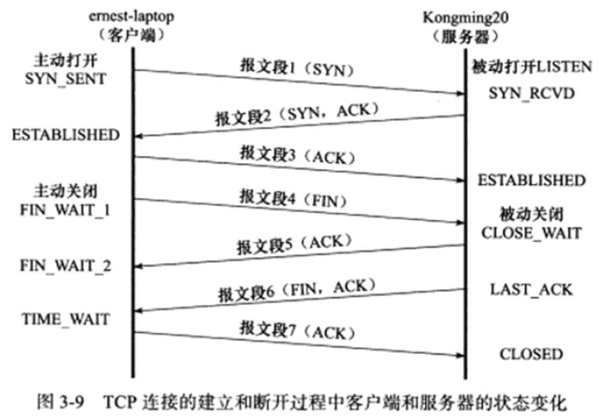

## Leetcode 编程：
> **剑指offer 10-I.斐波那契数列**：写一个函数，输入 n ，求斐波那契（Fibonacci）数列的第 n 项。斐波那契数列的定义如下：  
> 　　　　　F(0) = 0,   F(1) = 1  
>　　　　　F(N) = F(N - 1) + F(N - 2), 其中 N > 1.  
>
>斐波那契数列由 0 和 1 开始，之后的斐波那契数就是由之前的两数相加而得出。
>答案需要取模 1e9+7（1000000007），如计算初始结果为：1000000008，请返回 1。  
>示例 1：  
>　　输入：n = 2  
>　　输出：1  
>示例 2：  
>　　输入：n = 5  
>　　输出：5  
>提示：0 <= n <= 100  

[评论精选](https://leetcode-cn.com/problems/fei-bo-na-qi-shu-lie-lcof/solution/mian-shi-ti-10-i-fei-bo-na-qi-shu-lie-dong-tai-gui/)描述得比较全面，直接复制如下。
- 递归法：
  - 原理： 把 f(n) 问题的计算拆分成 f(n−1) 和 f(n-2) 两个子问题的计算，并递归，以 f(0) 和 f(1) 为终止条件。
  - 缺点： 大量重复的递归计算，例如 f(n) 和 f(n−1) 两者向下递归需要 各自计算 f(n - 2) 的值。这里因为递归法中重复计算太多了，所以改进的方向也就很明确：避免重复计算。  
```
f(5) = 　　　　　f(4) 　　　 　　 + 　　　　　　　f(3)
　　　　   f(3) 　+　 f(2)　 　　 +　    f(2)  　 +　 f(1)
　　　f(2) + f(1) + f(1) + f(0)  +  f(1) + f(0)  +    1

```

- 记忆化递归法（《算法笔记》P426）：
  - 原理：在递归法的基础上，新建一个长度为 n 的数组，用于在递归时存储 f(0) 至 f(n) 的数字值，重复遇到某数字则直接从数组取用，避免了重复的递归计算。
  - 缺点：记忆化存储需要使用 O(N) 的额外空间。
- 动态规划法：
  - 原理：直接利用公式（状态转移方程）循环迭代计算。
  - 缺点：每次查询都要从头开始计算。
  - 时间复杂度 O(N) ： 计算 f(n) 需循环 n 次，每轮循环内计算操作使用 O(1)。
  - 空间复杂度 O(1) ： 几个标志变量使用常数大小的额外空间。
```
class Solution {
public:
    int fib(int n) {
        if(n == 0 || n == 1)//合并
            return n;

        unsigned int sum, b = 0, a = 1;
        for(int i = 2; i<=n; i++)
        {
            sum = (a + b) % 1000000007;
            b = a;
            a = sum;
        }
        return sum;

        /*评论区看的，附上
        int b = 0, a = 1;
        for (int i = 1; i < n; i++) {
            a = a + b;
            b = a - b;
            a %= 1000000007;
            }
        return a;*/
    }
};
```
> **剑指offer 10-II.青蛙跳台阶问题 = Leetcode 70.爬楼梯**：一只青蛙一次可以跳上1级台阶，也可以跳上2级台阶。求该青蛙跳上一个 n 级的台阶总共有多少种跳法。答案需要取模 1e9+7（1000000007），如计算初始结果为：1000000008，请返回 1。  
>示例 1：  
>　　输入：n = 2  
>　　输出：2  
>示例 2：  
>　　输入：n = 7  
>　　输出：21  
>示例 3：  
>　　输入：n = 0  
>　　输出：1  
>提示：0 <= n <= 100

这道题剑指offer上面已经讲解得非常清楚了，这里也可参考[官方精选分析](https://leetcode-cn.com/problems/qing-wa-tiao-tai-jie-wen-ti-lcof/solution/mian-shi-ti-10-ii-qing-wa-tiao-tai-jie-wen-ti-dong/)。  
此类求 多少种可能性 的题目一般都有 递推性质 ，即 f(n) 和 f(n−1)…f(1) 之间是有联系的。
- 设跳上 n 级台阶有 f(n) 种跳法。在所有跳法中，青蛙的最后一步只有两种情况： 跳上 1 级或 2 级台阶。
  - 当为 1 级台阶： 剩 n−1 个台阶，此情况共有 f(n−1) 种跳法；
  - 当为 2 级台阶： 剩 n-2 个台阶，此情况共有 f(n-2) 种跳法。

- f(n) 为以上两种情况之和，即 f(n)=f(n−1)+f(n−2) ，以上递推性质为斐波那契数列。本题可转化为 求斐波那契数列第 n 项的值 ，与 剑指offer 10-I.斐波那契数列 等价，唯一的不同在于起始数字不同。
  - 青蛙跳台阶问题： f(0)=1 , f(1)=1 , f(2)=2 ；
  - 斐波那契数列问题： f(0)=0 , f(1)=1 , f(2)=1；
- 复杂度分析：
  - 时间复杂度 O(N) ： 计算 f(n) 需循环 n 次，每轮循环内计算操作使用 O(1)。
  - 空间复杂度 O(1) ： 几个标志变量使用常数大小的额外空间。

[为什么取模，参考评论区ajslpzcd用户的回答，将其回答整理下然后贴在下面。](https://leetcode-cn.com/problems/qing-wa-tiao-tai-jie-wen-ti-lcof/comments/)
```
PS : 为什么要模1000000007（跟我念，一，八个零，七）。参考https://www.liuchuo.net/archives/645，大数相乘，大数的排列组合等为什么要取模。
1. 1000000007是一个质数（素数），对质数取余能最大程度避免结果冲突/重复。
2. int32位的最大值为2147483647，所以对于int32位来说1000000007足够大。
3. int64位的最大值为2^63-1，用最大值模1000000007的结果求平方，不会在int64中溢出。
4. 所以在大数相乘问题中，因为(a∗b)%c=((a%c)∗(b%c))%c，所以相乘时两边都对1000000007取模，再保存在int64里面不会溢出。

这道题为什么要取模，取模前后的值不就变了吗？
确实：取模前 f(43) = 701408733, f(44) = 1134903170, f(45) = 1836311903, 但是 f(46) > 2147483647结果就溢出了。
取模后 f(43) = 701408733, f(44) = 134903163 , f(45) = 836311896, f(46) = 971215059没有溢出。
这样取模之后能够计算更多的情况，如 f(46)

总结一下，这道题要模1000000007的原因是为了能够测试更多用例，此外模1000000007是通用做法，原因见第一点。
```
>
---
## 基础知识学习

### C++基础：《Effective C++》  
***《Effective C++》已经看完了25个条款，今天开始对这25个条款进行总结，然后再开始学习最后25个条款。***

> 条款1：视C++为一个语言联邦
> - C++ 高效编程守则视状况而变化，取决于你使用 C++ 的哪一部分

C++最初的名称是 C with classes，那时的它只是比C多了一些面向对象的特性。经过发展，现在 C++ 已经是一个多重范型编程语言，同时支持过程式、函数式、面向对象、泛型编程、元编程。  
在编程的过程中，我们往往会遵循一些守则让程序变得更加高效规范，这时问题就出现了，C++的多重性使得它并没有一个统一的守则来让我们在使用不同范型编程的时候，程序依然保持高效规范。这时我们就最好不要再将 C++ 视为一个带有一组守则的一体语言了，而是由多个子语言（不同的子语言有其独特的范型编程模式）组成的联邦政府，每个子语言都有自己的守则。
C++ 的子语言总共只有4个：
- C：C++是以C为基础的，你完全可以只适用C++中C的那部分语法。但是此时你会发现你的程序就只反映了C的特征：没有模板、没有异常、没有重载。
- 面向对象（Object-Oriented C++）：面向对象程序设计的初衷，即构造函数和析构函数，封装，继承，多态性，虚函数等等。
- Template C++：这是C++的泛型编程部分，多数程序员很少涉及，但模板在很多情况下仍然很方便。另外模板元编程（template metaprogramming）也是一个新兴的程序设计范式。
- STL：这是一个特殊的模板库，它的容器、迭代器和算法优雅地结合在一起，只是在使用时你需要遵循它的程序设计守则。当然你也可以基于其它想法来构建模板库。  

  
设计高效规范的 C++ 程序的守则并非一成不变，而是取决于你使用C++语言的哪一部分。例如，在基于C语言的程序设计中，对基本类型，传参时传值比传引用更有效率。然而当你接触Object-Oriented C++时会发现，对用户自定义类型，传参时传常量指针是更好的选择。但是你如果又碰到了STL，其中的迭代器和函数对象都是基于C语言的指针而设计的，这时又回到了原来的守则：传值比传引用更好。

> 条款2：尽量以 const，enum，inline 替换 #define
> - 对于单纯常量，最好以 const 对象或 enums 替换 #define。
> - 对于形似函数的宏（macros），最好改用 inline 函数替换 #define。

>在编译器对代码处理前，预处理器会先对代码处理，预处理器根据以字符#开头的命令修改原始的C程序，结果得到另一个C程序，通常以.i作为文件扩展名。主要是进行文本替换、宏展开、删除注释这类简单工作。例如"#include < iostream >"、"#define"、"#ifdef/#ifndef"都会在这个阶段进行处理，这是背景。  

这里我们主要考虑的是 ```PI 3.14``` 是以**宏的形式**出现在代码中还是以**常量的形式**出现在代码中：
1) 如果以宏的形式：```#define PI 3.14```。在预处理阶段，预处理器将代码中符号（PI）出现的地方全部替换为对应的值（3.14），如果预处理器将PI移除掉了，自然进入编译阶段时，编译器看不到这个符号，也就不会在记号表中创建相关的内容。
2) 如果以常量的形式：```const int PI = 3.14```。在预处理阶段不会对这个常量进行处理，进入编译阶段，编译器会在记号表中创建相关的内容。  
  
我们从以下几个角度来说明第二种定义方式更加合适：
- 报错信息输出。在编译阶段，如果PI出现的地方存在错误，编译器将给出报错信息。如果定义为第一种形式，并且预处理器会将PI移除，编译器报错信息中只会出现3.14，而不会出现PI（如果不移除自然也会有，但谁能百分百的确定呢）。如果定义为第二种形式，编译器报错信息就会顺利出现PI。
- 使用记号式调试器调试程序。调试过程将会使用编译器创建的记号表，第一种定义方式，同样，如果预处理器将PI移除，调试器将无法跟踪PI，因为记号表中压根就没有。第二种定义方式显然如我们的意。
- 作用域不同（封装性不同）。如果我们设计的class需要一个专属常量，同时让它的作用域限制在class中。如果以第二种方式，我们只需要将它设计为成员，并且加以const修饰，就能完成封装和作用域限定。我们没有办法用第一种方式来做到这两点，#define并不重视作用域，一旦宏被定义，在其后的编译过程中都有效，所以这意味着#define不仅不能够用来定义class专属常量，也不能够提供任何封装性。
  
上面我们把焦点放在了#define和const常量的对比上面，在“作用域不同（封装性不同）”这里，关于用const设计class专属常量需要展开说明，当然这里的展开说明不会带上#define，但是我们会转向enum。如果我们要让这个const修饰的class专属常量只有一个实体，也就是说不论定义多少对象，这个常量就只有一个实体，我们需要再在const前面加一个static关键字。《Effective C++》针对这个**static const**修饰的专属常量的初值设定时机和各时机情况下编译器可能作出的反映作了详细说明：声明式中设定初值、定义式中设定初值...，感觉有点记忆负担，就直接规范为在类内（in-class）的声明式上不设定初值（in-class初值设定），只在定义处设定初值。
```
//时机1：
class A{
private:
    static const int NUM = 5; // 常量声明式，初值设定（in-class方式）
}
const int A::NUM //常量定义式，在以下情况需要：某个编译器内在规则设定为需要；它是专属常量、是static类型、是整数类型且要对它取地址操作。当然这时这里就不能设定初值了。
//时机2：
class A{
private:
    static const int NUM; // 常量声明式
}
const int A::NUM = 5 //常量定义式，初值设定
```  
接下来我们要转向enum了，你可以认为前面在啰嗦其它事情。我们的class现在有一个数组成员arr（见下面代码片段），这个数组成员的大小依赖于我们刚才的那个static const修饰的专属常量。此时此刻我们的编译器可能就会出问题了，如果编译器坚持在编译期间知道数组的大小，并且“不允许static整型常量”完成“in-class初值设定”，那么编译器就不允许这段代码通过编译。
```
class A{
private:
    static const int NUM = 5; // in-class初值设定
    int arr[NUM]
}
```
这时就引出了enum，我们该用“enum hack”补偿做法。下面这个代码段能够编译通过。
```
class A{
private:
    enum { NUM = 5 };
    int arr[NUM]
}
```
这里enum除了补偿这一需求，它还有自己的特点，它不会让别人获得一个pointer或reference指向你的这个整数常量，而const显然可以。  
重新将焦点拉回#define，它的第二种使用方式是以它来实现一个像函数的宏，这样做虽然不会导致函数调用的额外开销，但是书写实在太麻烦，而且存在一些细节性的问题（宏实参为前置++）。一劳永逸的解决办法就是把这个函数改为inline实现，这样做不会导致函数调用的额外开销，也让书写更加简单，更重要的是可以对它进行封装和作用域限定。
```
#define CALL_WITH_MAX(a,b) f((a) > (b)? (a) : (b))//实现宏

inline void callWithMax(const int a,const int b)//inline实现
{
    f(a > b? a : b);
}
```

> 条款3：尽可能使用 const
> - 将某些东西声明为 const 可帮助编译器侦测出错误用法。const 可被施加于任何作用域内的对象、函数参数、函数返回类型、成员函数本体。
> - 编译器强制实施 bitwise constness，但你编写程序时应该使用“概念上的常量性”（conceptual constness）。
> - 当 const 和 non-const 成员函数有着实质等价的实现时，令 non-const 版本调用 const 版本可避免重复代码。

> 条款4：确定对象被使用前已先被初始化
> - 对内置型对象进行手工初始化，因为 C++ 不保证初始化它们。
> - 构造函数最好使用成员初始列（member initialization list），而不要在构造函数本体内使用赋值操作（assignment）。初值列列出的成员变量，其排列次序应该和它们在 class 中的声明次序相同。
> - 为免除“跨编译单元之初始化次序”问题，请以 local static 对象替换 non-local static 对象。

> 条款5：了解 C++ 默默编写并调用那些函数
> - 编译器可以暗自为 class 创建 default 构造函数、copy 构造函数、copy assignment 操作符，以及析构函数


---

### Linux 高性能服务器编程：tcp 协议详解

> tcp 服务的特点
- 面向连接、字节流和可靠传输  
- tcp 的连接是一对一的，基于广播和多播的应用程序不能使用 tcp 服务，而无连接协议 udp 则非常适合于广播和多播

> tcp 头部结构  
> 用于指定通信的源端端号，目的端号，管理 tcp 的连接

- tcp 固定头部结构  
  **16 位源端口号/16 位目的端口号**：客户端通常使用系统自动选择的临时端口号，而服务器则使用知名服务端口号   
  **32 位序号**：一个传输方向上的字节流的每个字节的编号   
  **32 位确认号**：其值是收到的 tcp 报文段的 32 位序号值加 1   
  **4 位头部长度**：单位为字节，表示 tcp 头部的大小  
  **6 位标志位**：区分紧急指针、确认报文段、复位报文段、同步报文段、结束报文段   
  **16 为窗口大小**：告诉对方本端的 tcp 接收缓冲区还能容纳多少字节   
  **16 位校验和**：   
  **16 位紧急指针**：   
- tcp 头部选项   
  kind = 0 是选项表结束选项   
  kind = 1 是空操作，无含义   
  kind = 2 是最大报文段长度选项，通信双方使用该选项来协商最大报文段长度   
  kind = 3 是窗口扩大因子   
  kind = 4 是选择性确认选项   
  kind = 5 是选择性确认实际工作的选项   
  kind = 8 是时间戳选项   
- 使用 tcpdump 观测 tcp 头部信息   
  无

> tcp 连接的建立和关闭

- 使用 tcpdump 观测 tcp 连接的建立和关闭
- 半关闭状态   
  如果请求端关闭或者异常终止了连接，而对方没有接收到结束报文段，这时，对方仍然维持着原来的连接，而请求端将丢失这个连接的相关信息。这时这个连接就是半打开连接  
  使用半关闭的应用程序很少见
- 连接超时   
  每次重连的超时时间都增加一倍，在 5 次重连均失败的情况下，tcp 模块放弃连接并通知应用程序

> tcp 状态转移   
> tcp 端口的状态可以使用 netstat 命令查看

- tcp 状态转移总图  
  
- time_wait 状态  
  time_wait状态在经过2MSL时间后才进入close状态
  可靠地终止tcp连接：防止报文段7丢失后无法接收到服务端重新发送的报文段6  
  保证让迟来的tcp报文段有足够的时间被识别丢弃：若立即将该接口让给其它应用程序A使用，则可能让A接收到一个迟到的发送给上一个应用程序的报文段（例如网络比较拥堵，这个报文段走了很长的路程）

> 复位报文段  
> 通知对方关闭连接或重新建立连接

- 访问不存在的端口  
  访问不存在的端口或者访问的端口处于被time_wait状态的连接所占用时，目标端会回复一个复位报文段，收到该复位报文段后，请求端就应该关闭连接或者重新进行连接，而不能回应这个复位报文段。  
- 异常终止连接  
  发送复位报文段后，发送端所有排队等待发送的数据都将被丢弃。
- 处理半打开连接  
  往处于半打开状态的连接写入数据，对方会回应一个复位报文段。

> tcp 交互数据流  

- 使用交互数据的应用程序对实时性要求较高。  
- 延迟确认：即高速的一端发送给低速的一端的确认报文段中包含有数据，这样可以减少发送tcp报文段的数量。因为服务器对客户请求处理速度快，所以它发送确认报文段的时候总是有数据一起发送。同时由于用户的输入速度明显慢于客户端程序的处理速度，所以客户端的确认报文段总是不携带任何应用程序数据。  
- 另外由于携带交互数据的微小tcp报文段数量一般很多，这些可能会导致拥塞发生，解决该问题的一个简单有效的算法是使用Nagle算法。

> tcp 成块数据流

- 使用成块数据的应用程序对传输效率要求较高
- 需要注意的参数包括：接收窗口大小、成块数据大小

> 带外数据（紧急数据）

- 带外数据就是比较紧急的数据，它的传输可以使用独立的传输层连接，也可以复用普通数据的传输连接。
- udp没有带外数据传输，tcp也没有真正意义上的带外数据传输，但是tcp可以利用紧急指针标志和紧急指针两个字段给应用程序提供一种紧急方式。
- tcp复用普通数据的传输连接来传输紧急数据。
- tcp模块发送和接收带外数据的过程参考书上的过程，比较详细。

> tcp 超时重传

- tcp在多次超时重传均失败的情况下，底层的ip和arp开始接管，直到telnet客户端放弃连接为止。
- Linux有两个重要的内核参数与tcp超时重传相关：
  - /proc/sys/net/ipv4/tcp_retries1（指定在底层ip接管前tcp最少执行的重传次数，默认值为3）
  - /proc/sys/net/ipv4/tcp_retries2（指定连接放弃tcp最多可以执行的重传次数，默认值为15，一般对应13~30min）


> 拥塞控制

- 拥塞控制概述
  - 拥塞控制的四个部分：慢启动、拥塞避免、快速启动、快速恢复。
  - Linux使用的哪种拥塞控制算法，可以在/proc/sys/net/ipv4/ tcp_congestion_control中查看。
  - 拥塞控制的最终受控变量是发送端向网络一次连续写入（收到其中第一个数据的确认之前）的数据量，我们称为 SWND（send window，发送窗口），SWND = min(RWND, CWND)；
    - 接收方有一个接收通告窗口RWND。
    - 发送端引入的一个拥塞窗口（CWND）。
  - SMSS(sender maximum segment size，发送者最大段大小)，是指tcp报文段的最大长度。

  - 
- 慢启动和拥塞避免
- 快速重传和快速恢复

### Linux 高性能服务器编程：tcp/ip通信案例：访问Internet上的web服务器

> 实例总图

> 部署代理服务器

> 使用tcpdump抓取传输数据包