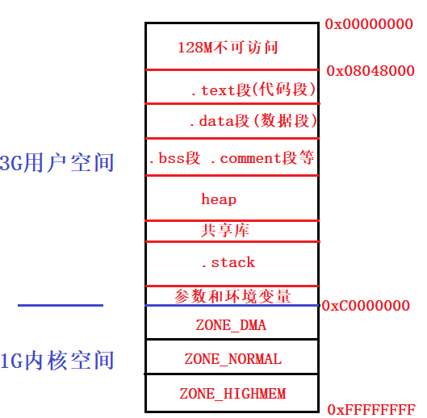
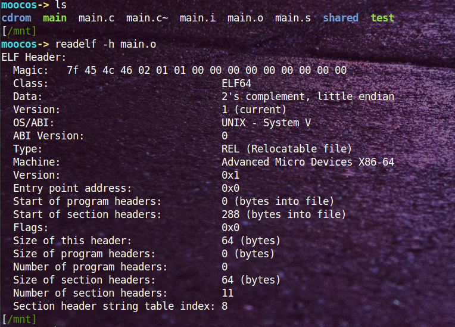
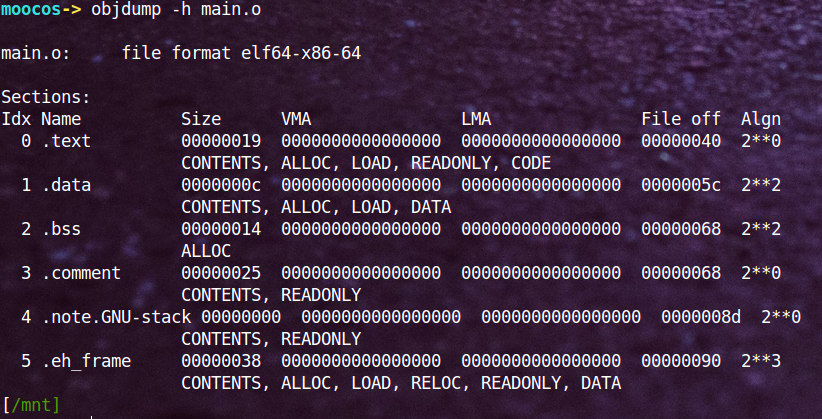
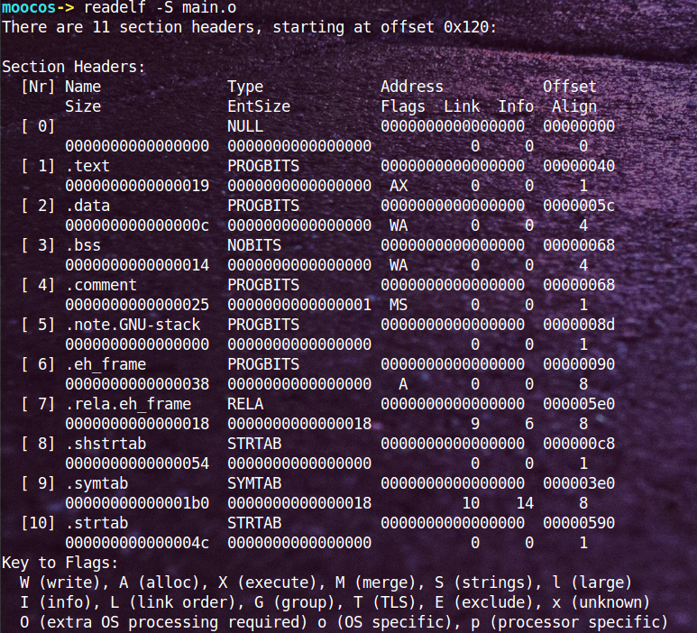
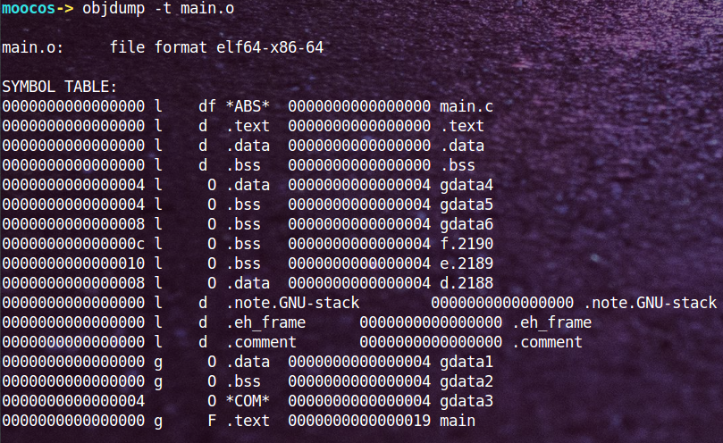

参考连接：

- [从编写源代码到程序在内存中运行的全过程解析](https://blog.csdn.net/kang___xi/article/details/79571137)

static修饰符可以将一个全局变量的使用范围（或者说作用域）进行限制，全局变量用static修饰使得其只能在本源文件中使用，局部变量用static修饰使得该变量只能在该函数作用域中使用，类成员用static修饰使得该成员只能在该类作用域中使用。这里就不禁想知道变量在内存中究竟是怎么存储的，什么时候存在什么时候不存在？

为此找到了上面这篇博客，同时也参考了一些其他博客，现在记录如下。

先来看一段代码：

```C
int gdata1 = 10;    //全局变量  初始化
int gdata2 = 0;     //全局变量  初始化为0
int gdata3;         //全局变量  未初始
 
static int gdata4 = 11;     //静态全局变量  初始化
static int gdata5 = 0;      //静态全局变量  初始化为0
static int gdata6;          //静态全局变量  未初始化
 
int main(void)
{
    int a = 12;         //局部变量  初始化
    int b = 0;          //局部变量  初始化为0
    int c;              //局部变量  未初始化
 
    static int d = 13;  //静态局部变量  初始化
    static int e = 0;   //静态局部变量  初始化为0
    static int f;       //静态局部变量  未初始化
    return 0;
}
```

### 一、基础概念

#### 1. 什么是数据？

这个代码段中除了类static成员没有列出来，其它两种情况均包含了，同时这里也做了另外一个维度的区分，也就是是否初始化。也就是现在有两个维度：是否初始化、是否添加static修饰符。

在学习OS的过程中，我们应该知道一个程序是由程序代码、程序数据和进程控制块组成。程序代码我们能够明白，进程控制块也能明白，但是针对这个数据却没有一个清晰的概念，这里主要搞清楚两件事情：

- 什么是数据
- 数据存放在哪里

> 什么是数据

数据指的是程序中定义的全局变量和静态变量，同时还有一种特殊的常量。所以上面的gdata1、gdata2、gdata3、gdata4、gdata5、gdata6、d、e和f均是数据。

> 数据存放在哪里

数据存放的区域有三个地方：**`.data`** 段、**`.bss`** 段和 **`.rodata`** 段。等等，什么是段，段是可执行文件中的一个部分，这里需要先有一些ELF数据格式的基础，比较简单不多做介绍。我们这里想知道的是数据如何放在这三个段中，以及如何区分。

- 对于初始化不为0的全局变量和静态变量存放在.data段，即gdata1、gdata4和d存放在.data段；
- 对于未初始化或者初始化值为0的数据存放在.bss段，而且不占目标文件的空间，即gdata2、gdata3、gdata5、gdata6、e和f
文章下面有一张关于符号表的图，大家可以看到确实是这样的分布。

- 字符串常量则存在.rodata段中，而且对于字符串而言它还有一个特殊的地方，就是它在内存中只有一份。如下代码：

  ```C
  #include<stdio.h>
  int main(void)
  {
    const char *pStr1 = "hello,world";
    const char *pStr2 = "hello,world";
    printf("0x%x\n", pStr1);
    printf("0x%x\n", pStr2);
    return 0;
  }
  ```

  运行结果可以发现为一样的，因为常量字符串“hello,world”在内存中只有一份。

#### 2. 什么是指令

刚才说了程序由程序代码、程序数据和进程控制块组成，那么指令是什么呢，它对应的就是程序代码。很简单，程序中除了数据，剩下的就是指令了。这里有一个很容易混淆的地方（之前疑惑的核心就是它了），如下代码：.

```C
#include<stdio.h>
int main()
{
    int a = 10;
    int b = 20;
    printf("a+b=%d\n", a + b);
    return 0;
}
```

对于上面的代码，a和b究竟是数据还是指令呢？可以看到它是一个局部变量，所以它应该是数据。嗯，事实上它并不是数据，它是一条指令或者说是一条代码。这个**指令的功能**是在函数栈帧上开辟8个字节，并在这8个字节中写入对应的值。

#### 3. 什么是符合

这里我们没有顺着继续说进程控制块，因为那是OS的课程将的。这里我们讲完了数据和指令，我们要转向另外一个概念：符号。在我们编写完程序后，在链接时会碰到这样的错误：

```C
错误  LNK1169  找到一个或多个多重定义的符号
```

即符号重定义，那什么是符号，什么东西会产生符号呢？

在程序中，所有的数据都会产生符号，而对于代码段只有函数名才会产生符号。而且符号的作用域有global和local之分，对于未用static修饰过的全局变量和函数产生的均是global符号，这样的变量和函数可以被其它文件所看见和引用；而使用过static修饰的变量和函数，它们的作用域仅局限在当前文件，不会被其它文件所看见，即其它文件无法引用local符号的变量和函数。

对于上面的“找到一个或多个多重定义的符号”的错误原因有可能是：在多个文件中定义同一个全局变量或函数，即函数名和全局变量重名了。

#### 4. 虚拟地址空间布局

对于32位操作系统，每个操作系统都有2^32字节的虚拟地址空间，即4G的虚拟地址空间。这4G的虚拟地址空间分为两个大部分：

- 每个进程独立的3G的用户空间
- 所有进程共享的1G的内核空间。

具体分布如下图：

一个小问题：为什么前128M不可访问，而不是256M？

### 二. 编译过程

#### 1. 编译

整个编译分为四个步骤：

- 首先编写源文件main.c/main.cpp；
- 编写好代码以后进行预编译成main.i文件，预编译过程中去掉注释、进行宏替换、增加行号信息等；
- 然后将main.i文件经过语法分析、代码优化和汇总符号等步骤后，编译形成main.S的汇编文件，里面存放的都是汇编代码；
- 最后一个编译步骤是进行汇编，从main.S变成二进制可重定位目标文件main.o。

以上四个步骤对应的在linux下的命令为：

```shell
gcc -E main.c -o main.i  #预编译，生成main.i文件
gcc -S main.i            #编译，生成main.S文件
gcc -c main.S            #汇编，生成main.o文件
```

这里注意，我们讨论的是编译阶段，还没有生成可执行文件。

#### 2. 二进制可重定位目标文件的结构和布局

首先给出一个二进制可重定位目标文件(linux下是*.o文件，windows中是*.obj文件)的总体布局，简单来说整个obj文件就是由ELF header+各种段组成：


二进制可重定位文件的头部，可以看到ELF header占64个字节，里面存放着文件类型、支持的平台、程序入口点地址等信息，如果你对每个字段的具体含义感兴趣，可以看《程序员自我修养》：

下面的分析主要涉及到两个命令：readelf和objdump。不做专门介绍，在使用的过程中慢慢学习。



接下来就是目标文件的各个段，从下面可以看到数据和指令在目标文件中是按段的形式组织起来的，而且.text段的起始位置从file off字段可以看到是0x40位置，即64字节处，也说明.text段是接在ELF header后面。



代码段的大小为0x19，起始偏移为0x40，所以.data段的起始偏移应该为0x19+0x40=0x59，但是为了字节对齐，所以。data段的起始地址为0x5c，也即图中file off字段所示，后面的段以此类推。

之后的.bss段会出现两个问题，一个是.bss段的大小应该为4*6=24字节（
对于未初始化或者初始化值为0的数据存放在.bss段，而且不占目标文件的空间，即gdata2、gdata3、gdata5、gdata6、e和f），但是实际上却是20字节；另一个问题就是可以看到.comment段的偏移(file off)也为0x68，这说明.bss段在目标文件中是不占大小的，即.comment和.bss段的偏移相同。对于这两个问题，简单说一下。第一个问题，涉及到C语言中的强符号和弱符号概念；第二个问题我们可以这样理解，因为.bss段中存的是初始化为0或者未初始化的数据，而实际未初始化的数据其默认值也为0，这样我们就没必要存它们的初始值，相当于有一个默认值0。

上面的图只列出了部分段，下面查看一下目标文件中所有的段，一共有11个段，简单说明一下，.comment是注释段、.symtab是符号表段。



接下来就是看段的详细内容，可以看到各个段真实的存储内容如下，下面最明显的是.data段，里面存放着gdata1、gdata4和d的值分配为0x0000000a(10)、0x0000000b(11)和0x0000000d(13)，正好与代码中的初始值匹配。注意下面显示的小端模式。


以上就是可重定位目标文件的组成，下面再介绍一下上面提到的符号表如下图，第一列是符号的地址，由于编译的时候不分配地址，所以放的是零地址或者偏移量；第二列是符号的作用域(g代表global，l代表local)，前面讨论了用static修饰过的符号均是local的（不明白的搜一下static关键字的作用），如下图中gdata4/gdata5/gdata6等；第三列表示符号位于哪个段，在这里也能看到gdata1、gdata4和d都存放在.data段中，初始化为0或未初始化的gdata2/gdata5/gdata6等都存放在.bss段：



这里特别说一下gdata3，按上面的分析来说它应该是存放在.bss段，但是我们可以看到它是*COM*，原因在于它是一个弱符号，在编译时无法确定有没有强符号会覆盖它。

