参考：

- [从编写源代码到程序在内存中运行的全过程解析](https://blog.csdn.net/kang___xi/article/details/79571137)
- 《计算机组成与设计 硬件/软件接口》第2章、附录A

`static` 修饰符可以将一个变量的使用范围（或者说作用域）进行限制，全局变量用 `static` 修饰使得其只能在本源文件中使用，局部变量用 `static` 修饰使得该变量只能在该函数作用域中使用，类成员用 `static` 修饰使得该成员只能在该类作用域中使用。这里就不禁想知道变量在内存中究竟是怎么存储的，什么时候存在什么时候不存在，究竟是什么样的量才叫变量？

为此找到了上面这篇博客，同时也参考了一些其他博客，现在记录如下。

以下内容包含：

- ELF文件类型
- 查看目标文件的 `objdump` 指令
- 编译、汇编、链接、加载过程。

学习的过程中也慢慢发现，完整的路线应该是：
C++源程序 -> 可执行目标文件 -> 进程 -> 内核调度执行。

### 一、基础概念

在学习的过程中，我们经常看见这一句话：“一个程序是由程序代码、程序数据和进程控制块组成”。程序代码我们能够明白，进程控制块也能明白，但是针对这个数据，感觉知道，但是真要说清楚好像也说不清楚。

#### 1. 什么是数据？

先来看一段代码：

```C
int gdata1 = 10;    //全局变量  初始化
int gdata2 = 0;     //全局变量  初始化为0
int gdata3;         //全局变量  未初始
 
static int gdata4 = 11;     //静态全局变量  初始化
static int gdata5 = 0;      //静态全局变量  初始化为0
static int gdata6;          //静态全局变量  未初始化
 
int main(void)
{
    int a = 12;         //局部变量  初始化
    int b = 0;          //局部变量  初始化为0
    int c;              //局部变量  未初始化
 
    static int d = 13;  //静态局部变量  初始化
    static int e = 0;   //静态局部变量  初始化为0
    static int f;       //静态局部变量  未初始化
    return 0;
}
```

这个代码段中除了类 `static` 成员没有列出来，其它两种情况均包含了，同时这里也做了另外一个维度的区分，也就是是否初始化。所以现在有两个维度：是否初始化、是否添加 `static` 修饰符。

这里主要搞清楚两件事情：

- 什么是数据
- 数据存放在哪里

> 什么是数据

**数据**指的是程序中定义的**全局变量**和**静态变量**，同时还有一种特殊的**常量**。所以上面的 `gdata1`、`gdata2`、`gdata3`、`gdata4`、`gdata5`、`gdata6`、`d`、`e` 和 `f` 均是数据。这里注意不包含**局部变量** `a`、`b`、`c`。尽管都有个 **“变量”** 后缀，但是不一定都可以称为是数据。

**所以最开始的疑惑应该改为：什么样的变量是数据，什么样的变量不是数据，以及一个变量是数据时它们存在哪里，一个变量不是数据时它们又存在哪里？**

> 数据存放在哪里

一个代码要想运行，必须先变成一个可执行目标文件，然后等待被加载到虚拟内存空间中，CPU调度后即可执行。所以细化一点：**数据存放在可执行目标文件中的哪里 以及 数据存放在虚拟内存空间中的哪个部分**。

先说**数据存放在可执行目标文件中的哪里**：数据存放的区域有三个地方：**`.data`** 段、**`.bss`** 段和 **`.rodata`** 段。等等，什么是段，这里简单介绍可执行目标文件的构成，从**加载器的角度**来说，由三部分构成：**可执行目标文件头**，**各段的描述结构体**（描述该段的属性、大小、起始位置...），**段具体内容**。

```C
可执行目标文件Header | 段1描述结构体 | 段2描述结构体 | 段3描述结构体 | ... | 段1 |段2 | 段3 |...
```

程序的实体部分在可执行目标文件中就被分解为了 `段1、段2、段3、...`

我们这里想知道的是数据如何放在这三个段中，以及如何区分。

- 对于**初始化不为0**的**全局变量**和**静态变量**存放在 **`.data`** 段，即 `gdata1`、`gdata4` 和 `d` 存放在 `.data` 段；
- 对于**未初始化或者初始化值为0**的数据存放在 **`.bss`** 段，而且不占目标文件的空间，即 `gdata2`、`gdata3`、`gdata5`、`gdata6`、`e` 和 `f`
文章下面有一张关于符号表的图，大家可以看到确实是这样的分布。
- **字符串常量**则存在 **`.rodata`** 段中，而且对于字符串而言它还有一个特殊的地方，就是它在内存中只有一份。如下代码：

  ```C++
  #include<stdio.h>
  int main(void)
  {
    const char *pStr1 = "hello,world";
    const char *pStr2 = "hello,world";
    printf("0x%x\n", pStr1);
    printf("0x%x\n", pStr2);
    return 0;
  }
  ```

  ```shell
  输出结果：
        0x89d6c004
        0x89d6c004
  运行结果是一样的，因为常量字符串“hello,world”在内存中只有一份
  ```

最后，在内核线程将用户程序加载进虚拟内存空间中时，我们的**数据存放在虚拟内存的哪里呢**，其实可执行目标文件中的每个**段描述结构体**中已经指定了位置了。也就是说内核线程在将用户程序加载进虚拟内存空间的过程中，就要根据可执行目标文件中每一**段描述结构体**指定的虚拟地址加载进虚拟地址空间。

#### 2. 什么是指令

刚才说了程序由程序代码、程序数据和进程控制块组成，那么指令是什么呢，它对应的就是程序代码。很简单，程序中除了数据，剩下的就是指令了。这里有一个很容易混淆的地方（**之前疑惑的核心就是它了**），如下代码：

```C
#include<stdio.h>
int main()
{
    int a = 10;
    int b = 20;
    printf("a+b=%d\n", a + b);
    return 0;
}
```

对于上面的代码，`a` 和 `b` 究竟**是数据还是指令**呢？可以看到它是一个**局部变量**，所以它应该是**数据**。嗯，**事实上它并不是数据**，它是一条指令或者说是一条代码。这个**指令的功能**是在函数栈帧上开辟 `2 x 4 = 8` 个字节，并在这 `8` 个字节中写入对应的值。

#### 3. 什么是符号

这里我们没有顺着继续说进程控制块，因为那是OS的课程讲的。这里讲完了数据和指令，我们要转向另外一个概念：**符号**。在我们编写完程序后，在**链接**时有时候会碰到这样的错误：

```C
错误  LNK1169  找到一个或多个多重定义的符号
```

即**符号重定义**，那**什么是符号**，**什么东西会产生符号**呢？

在程序中，所有的**数据**都会产生符号，而对于**代码段**只有**函数名**才会产生符号。而且**符号的作用域有global和local之分**，对于未用 `static` 修饰过的全局变量和函数产生的均是**global符号**，这样的变量和函数可以被其它文件所看见和引用；而使用过 `static` 修饰的变量和函数，它们的作用域仅局限在当前文件，不会被其它文件所看见，即其它文件无法引用**local符号**的变量和函数。

对于上面的“找到一个或多个多重定义的符号”的错误原因有可能是：**在多个文件中定义同一个全局变量或函数，即函数名和全局变量重名了。**

#### 4. 虚拟地址空间布局

对于32位操作系统，每个进程都有2^32字节的虚拟地址空间，即4G的虚拟地址空间。这4G的虚拟地址空间分为两个大部分：

- 每个进程独立的3G用户空间
- 所有进程共享的1G内核空间。

具体分布如下图：

一个小问题：为什么前128M不可访问，而不是256M？

以上4个点是一些基础概念，第1、2两点比较常见，第3点与ELF文件有关，第4点与操作系统：用户进程空间有关。

其实第2点就已经解答了我的疑惑了，但是也继续看下去。

### 二、 C语言的翻译层次

#### 1. 翻译层次

首先需要知道一个**源程序**从**编写完成**到**加载到内存中**要经过哪些**阶段**，以及每个阶段所使用的**程序**：
>参考[ELF文件详解—初步认识](https://blog.csdn.net/daide2012/article/details/73065204)

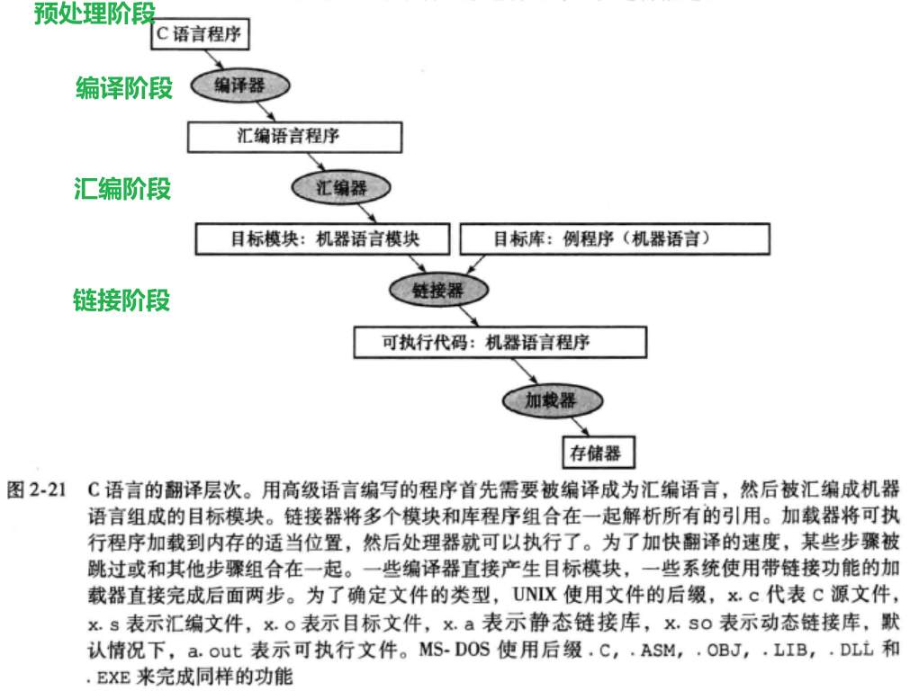


#### 2. 各层次分析

在 `Unix` 系统中，从源文件到可执行目标文件（=可执行文件）是由编译驱动程序完成的，如大名鼎鼎的 `gcc`，翻译过程包括图中的四个阶段，接下来分析这四个阶段:

- **预处理阶段**
  预处理器（ `cpp` ）根据以字符 `#` 开头的命令修给原始的C程序，结果得到另一个C程序，通常以 `.i` 作为文件扩展名。主要是进行文本替换、宏展开、删除注释这类简单工作。对应的命令：

  ```shell
  linux> gcc -E hello.c hello.i 
  ```

- **编译阶段**：
  编译器将文本文件 `hello.i` 翻译成 `hello.s`，包含相应的汇编语言程序。对应的命令：

  ```shell
  linux> gcc -S hello.c hello.s 
  ```

接下来的汇编阶段和链接阶段都会生成**目标文件**，但是生成的**目标文件具有不同的类型**。所以我们可以把焦点放在**目标文件的区别**上，以此来完成对这两个阶段的分析。首先先看下目标文件。

- ***目标文件***：
  - **目标文件类型**
    一共有三类目标文件：
    **1. 可重定位目标文件**：包含**二进制**代码和数据，其形式可以和其他目标文件进行合并，创建一个**可执行目标文件**
    **2. 可执行目标文件**：包含**二进制**代码和数据，可直接被加载器加载执行
    **3. 共享目标文件**：可被动态的加载和链接（这里暂不讨论）
  - **两个阶段生成的目标文件类型**
    由**汇编器生成的就是可重定位目标文件**，经过**链接器作用后才生成可执行目标文件**，链接器的作用就是以一组可重定位目标文件作为输入，生成可加载和运行的可执行目标文件。
  - **目标文件构成**
    在UNIX系统中的目标文件（可重定位目标文件、可执行目标文件）通常包含以下6个不同的部分：
    - **目标文件头**，描述目标文件其它部分的大小和位置
    - **代码段**，包含机器语言代码
    - **静态数据段**，包含在程序生命周期内分配的数据
    - **重定位信息**，标记了一些在程序加载进内存时依赖于绝对地址的指令和数据。如果程序中这些部分在内存中被移动，这些引用必须改变。
    - **符号表**，包含未定义的剩余标记，如外部引用。
    - **调试信息**，包含一份说明目标模块如何编译的简明描述，这样，调试器能够将机器指令关联到C源文件，并使数据结构变得可读。

- **汇编阶段**
  系统程序汇编器将 `.s` 文件翻译成机器语言指令，即机器代码，并把这些指令打包成 **可重定位目标文件** 的格式，将结果保存在目标文件 `.o` 中(把汇编语言翻译成机器语言的过程)。**注意这个可重定位目标文件中包含有未解决的引用**。
  在这个过程中汇编器会将分支和数据传输指令中用到的标号都放入一个符号表，这个符号表由标号和地址成对构成。对应的命令：

  ```shell
  linux> gcc -c hello.c hello.o
  ```

- **链接阶段**
  系统程序链接器将所有独立汇编的机器语言程序（可重定位目标文件）拼接在一起，它使用每个模块中的重定位信息和符号表，来解析所有未定义标签（这种标签引用会发生在分支指令、跳转指令和数据寻址处）。如果所有外部引用都解析完了，链接器决定每个模块将要占用的内存位置，所有的绝对引用必须重定位以反映它真实的地址。最后生成可执行目标文件。
  举例如：此时 `hello` 程序调用了 `printf` 函数。`printf` 函数存在于一个名为 `printf.o` 的单独的预编译目标文件中。 **链接器**（`ld`）就负责处理，把这个文件并入到 `hello.o` 程序中，结果得到 `hello` 文件，一个**可执行目标文件**。最后**可执行目标文件加载到内存**后由系统负责执行。
  注：函数库一般分为**静态库**和**动态库**两种。**静态库**是指**编译链接时**，把库文件的代码全部加入到可执行目标文件中，因此生成的文件比较大，但在运行时也就不再需要库文件了。其后缀名一般为 `.a`。**动态库**与之相反，在**编译链接时**并没有把库文件的代码加入到可执行目标文件中，而是在程序执行时由运行时链接文件加载库，这样可以节省系统的开销。动态库一般后缀名为 `.so`，`gcc` 在编译时默认使用动态库。

- **加载阶段**
  操作系统需要将位于磁盘中的可执行目标文件加载到内存中并启动执行它，在UNIX系统中，加载器安装如下步骤工作：
  - 读取可执行目标文件头来确定代码段和数据段的大小。
  - 为正文和数据创建一个足够大的地址空间。
  - 将可执行目标文件中的指令和数据复制到内存中。
  - 把主程序的参数（如果存在）复制到栈顶。
  - 初始化机器寄存器，将栈指针指向第一个空位置。
  - 跳转到启动例程，它将参数复制到参数寄存器并且调用程序的main函数。当main函数返回时，启动例程通过系统调用exit终止程序。

第二小节给出了一个大致的C语言翻译流程，接下来结合之前的实际代码来看看各阶段生成的文件中的具体内容。

### 三、 编译过程

这里我们的编译过程包括：预编译阶段、编译阶段、汇编阶段。所以编译结束后的文件是一个**可重定位目标文件**，linux下是*.o文件，windows中是*.obj文件。经过后续的链接器作用才会得到一个**可执行目标文件**。

#### 1. 编译命令

如上所述，整个编译将分为四个步骤：

- 首先编写源文件main.c/main.cpp；
- 编写好代码以后进行预编译成main.i文件，预编译过程中去掉注释、进行宏替换、增加行号信息等；
- 然后将main.i文件经过语法分析、代码优化和汇总符号等步骤后，编译形成main.S的汇编文件，里面存放的都是汇编代码；
- 最后一个编译步骤是进行汇编，从main.S变成二进制可重定位目标文件main.o。

以上四个步骤对应的在linux下的命令为：

```shell
gcc -E main.c -o main.i  #预编译，生成main.i文件
gcc -S main.i            #编译，生成main.S文件
gcc -c main.S            #汇编，生成main.o文件
```

#### 2. 二进制可重定位目标文件的结构和布局

参考：[使用readelf和objdump解析目标文件。](https://www.jianshu.com/p/863b279c941e)

首先给出一个二进制可重定位目标文件的总体布局，简单来说整个obj文件就是由ELF header+各种段组成（和可执行目标文件的布局是一样的）：

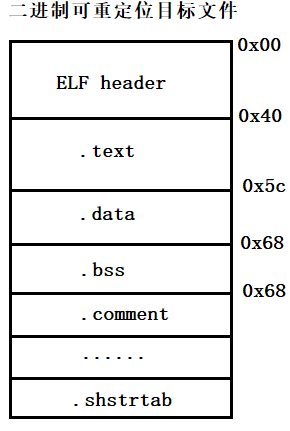

- **查看ELF header**
首先查看可重定位目标文件main.o的ELF header，在Linux下输入如下命令：

  ```shell
  # readelf用来显示一个或多个elf格式的目标文件的信息
  # -h --file-header 显示elf文件开始的文件头信息.
  readelf -h main.o
  ```

  得到输出：

  

  可以看到ELF header占64个字节，里面存放着文件类型、支持的平台、程序入口点地址等信息，如果你对每个字段的具体含义感兴趣，可以看《程序员自我修养》

- **目标文件的各个段**

接下来就是目标文件的各个段，从下面可以看到数据和指令在目标文件中是按段的形式组织起来的，而且.text段的起始位置从file off字段可以看到是0x40位置，即64字节处，也说明.text段是接在ELF header后面。

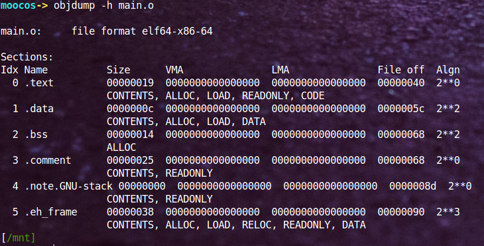

代码段的大小为0x19，起始偏移为0x40，所以.data段的起始偏移应该为0x19+0x40=0x59，但是为了字节对齐，所以。data段的起始地址为0x5c，也即图中file off字段所示，后面的段以此类推。

之后的.bss段会出现两个问题，一个是.bss段的大小应该为4*6=24字节（
对于未初始化或者初始化值为0的数据存放在.bss段，而且不占目标文件的空间，即gdata2、gdata3、gdata5、gdata6、e和f），但是实际上却是20字节；另一个问题就是可以看到.comment段的偏移(file off)也为0x68，这说明.bss段在目标文件中是不占大小的，即.comment和.bss段的偏移相同。对于这两个问题，简单说一下。第一个问题，涉及到C语言中的强符号和弱符号概念；第二个问题我们可以这样理解，因为.bss段中存的是初始化为0或者未初始化的数据，而实际未初始化的数据其默认值也为0，这样我们就没必要存它们的初始值，相当于有一个默认值0。

上面的图只列出了部分段，下面查看一下目标文件中所有的段，一共有11个段，简单说明一下，.comment是注释段、.symtab是符号表段。


接下来就是看段的详细内容，可以看到各个段真实的存储内容如下，下面最明显的是.data段，里面存放着gdata1、gdata4和d的值分配为0x0000000a(10)、0x0000000b(11)和0x0000000d(13)，正好与代码中的初始值匹配。注意下面显示的小端模式。

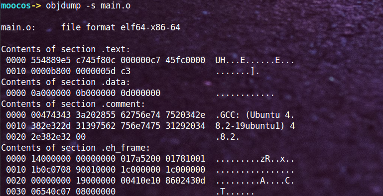

以上就是可重定位目标文件的组成，下面再介绍一下上面提到的符号表如下图，第一列是符号的地址，由于编译的时候不分配地址，所以放的是零地址或者偏移量；第二列是符号的作用域(g代表global，l代表local)，前面讨论了用static修饰过的符号均是local的（不明白的搜一下static关键字的作用），如下图中gdata4/gdata5/gdata6等；第三列表示符号位于哪个段，在这里也能看到gdata1、gdata4和d都存放在.data段中，初始化为0或未初始化的gdata2/gdata5/gdata6等都存放在.bss段：

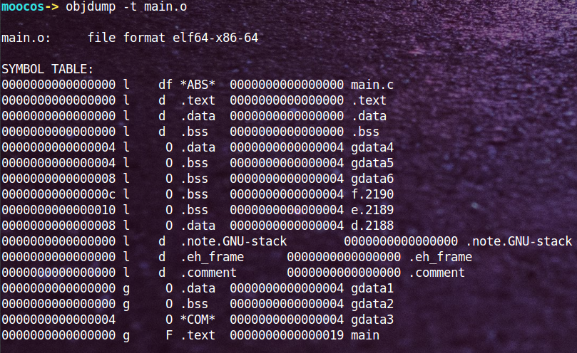

这里特别说一下gdata3，按上面的分析来说它应该是存放在.bss段，但是我们可以看到它是*COM*，原因在于它是一个弱符号，在编译时无法确定有没有强符号会覆盖它。

### 四、链接过程

链接过程分为两步：

- 第一步是合并所有目标文件的段，并调整段偏移和段长度，合并符号表，分配内存地址；
- 第二步是链接的核心，进行符号的重定位。

1) **合并段**
所有相同属性的段进行合并，组织在一个页面上，这样更节省空间。如.text段的权限是可读可执行，.rodata段也是可读可执行，所以将两者合并组织在一个页面上；同理合并.data段和.bss段。

2) **合并符号表**
链接阶段只处理所有obj文件的global符号，local符号不作任何处理。

3) **符号解析**
符号解析指的是所有引用符号的地方都要找到符号定义的地方。

4) **分配内存地址**
在编译过程中不分配地址（给的是零地址和偏移），直到符号解析完成以后才分配地址。如下图，数据的零地址：
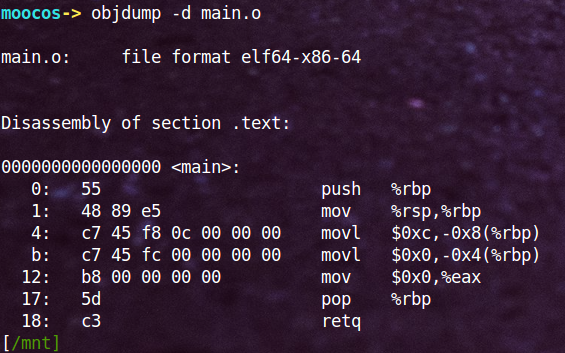

5) 符号重定位
因为在编译过程中不分配地址，所以在目标文件所以数据出现的地方都给的是零地址，所有函数调用的地方给的是相对于下一条指令的地址的偏移量。在符号重定位时，要把分配的地址回填到数据和函数调用出现的地方，而且对于数据而言填的是绝对地址，而对函数调用而言填的是偏移量。
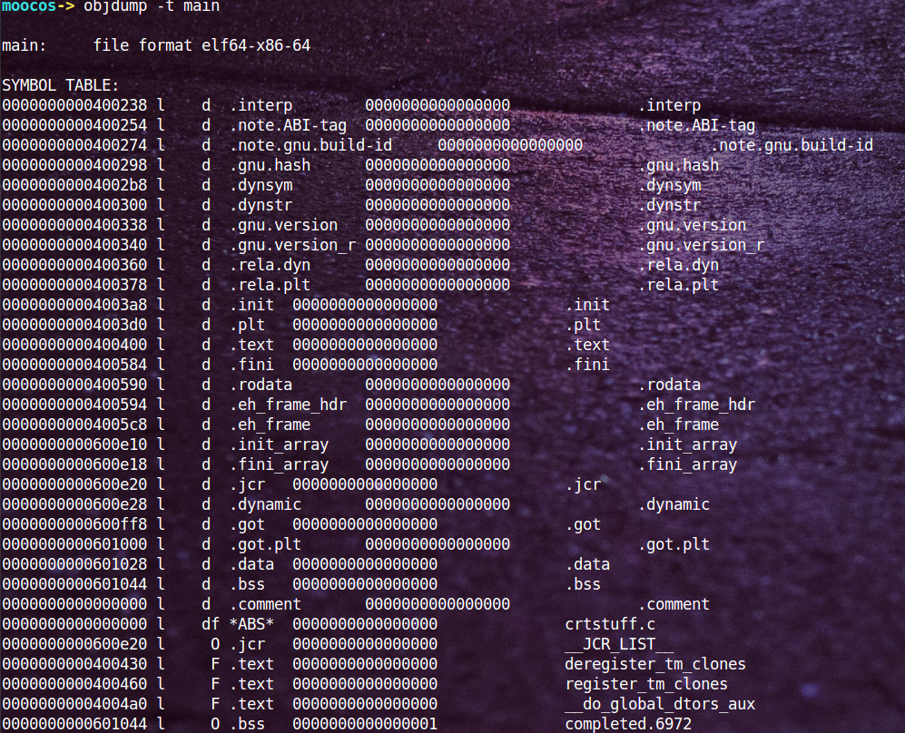
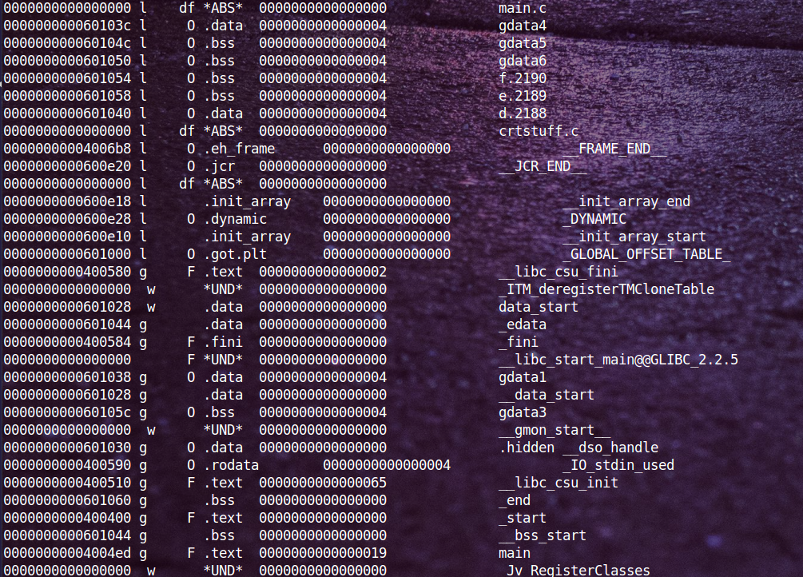

从上图中我们可以看到gdata1等变量的地址不再是0，而是0x080490e4，正确回填了绝对地址。

### 五、 可执行程序

链接完成以后形成了可执行文件，下面来解析可执行文件是如何执行起来的。同样，首先给出可执行文件的总体布局，然后再来深入解析。
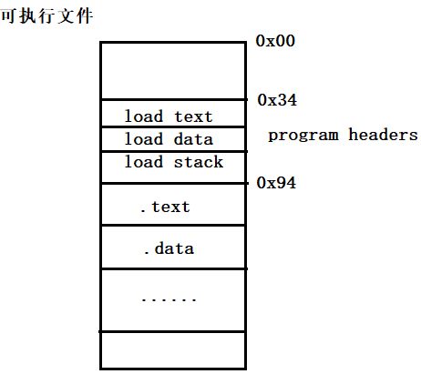

首先看一下可执行文件的头部，如下图，里面记录了函数的入口点地址为0x08048094(后面会解释这个值的来由)，还有就是size of this headers，程序头部占52个字节，然后还有三个program headers，每个program headers占32字节，共占3*32=96字节，所以程序头部+program heades=52+96=0x94，而从虚拟地址空间布局可知.text段正好是从0x08048000开始的，所以可执行程序的入口点就是0x08048000+0x94=0x08048094：

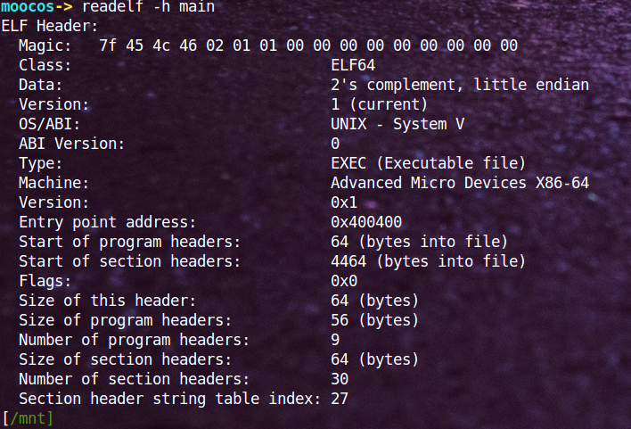

 然后看看这三个program headers里面的内容，第一个load项的属性是可读可执行，其实存放的就是代码段；第二个load项的属性是可读可写，其实存放的就是数据段。这两个load项的意义在于它指示了哪些段会被加载到同一个页面中：

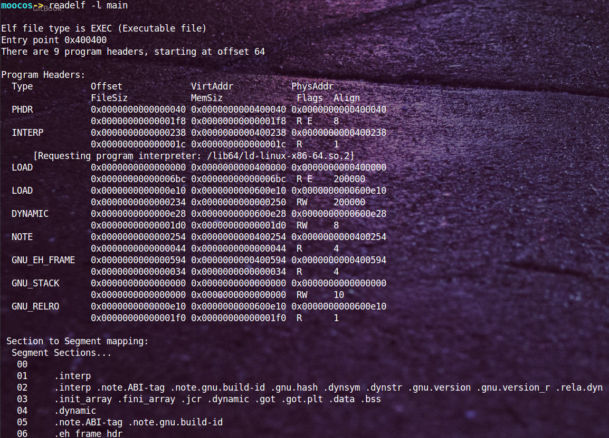

可以看到这两个load项的对齐方式是页面对齐（32位linux操作系统页面大小为4K）。

当双击一个可执行程序时，首先解析其文件头部ELF header获取entry point address程序入口点地址，然后按照两个load项的指示将相应的段通过mmap()函数映射到虚拟页面中（虚拟页面存在于虚拟地址空间中），最后再通过多级页表映射将虚拟页面映射到物理页面中。

说完编译链接，最后说明如何将VP映射到PP就打工告成了。

分为三步，1.首先是创建虚拟地址到物理内存的映射（创建内核地址映射结构体），创建页目录和页表；2. 再就是加载代码段和数据段；3.把可执行文件的入口地址写到CPU的PC寄存器中。
