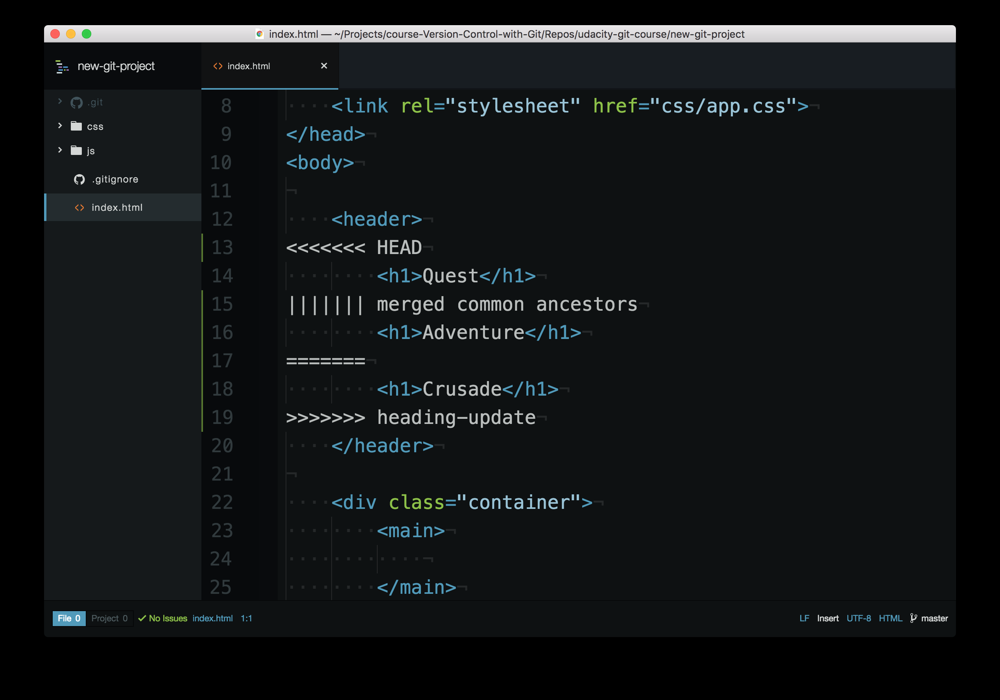

#### **```git init```**

#### **```git clone```**

#### **```git log```**

我们快速总结下 ```git log``` 命令。```git log``` 命令用于显示仓库中所有 commit 的信息。
默认情况下，该命令会显示仓库中每个 commit 的：

- SHA
- 作者
- 日期
- 消息

使用```git log```查看的时候，```git``` 使用命令行分页器 ```less``` 浏览所有信息。以下是 ```less``` 的重要快捷键：

- 要**向下**滚动，按下
- ```j``` 或 ```↓``` 一次向下移动一行
- ```d``` 按照一半的屏幕幅面移动
- ```f``` 按照整个屏幕幅面移动
- 要**向上**滚动，按上
- ```k``` 或 ```↑``` 一次向上移动一行
- ```u``` 按照一半的屏幕幅面移动
- ```b``` 按照整个屏幕幅面移动
- 按下 ```q``` 可以**退出**日志（返回普通的命令提示符）

#### **```git log --oneline```**

--oneline 选项用于更改 ```git log``` 显示信息的方式：
此命令：

- 每行显示一个 commit
- 显示 commit 的 SHA 的前 7 个字符
- 显示 commit 的消息

#### **```git log --stat```**

总结下，```--stat``` 选项用于更改 ```git log``` 显示信息的方式：
此命令会：

- 显示被修改的文件
- 显示添加/删除的行数
- 显示一个摘要，其中包含修改/删除的总文件数和总行数

#### **```git log -p```**

总结下，```-p``` 选项（和 ```--patch``` 选项一样）用来更改 ```git log``` 显示信息的方式：
此命令会向默认输出中添加以下信息：

- 显示被修改的文件
- 显示添加/删除的行所在的位置
- 显示做出的实际更改

>你已经知道如何使用以下命令输出信息：
>**```git log```**
>**```git log --oneline```**
>**```git log --stat```**
>**```git log -p```**

但是你是否知道，可以向所有这些命令提供 commit 的 SHA 作为最后一个参数？例如：

#### **```git log -p fdf5493```**

通过提供 SHA，**```git log -p```** 命令将从这条 commit 开始！无需滚动并逐条查阅！注意，它还会显示在所提供的 SHA 之前提交的所有 commit 信息。

注意上面的git log只能显示当前分支的信息，如果要显示其它分支的信息，就需要添加额外的信息：

```shell
git log --oneline --decorate --graph --all
```

其中```--graph``` 选项将条目和行添加到输出的最左侧。显示了实际的分支。```--all``` 选项会显示仓库中的所有分支。
运行此命令将显示仓库中的所有分支和 commit

#### **```git show```**

该命令将仅显示最近的 commit。通常，将 SHA 作为最后一个参数提供给命令：```git show fdf5493```，```git show``` 命令的输出和 ```git log -p``` 命令的完全一样。因此默认情况下，```git show``` 会显示：

- commit
- 作者
- 日期
- commit 消息
- 补丁信息

但是，```git show``` 可以与我们了解过的大部分其他选项一起使用：

- ```--stat```：显示更改了多少文件，以及添加/删除的行数
- ```-p``` 或 ```--patch```：显示默认补丁信息，但是如果使用了 ```--stat```，将不显示补丁信息，因此传入 ```-p``` 以再次添加该信息。
- ```-w```：忽略空格变化

#### **```git add```**

该命令用于将文件从工作目录移到暂存区。

```shell
git add <file1> <file2> … <fileN>
```

此命令：

- 可接受多个文件名（用空格分隔）
- 此外，可以使用句点 ```.``` 来代替文件列表，告诉 git 添加当前目录至暂存区（以及所有嵌套文件）

#### **```git commit```**

该命令会取出暂存区的文件并保存到仓库中。

```shell
git commit
```

此命令将打开配置中指定的代码编辑器（请参阅第一节课中的 git 配置流程，了解如何配置编辑器）

在代码编辑器中：

- 必须提供提交说明
- 以 # 开头的行是注释，将不会被记录
- 添加提交说明后保存文件
- 关闭编辑器以进行提交

然后使用 git log 检查你刚刚提交的 commit！

#### **良好的提交说明**

在编写好的提交说明时，需要注意以下几个事项：

- **建议**
  - 消息篇幅简短（少于 60 个字符）
  - 解释提交的作用（不是如何更改或为何更改！）

- **禁忌**
  - 请勿解释为何做出了这些更改（下文会深入讲解这一点）
  - 请勿解释如何进行了更改（这是 ```git log -p``` 的目的！）
  - 请勿使用单词"and"
  - 如果你必须使用 "and"，则你的提交说明可能进行了太多的更改，将这些更改拆分为独立的 commit.例如 "make the background color pink and increase the size of the sidebar"

在编写提交说明时，我喜欢用以下短语造句："This commit will…"。你可以补充完整该句子并作为提交说明使用。

最重要的是，在编写提交说明时**保持一致性**！

#### **```git commit --amend```**

使用该命令可以更新最近的 commit，而不是创建新的 commit。

#### **```git diff```**

总结下，```git diff``` 命令用来查看已经执行但是尚未 commit 的更改：

```shell
git diff
```

此命令会显示：

- 已经修改的文件
- 添加/删除的行所在的位置
- 执行的实际更改

深入研究
[git diff](https://git-scm.com/docs/git-diff) git 文档 (英)

#### **```.gitignore```**

总结下，通过将不应该追踪的文件名字添加进 ```.gitignore``` 文件来告诉 ```git``` 不应跟踪它们。同时该文件应该放在 ```.git``` 目录所在的目录。

#### **```git tag```**

标签可以让你找到特定的提交，将它们与其它提交区分出来。因为它会标记特定的 commit 。当添加新的 commit 时，标签也不会移动。命令：

```shell
 git tag -a v1.0 
```

使用了 ```-a``` 选项。该选项告诉 ```git``` 创建一个带注释的标签。如果你没有提供该选项（即 ```git tag v1.0```），那么它将创建一个轻量级标签。
建议使用带注释的标签，因为它们包含了大量的额外信息，例如：

- 标签创建者
- 标签创建日期
- 标签消息

因此，你应该始终使用带注释的标签。

向以前的commit添加标签，只需提供要添加标签的 commit 的 SHA 即可！

```shell
git tag -a v1.0 a87984
```

可以通过输入 ```-d``` 选项 （表示 ```delete``` 删除！）加上标签名称来删除 ```git``` 标签：

```shell
git tag -d v1.0
```

#### **```git branch```**

总结下，```git branch``` 命令用来管理 ```git``` 中的分支：

```shell
# 列出所有分支，并标记当前活跃分支
$ git branch

# 创建新的"footer-fix"分支
$ git branch footer-fix
# 如果在后面添加SHA，就会在该commit下创建一个分支，如下命令会在42a69f上创建一个分支
$ git branch footer-fix 42a69f

# 删除"footer-fix"分支
$ git branch -d footer-fix
# 注意你不能在footer-fix分支下执行这个操作，你需要切换到另外一个分支才能执行，没有谁会自己删除自己。另外如果footer-fix中有新的commit，就算切换到其它分支然后删除它也会失败。但是你可以使用如下命令强制删除：
$ git branch -D footer-fix
```

#### **```git checkout```**

```shell
# 切换到分支footer-fix
$ git checkout footer-fix

# 创建一个分支并切换到新创建分支上
$ git checkout -b richards-branch

# 创建一个分支，使得它的分支与某一个分支（例如：master）起点一样，并切换到新创建的分支
$ git checkout -b footer master
```

#### **```git merge```**

总结下，git merge 命令用来在 git 中合并分支：

```shell
git merge <other-branch>
```

合并有以下两种类型：

- 快进合并 – 要合并的分支必须位于检出分支前面。检出分支的指针将向前移动，指向另一分支所指向的同一 commit。
- 普通类型的合并
  - 两个完全不同的分支被合并
  - 创建一个合并 commit

#### 合并冲突

在master中将Adventure改为quest，然后提交。回到heading-update，此时heading-update指向master修改为quest之前，在heading-update中将Adventure修改为Crusade。然后将heading-update和master合并就会产生如下冲突：

合并冲突指示符解释，编辑器具有以下合并冲突指示符：

- ```<<<<<<< HEAD``` 此行下方的所有内容（直到下个指示符）显示了当前分支上的行。
- ```||||||| merged common ancestors``` 此行下方的所有内容（直到下个指示符）显示了原始行的内容。
- ```=======``` 表示原始行内容的结束位置，之后的所有行（直到下个指示符）是被合并的当前分支上的行的内容。
- ```>>>>>>> heading-updae``` 是要被合并的分支（此例中是 ```heading-update``` 分支）上的行结束指示符。

在这个文件中我们需要做以下的事情：

- 选择保留哪些行
- 删掉所有带指示符的行


#### 合并冲突小结

当相同的行在要合并的不同分支上做出了更改时，就会出现合并冲突。git 将在合并途中暂停，并告诉你存在冲突，以及哪些文件存在冲突。要解决文件中的冲突：

- 找到并删掉存在合并冲突指示符的所有行
- 决定保留哪些行
- 保存文件
- 暂存文件
- 提交 commit

注意一个文件可能在多个部分存在合并冲突，因此检查整个文件中的合并冲突指示符，搜索 <<< 能够帮助你找到所有这些指示符。

#### **```git revert```**

总结下，git revert 命令用于还原之前创建的 commit：

```shell
git revert <SHA-of-commit-to-revert>
```

此命令：

- 将撤消目标 commit 所做出的更改
- 创建一个新的 commit 来记录这一更改

#### 相关commit引用

你已经知道可以使用 SHA、标签、分支和特殊的 HEAD 指针引用 commit。有时候这些并不足够，你可能需要引用相对于另一个 commit 的 commit。例如，有时候你需要告诉 git 调用当前 commit 的前一个 commit，或者是前两个 commit。我们可以使用特殊的“祖先引用”字符来告诉 git 这些相对引用。这些字符为：

- ```^```  表示父 commit
- ```~```  表示第一个父 commit

我们可以通过以下方式引用之前的 commit：

- 父 commit – 以下内容表示当前 commit 的父 commit
  - ```HEAD^```
  - ```HEAD~```
  - ```HEAD~1```
- 祖父 commit – 以下内容表示当前 commit 的祖父 commit
  - ```HEAD^^```
  - ```HEAD~2```
- 曾祖父 commit – 以下内容表示当前 commit 的曾祖父 commit
  - ```HEAD^^^```
  - ```HEAD~3```

 ```^``` 和 ```~``` 的区别主要体现在通过合并而创建的 commit 中。合并 commit 具有两个父级。对于合并 commit，```^``` 引用用来表示第一个父 commit，而 ```^2``` 表示第二个父 commit。第一个父 commit 是当你运行 ```git merge``` 时所处的分支，而第二个父 commit 是被合并的分支。

我们来看一个示例，这样更好理解。这是我的 git log 当前的显示结果：

```shell
* 9ec05ca (HEAD -> master) Revert "Set page heading to "Quests & Crusades""
* db7e87a Set page heading to "Quests & Crusades"
*   796ddb0 Merge branch 'heading-update'
|\  
| * 4c9749e (heading-update) Set page heading to "Crusade"
* | 0c5975a Set page heading to "Quest"
|/  
*   1a56a81 Merge branch 'sidebar'
|\  
| * f69811c (sidebar) Update sidebar with favorite movie
| * e6c65a6 Add new sidebar content
* | e014d91 (footer) Add links to social media
* | 209752a Improve site heading for SEO
* | 3772ab1 Set background color for page
|/  
* 5bfe5e7 Add starting HTML structure
* 6fa5f34 Add .gitignore file
* a879849 Add header to blog
* 94de470 Initial commit
```

我们来看看如何引用一些之前的 commit。因为 ```HEAD``` 指向```9ec05ca``` commit：

- ```HEAD^``` 是 ```db7e87a commit```
- ```HEAD~1``` 同样是 ```db7e87a commit```
- ```HEAD^^``` 是 ```796ddb0 commit```
- ```HEAD~2``` 同样是 ```796ddb0 commit```
- ```HEAD^^^``` 是 ```0c5975a commit```
- ```HEAD~3``` 同样是 ```0c5975a commit```
- ```HEAD^^^2``` 是 ```4c9749e commit```（这是曾祖父的 (```HEAD^^```) 第二个父 commit (```^2```))

#### **```git reset```**

总结下，```git reset``` 命令被用来清除 commit：

```shell
git reset <reference-to-commit>
```

它可以用来：

- 将 ```HEAD``` 和当前分支指针移到引用的 commit
- 使用 ```--hard``` 选项清除 commit
- 使用 ```--soft``` 选项将 commit 的更改移至暂存区
- 使用 ```--mixed``` 选项取消暂存已被 commit 的更改

我们通常会用到祖先引用来指代之前的 commit。祖先引用包含：

- ```^``` – 表示父 commit
- ```~``` – 表示第一个父 commit
