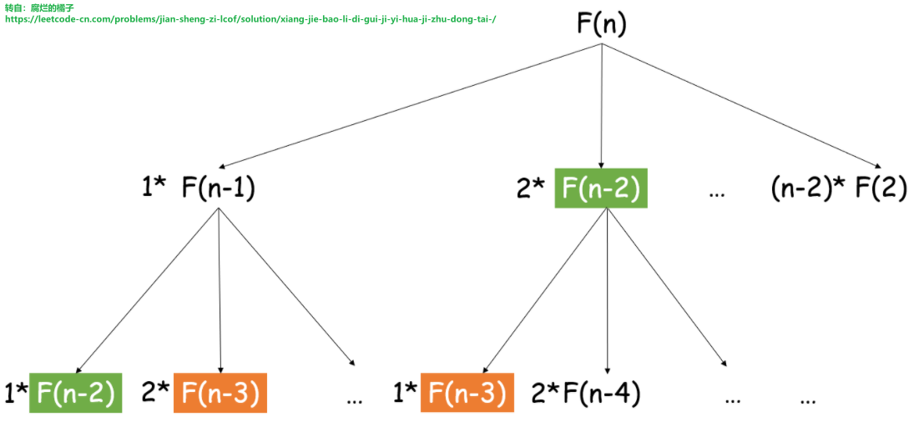

> **剑指offer 14-I.剪绳子**：给你一根长度为 n 的绳子，请把绳子剪成整数长度的 m 段（m、n都是整数，n>1并且m>1），每段绳子的长度记为 k[0],k[1]...k[m-1] 。请问 k[0]*k[1]*...*k[m-1] 可能的最大乘积是多少？例如，当绳子的长度是8时，我们把它剪成长度分别为2、3、3的三段，此时得到的最大乘积是18。  
>示例 1：  
>　　输入: 2  
>　　输出: 1  
>　　解释: 2 = 1 + 1, 1 × 1 = 1  
>示例 2:  
>　　输入: 10  
>　　输出: 36  
>　　解释: 10 = 3 + 3 + 4, 3 × 3 × 4 = 36  
>提示：2 <= n <= 58  
>注意：[本题与主站 343 题相同](https://leetcode-cn.com/problems/integer-break/)  

这道题拿到第一瞬间很懵逼，就算是暴力解法发现自己也想不到。然后看了些评论，感觉自己现在的解题习惯不好，没有学会走就开始跑。在没有太多的积累的情况下，应该先从最简单粗暴的方法开始。

大概规划下这道题的解题路线：暴力解法->记忆化搜索->动态规划->优化动态规划->数学解法（没时间就忽略掉数学解法）。

- 暴力解法：暴力解法就是遍历所有的可能，遍历的过程中把最大值记录下来。首先的重点是：**所有可能**究竟**有哪些可能**，以5为例：
```
拆分为2个数相加：
5 = 1+4、                       2+3、             3+2、    4+1

拆分为3个数相加：
5 = 1+1+3、1+2+2、1+3+1、       2+1+2、2+2+1、    3+1+1

拆分为4个数相加：
5 = 1+1+1+2、1+1+2+1、1+2+1+1、 2+1+1+1

拆分为5个数相加：
5 = 1+1+1+1+1
```
那我们的暴力解法就是```for(int i = 2; i <= 5; i++)//i为拆解为几个数相加```，但是这里会发现一个问题，我们的循环体究竟是啥呢？如果我们要在这个循环体内横向枚举的话（以拆分为i = 3个数相加为例：1+1+3、1+2+2、1+3+1、...），实在想不出什么方法能够去构建这个循环体，因为毫无章法。

在上面的代码段我把另外一种规律给列出来了，但是我并不认为我在面试的时候能够发现这个规律，这时候就需要我有一些先验知识了，我知道的先验知识是形如f(n) = f(n-1) + f(n-2)的。那么这个题的递归是哪种形式呢
```f(n) = max(1 * f(n-1), 2 * f(n-2), ..., (n-1) * f(n-(n-1)))```
那么第一行我们可以通过
```
for(int i = 1; i <= 4; i++)
    max(maxValue, i * f(n-i));

```
没写完，留到第二天

> **剑指offer 14-I.剪绳子**：给你一根长度为 n 的绳子，请把绳子剪成整数长度的 m 段（m、n都是整数，n>1并且m>1），每段绳子的长度记为 k[0],k[1]...k[m-1] 。请问 k[0]*k[1]*...*k[m-1] 可能的最大乘积是多少？例如，当绳子的长度是8时，我们把它剪成长度分别为2、3、3的三段，此时得到的最大乘积是18。  
>示例 1：  
>　　输入: 2  
>　　输出: 1  
>　　解释: 2 = 1 + 1, 1 × 1 = 1  
>示例 2:  
>　　输入: 10  
>　　输出: 36  
>　　解释: 10 = 3 + 3 + 4, 3 × 3 × 4 = 36  
>提示：2 <= n <= 58  
>注意：[本题与主站 343 题相同](https://leetcode-cn.com/problems/integer-break/)  

这道题拿到第一瞬间很懵逼，就算是暴力解法发现自己也想不到。然后看了些评论，感觉自己现在的解题习惯不好，没有学会走就开始跑。在没有太多的积累的情况下，应该先从最简单粗暴的方法开始。

大概规划下这道题的解题路线：暴力解法->记忆化搜索->动态规划->优化动态规划->数学解法（没时间就忽略掉数学解法）。

- **暴力解法**：虽然明白暴力解法就是将所有的可能遍历一遍，但是还是不知道应该如何下手，这个遍历究竟是一个循环就完了呢还是要递归呢，循环的话好像没法构造，递归的话也不明白递归式是什么，这个时候就只有学习了。
  
  > 分治思想：分治是将原问题划分成若干个规模较小而结构与原问题相同或相似的子问题，然后分别解决这些子问题，然后合并子问题的解，即可得到原问题的解。分治法的三个步骤：
  > - 分解：将原问题分解为若干和原问题拥有相同或相似结构的子问题。
  > - 解决：递归求解所有子问题。如果存在子问题的规模小到可以直接解决，就直接解决它。
  > - 合并：将子问题的解合并为原问题的解。
  >
  >分治可以用递归的手段实现，也可以用非递归的手段实现。但是递归比较适合实现分治思想。递归中最重要的两个概念是：递归边界和递归式。
  > ——摘自《算法笔记》P111 

  设f(n)为长度为n的绳子可以得到的最大乘积，对于每一个f(n)，可以得到如下分解：
  从上图看出我们可以把F(n)问题分解为F(n-1)的问题，以此类推，直到求解f(2)=1（**递归边界**），然后递归回去，问题就得到了解决，这用到的就是分治的思想。注意到我们每次将一段绳子剪成两段时，剩下的部分可以继续剪，也可以不剪。因此**递归式**就是：
  ```
  f(n) = max(i * (n - i), i * f(n - i)), i = 1,2,...,n-2。
  ```
  - 复杂度分析
    - 时间复杂度：O(2^n)， 即C(1,n)+C(2,n)+...+C(n-1,n)=2^n
    - 空间复杂度：O(2^n)。

```
//代码段
class Solution {
public:
    int cuttingRope(int n) {
        if(n == 2)//递归边界
            return 1;

        int maxValue = 0;

        for(int i = 1; i < n - 1; i++)
            maxValue = max(maxValue, max(i * (n - i), i * cuttingRope(n-i)));//递归式
        
        return maxValue;
    }
};
```

- **记忆化搜索**：上述的暴力解法会超时，这个时候就需要进行优化，注意到超时的主要原因是重复计算了F(n)，为了避免重复计算，我们可以使用记忆化搜索：我们把已经计算过的内容记录下来，于是下次碰到需要计算相同的内容时，就能直接使用上次计算的结果，这可以省去大半无效计算。
    -  复杂度分析
       - 时间复杂度：O(n)， 只要dp[i]计算过的地方都不会再计算。
       - 空间复杂度：O(n)。
```
class Solution {
public:

    vector<int> dp;
    int cuttingRope(int n)
    {
        dp.assign(n+1, 0);
        return F(n);
    }
    int F(int n) {
        if(dp[n]!=0) return dp[n];//递归边界

        for(int i = 1; i < n; i++)
            dp[n] = max(dp[n], max(i * (n - i), i * F(n-i)));//递归式
        
        return dp[n];
    }
};
```

- **背包型动态规划**：
  