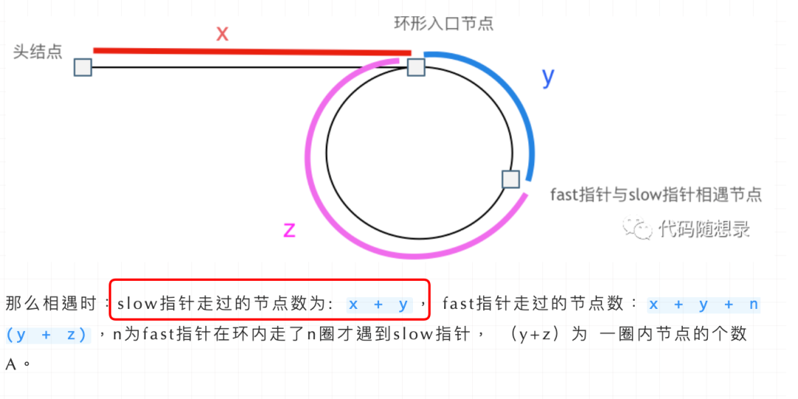
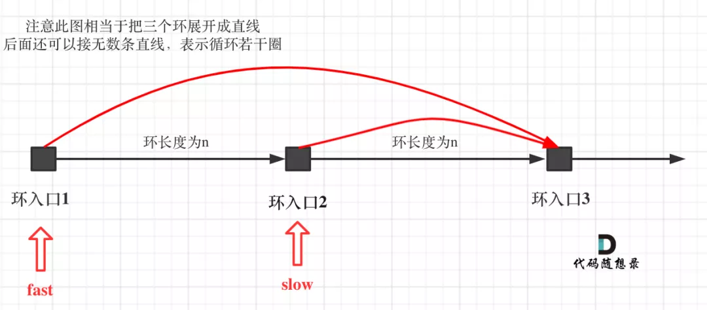
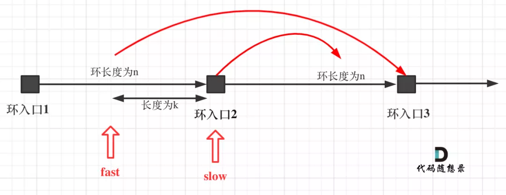

<p align='center'>

</p>
<p align="center">
  <a href="https://github.com/youngyangyang04/leetcode-master"></a>
  <a href="https://img-blog.csdnimg.cn/20201115103410182.png"></a>
  <a href="https://img-blog.csdnimg.cn/20201210231711160.png"></a>
  <a href="https://space.bilibili.com/525438321"></a>
  <a href="https://www.zhihu.com/people/sun-xiu-yang-64"></a>
  <a href="https://www.toutiao.com/c/user/60356270818/#mid=1633692776932365"></a>
</p>

# 链表的理论基础

在这篇文章[关于链表，你该了解这些！](https://mp.weixin.qq.com/s/ntlZbEdKgnFQKZkSUAOSpQ)中，介绍了如下几点：

- 链表的种类主要为：单链表，双链表，循环链表
- 链表的存储方式：链表的节点在内存中是分散存储的，通过指针连在一起。
- 链表是如何进行增删改查的。
- 数组和链表在不同场景下的性能分析。

**可以说把链表基础的知识都概括了，但又不像教科书那样的繁琐**。

# 链表经典题目

## 虚拟头结点

在[链表：听说用虚拟头节点会方便很多？ <font color = 'red'>2021/02/24</font>](https://mp.weixin.qq.com/s/slM1CH5Ew9XzK93YOQYSjA)中，我们讲解了链表操作中一个非常总要的技巧：虚拟头节点。

链表的一大问题就是操作当前节点必须要找前一个节点才能操作。这就造成了，头结点的尴尬，因为头结点没有前一个节点了。

**每次对应头结点的情况都要单独处理，可以使用虚拟头结点的技巧，就可以解决这个问题**。

在[链表：听说用虚拟头节点会方便很多？ <font color = 'red'>2021/02/24</font>](https://mp.weixin.qq.com/s/slM1CH5Ew9XzK93YOQYSjA)中，我给出了用虚拟头结点和没用虚拟头结点的代码，大家对比一下就会发现，使用虚拟头结点的好处。

## 链表的基本操作

在[链表：一道题目考察了常见的五个操作！ <font color = 'red'>2021/02/24</font>](https://mp.weixin.qq.com/s/Cf95Lc6brKL4g2j8YyF3Mg)中，我们通设计链表把链表常见的五个操作练习了一遍。

这是练习链表基础操作的非常好的一道题目，考察了：

- 获取链表第 index 个节点的数值
- 在链表的最前面插入一个节点
- 在链表的最后面插入一个节点
- 在链表第 index 个节点前面插入一个节点
- 删除链表的第 index 个节点的数值

**可以说把这道题目做了，链表基本操作就 OK 了，再也不用担心链表增删改查整不明白了**。

这里我依然使用了虚拟头结点的技巧，大家复习的时候，可以去看一下代码。

## 反转链表

在[链表：听说过两天反转链表又写不出来了？ <font color = 'red'>2021/02/24</font>](https://mp.weixin.qq.com/s/pnvVP-0ZM7epB8y3w_Njwg)中，讲解了如何反转链表。

因为反转链表的代码相对简单，有的同学可能直接背下来了，但一写还是容易出问题。

反转链表是面试中高频题目，很考察面试者对链表操作的熟练程度。

我在[文章](https://mp.weixin.qq.com/s/pnvVP-0ZM7epB8y3w_Njwg)中，给出了两种反转的方式，迭代法和递归法。

建议大家先学透迭代法，然后再看递归法，因为递归法比较绕，如果迭代还写不明白，递归基本也写不明白了。

**可以先通过迭代法，彻底弄清楚链表反转的过程！**

## 环形链表

在[链表：环找到了，那入口呢？ <font color = 'red'>2021/02/24</font>](https://mp.weixin.qq.com/s/_QVP3IkRZWx9zIpQRgajzA)中，讲解了在链表如何找环，以及如何找环的入口位置。

这道题目可以说是链表的比较难的题目了。

很多同学关注的问题是：为什么一定会相遇，快指针就不能跳过慢指针么？

可以确定如下两点：

- fast 指针一定先进入环中，如果 fast 指针和 slow 指针相遇的话，一定是在环中相遇，这是毋庸置疑的。
- fast 和 slow 都进入环里之后，fast 相对于 slow 来说，fast 是一个节点一个节点（2-1=1）的靠近 slow 的，**注意是相对运动，所以 fast 一定可以和 slow 重合**。

如果 fast 是一次走三个节点，那么可能会跳过 slow，因为相对于 slow 来说，fast 是两个节点（3-1=2）移动的。

确定是否有环比较容易，但是找到环的入口就不太容易了，需要点数学推理。

我在[链表：环找到了，那入口呢？](https://mp.weixin.qq.com/s/_QVP3IkRZWx9zIpQRgajzA)中给出了详细的推理，兼顾易懂和简洁了。

这是一位录友在评论区有一个疑问，感觉这个问题很不错，但评论区根本说不清楚，我就趁着总结篇，补充一下这个证明。

在推理过程中，**为什么第一次在环中相遇，slow 的 步数 是 x+y 而不是 x + 若干环的长度 + y 呢？**

了解这个问题一定要先把文章[链表：环找到了，那入口呢？](https://mp.weixin.qq.com/s/_QVP3IkRZWx9zIpQRgajzA)看了,即文章中如下的地方：

 </img></div>

首先 slow 进环的时候，fast 一定是先进环来了。

如果 slow 进环入口，fast 也在环入口，那么把这个环展开成直线，就是如下图的样子：

 </img></div>

可以看出如果 slow 和 fast 同时在环入口开始走，一定会在环入口 3 相遇，slow 走了一圈，fast 走了两圈。

重点来了，slow 进环的时候，fast 一定是在环的任意一个位置，如图：

 </img></div>

那么 fast 指针走到环入口 3 的时候，已经走了 k + n 个节点，slow 相应的应该走了(k + n) / 2 个节点。

因为 k 是小于 n 的（图中可以看出），所以(k + n) / 2 一定小于 n。

**也就是说 slow 一定没有走到环入口 3，而 fast 已经到环入口 3 了**。

这说明什么呢？

**在 slow 开始走的那一环已经和 fast 相遇了**。

那有同学又说了，为什么 fast 不能跳过去呢？ 在刚刚已经说过一次了，**fast 相对于 slow 是一次移动一个节点，所以不可能跳过去**。

好了，这次把为什么第一次在环中相遇，slow 的 步数 是 x+y 而不是 x + 若干环的长度 + y ，用数学推理了一下，算是对[链表：环找到了，那入口呢？](https://mp.weixin.qq.com/s/_QVP3IkRZWx9zIpQRgajzA)的补充。

这次可以说把环形链表这道题目的各个细节，完完整整的证明了一遍，说这是全网最详细讲解不为过吧，哈哈。

# 总结

考察链表的操作其实就是考察指针的操作，是面试中的常见类型。

链表篇中开头介绍[链表理论知识](https://mp.weixin.qq.com/s/slM1CH5Ew9XzK93YOQYSjA)，然后分别通过经典题目介绍了如下知识点：

- [虚拟头结点的技巧](https://mp.weixin.qq.com/s/slM1CH5Ew9XzK93YOQYSjA)
- [链表的增删改查](https://mp.weixin.qq.com/s/Cf95Lc6brKL4g2j8YyF3Mg)
- [反转一个链表](https://mp.weixin.qq.com/s/pnvVP-0ZM7epB8y3w_Njwg)
- [有否环形，以及环的入口](https://mp.weixin.qq.com/s/_QVP3IkRZWx9zIpQRgajzA)

虽然这几篇文章都是几个月前发的了，但在在文章留言区，可以看到很多录友都在从头打卡！

如果希望从基础学起来的同学，也可以从头学起来，从头开始打卡，打卡的同时也总结自己的所学所思，一定进步飞快！

<a id="TopicSummary"></a>

> **题目汇总**
>
> - 虚拟头节点
>   - **[Leetcode 203. 移除链表元素](https://leetcode-cn.com/problems/remove-linked-list-elements/submissions/)** [速览题解](#203)
> - 链表的基本操作
>   - **[Leetcode 707. 设计链表](https://leetcode-cn.com/problems/design-linked-list/)** [速览题解](#707)
>     简评：注意第 index 是从 0 开始还是从 1 开始，同时注意寻找的是第 index 个元素还是第 index 元素的前一个元素，这会导致起始点不同
> - 反转链表
>   - **[Leetcode 206. 反转链表](https://leetcode-cn.com/problems/reverse-linked-list/)** [速览题解](#206)
>   - **[剑指 Offer 24. 反转链表](https://leetcode-cn.com/problems/fan-zhuan-lian-biao-lcof/)** [速览题解](#206)
> - 环形链表
>   - **[Leetcode 141. 环形链表](https://leetcode-cn.com/problems/linked-list-cycle/)** [速览题解](#141)
>   - **[Leetcode 142. 环形链表 II](https://leetcode-cn.com/problems/linked-list-cycle-ii/)** [速览题解](#142)
>
> **补充**
>
> - **[剑指 Offer 06. 从尾到头打印链表](https://leetcode-cn.com/problems/cong-wei-dao-tou-da-yin-lian-biao-lcof)** [速览题解](#jz06)
> - **[剑指 Offer 18. 删除链表的结点](https://leetcode-cn.com/problems/shan-chu-lian-biao-de-jie-dian-lcof)** [速览题解](#jz18)
> - **[剑指 Offer 22. 链表中倒数第 K 个节点](https://leetcode-cn.com/problems/lian-biao-zhong-dao-shu-di-kge-jie-dian-lcof)** [速览题解](#jz22)
> - **[剑指 Offer 35. 复杂链表的复制](https://leetcode-cn.com/problems/fu-za-lian-biao-de-fu-zhi-lcof)** [速览题解](#jz35)
> - **[剑指 Offer 52. 两个链表的第一个公共节点](https://leetcode-cn.com/problems/liang-ge-lian-biao-de-di-yi-ge-gong-gong-jie-dian-lcof)** [速览题解](#jz52)

---

<a id="203"></a>

### [203. 移除链表元素](#TopicSummary)

```C++{.line-numbers}
class Solution {
public:
    ListNode* removeElements(ListNode* head, int val) {
        ListNode *tmpHead = new ListNode(0, head);
        ListNode *pre = tmpHead;

        while(head)
        {
            if(head->val == val)
            {
                pre->next = head->next;
                delete head;
            }
            else
                pre = head;
            head = pre->next;
        }

        return tmpHead->next;
    }
};

class Solution {
public:
    ListNode* removeElements_1(ListNode* head, int val) {
        //1、递归边界
        if(!head)return nullptr;
        //2、递去：直到到达链表尾部才开始删除重复元素
        head->next=removeElements(head->next,val);
        //3、递归式：相等就是删除head，不相等就不用删除
        return head->val==val?head->next:head;
    }
};
```

<a id="707"></a>

### [707. 设计链表](#TopicSummary)

```C++{.line-numbers}
//707. 设计链表
class MyLinkedList {
private:
    struct LinkedNode
    {
        int val;
        LinkedNode* next;
        LinkedNode():val(0),next(NULL){}
        LinkedNode(int val):val(val),next(NULL){}
        LinkedNode(int val, LinkedNode *next):val(val),next(next){}
    };
    int size;
    LinkedNode* dummyHead;
public:
    /** Initialize your data structure here. */
    MyLinkedList() {
        dummyHead = new LinkedNode;
        size = 0;
    }

    /** Get the value of the index-th node in the linked list. If the index is invalid, return -1. */
    int get(int index) {
        if(index >= size || index < 0)
            return -1;

        LinkedNode *cur = dummyHead->next;
        while(index--)
            cur = cur->next;

        return cur->val;
    }

    /** Add a node of value val before the first element of the linked list. After the insertion, the new node will be the first node of the linked list. */
    void addAtHead(int val) {
        LinkedNode *tmp = new LinkedNode(val);

        tmp->next = dummyHead->next;
        dummyHead->next = tmp;
        size++;
    }

    /** Append a node of value val to the last element of the linked list. */
    void addAtTail(int val) {
        LinkedNode *cur = dummyHead;
        while(cur->next)
            cur = cur->next;

        LinkedNode *tmp = new LinkedNode(val);
        cur->next = tmp;
        size++;
    }

    /** Add a node of value val before the index-th node in the linked list. If index equals to the length of linked list, the node will be appended to the end of linked list. If index is greater than the length, the node will not be inserted. */
    void addAtIndex(int index, int val) {
        if(index > size)
            return;

        LinkedNode *cur = dummyHead;
        while(index--)
            cur = cur->next;
        LinkedNode *tmp = new LinkedNode(val);
        tmp->next = cur->next;
        cur->next = tmp;
        size++;
    }

    /** Delete the index-th node in the linked list, if the index is valid. */
    void deleteAtIndex(int index) {
        if(index < 0 || index >= size)
            return;
        LinkedNode *cur = dummyHead;
        while(index--)
            cur = cur->next;
        LinkedNode *tmp = cur->next;
        cur->next = tmp->next;
        delete tmp;
        size--;
    }
};
```

<a id="206"></a>

### [206. 反转链表](#TopicSummary)

```C++{.line-numbers}
class Solution {
public:
    ListNode* reverseList(ListNode* head) {
        ListNode *newhead = NULL;
        while(head)
        {
            ListNode *next = head->next;
            head->next = newhead;
            newhead = head;
            head = next;
        }
        return newhead;
    }
};

class Solution {
public:
    ListNode* reverseList(ListNode *pre, ListNode *head)
    {
        if(head == NULL) return pre;
        ListNode *tmp = head->next;
        head->next = pre;
        return reverseList(head, tmp);
    }
    ListNode* reverseList(ListNode* head) {
        return reverseList(NULL, head);
    }
};

class Solution {
public:
    ListNode* reverseList(ListNode* head) {
        if(head == NULL || head->next == NULL)
            return head;
        ListNode *newhead = reverseList(head->next);
        head->next->next = head;
        head->next = NULL;
        return newhead;

    }
};
```

<a id="141"></a>

### [141. 环形链表](#TopicSummary)

```C++{.line-numbers}
class Solution {
    public:
        bool hasCycle(ListNode *head) {
            /* 方法一：使用哈希表：空间O(N)、时间O(N)
               方法二：快慢指针：空间O(1)、时间O(N)
            */
            /*if(head == nullptr)
                return false;
            unordered_set<ListNode*> x;
            while(head!=nullptr)
            {
                if(x.count(head))
                    return true;
                x.insert(head);
                head = head->next;
            }
            return false;*/

            ListNode *slow = head;
            ListNode *fast = head;

            while(fast && fast->next)
            {
                slow = slow->next;
                fast = fast->next->next;
                if(slow == fast)
                    return true;
            }
            return false;
        }
    };
```

<a id="142"></a>

### [142. 环形链表 II](#TopicSummary)

```C++{.line-numbers}
class Solution {
public:
    ListNode *detectCycle(ListNode *head) {
        ListNode *fast = head;
        ListNode *slow = head;
        do
        {
            if(fast == nullptr || fast->next == nullptr)
                return nullptr;
            slow = slow->next;
            fast = fast->next->next;
        }while(fast != slow);

        fast = head;
        while(fast != slow)
        {
            fast = fast->next;
            slow = slow->next;
        }
        return slow;
    }
};

class Solution {
public:
    ListNode *detectCycle(ListNode *head) {
        ListNode *fast = head;
        ListNode *slow = head;
        while(fast && fast->next)
        {
            slow = slow->next;
            fast = fast->next->next;

            if(slow == fast)
            {
                slow = head;
                while(slow != fast)
                {
                    slow = slow->next;
                    fast = fast->next;
                }
                return slow;
            }
        }
        return NULL;
    }
};
```

<a id="jz06"></a>

### [06. 从尾到头打印链表](#TopicSummary)

```C++{.line-numbers}
class Solution {
public:
    void reversePrint(ListNode* head,  vector<int> &res)
    {
        if(head == NULL) return;
        reversePrint(head->next, res);
        res.push_back(head->val);
    }
    vector<int> reversePrint(ListNode* head) {
        //方法一：递归
        vector<int> res;
        reversePrint(head, res);
        return res;

        //方法二：用库函数
        /*vector<int> res;
        while(head)
        {
            res.push_back(head->val);
            head = head->next;
        }
        reverse(res.begin(),res.end());
        return res;*/

        //方法三：先反转链表在输出
        /*ListNode* newhead = nullptr, *cur = head, *next = head;
        while(cur)
        {
            next = cur->next;
            cur->next = newhead;
            newhead = cur;
            cur = next;
        }
        while(newhead)
        {
            res.push_back(newhead->val);
            newhead = newhead->next;
        }
        return res;*/


    }
};
//简洁递归
class Solution {
public:
    vector<int> reversePrint(ListNode* head) {
        if(!head)
            return {};
        vector<int> a=reversePrint(head->next);
        a.push_back(head->val);
        return a;
    }
};
//辅助栈
class Solution {
public:
    vector<int> reversePrint(ListNode* head) {
        if(head == NULL) return {};

        stack<int> s;
        while(head)
        {
            s.push(head->val);
            head = head->next;
        }

        vector<int> res;
        while(!s.empty())
        {
            res.push_back(s.top());
            s.pop();
        }

        return res;
    }
};
```

<a id="jz18"></a>

### [18. 删除链表的节点](#TopicSummary)

```C++{.line-numbers}
class Solution {
public:
    ListNode* deleteNode(ListNode* head, int val)
    {
        ListNode *dummy = new ListNode;
        dummy->next = head;

        ListNode *cur = dummy;
        while(cur && cur->next)
        {
            if(cur->next->val == val)
            {
                head = cur->next;
                cur->next = head->next;
                //delete head 会出错，因为是head指向的空间是栈空间
            }
            cur = cur->next;
        }
        return dummy->next;
    }
};

class Solution {
public:
    ListNode* deleteNode(ListNode* head, int val)
    {
        if(head == NULL) return head;

        head->next = deleteNode(head->next, val);//注意是head->next =

        return head->val == val? head->next : head;
    }
};
```

<a id="jz22"></a>

### [22. 链表中倒数第 k 个节点](#TopicSummary)

```C++{.line-numbers}
class Solution {
public:
    ListNode* getKthFromEnd(ListNode* head, int k) {
        ListNode *cur = head;
        while(cur)
        {
            if(--k == 0)
            {
                while(cur->next)
                {
                    head = head->next;
                    cur = cur->next;
                }
                return head;
            }
            cur = cur->next;
        }
        return NULL;
    }
};

class Solution {
private:
    int size = 0;
public:
    ListNode* getKthFromEnd(ListNode* head, int k) {
            //边界条件判断
        if (head == NULL)
            return head;
        ListNode *node = getKthFromEnd(head->next, k);
        ++size;
        //从后面数结点数小于k，返回空
        if (size < k) {
            return NULL;
        } else if (size == k) {
            //从后面数访问结点等于k，直接返回传递的结点k即可
            return head;
        } else {
            //从后面数访问的结点大于k，说明我们已经找到了，
            //直接返回node即可
            return node;
        }
    }
};

class Solution {
public:
    ListNode* getKthFromEnd(ListNode* head, int k) {
        ListNode *first = head;
        ListNode *second = head;
        //第一个指针先走k步
        while(k-- > 0) //闭集
            first = first->next;

        //然后两个指针在同时前进
        while(first)
        {
            second = second->next;
            first = first->next;
        }
        return second;
    }
};

class Solution {
public:
    ListNode* getKthFromEnd(ListNode* head, int k) {
        ListNode *first = head;
        ListNode *second = head;
        //第一个指针先走k步
        while(--k > 0) //开集
            first = first->next;

        //然后两个指针在同时前进
        while(first->next)
        {
            second = second->next;
            first = first->next;
        }
        return second;
    }
};
```

<a id="jz35"></a>

### [35. 复杂链表的复制](#TopicSummary)

```C++{.line-numbers}

```

<a id="jz52"></a>

### [52. 两个链表的第一个公共节点](#TopicSummary)

```C++{.line-numbers}

```
