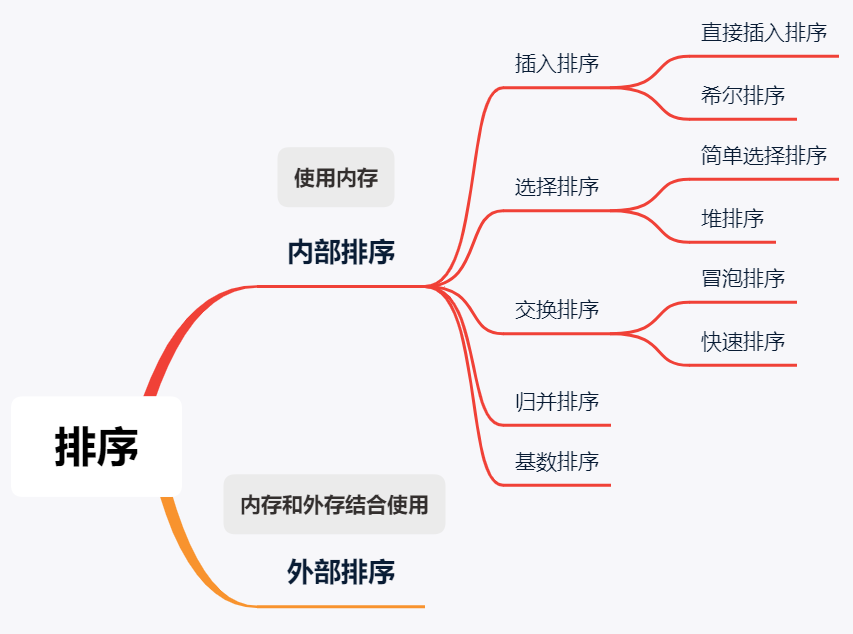

<a id="TopicSummary"></a>

> **题目汇总**
>
> * <font size=4>**循环不变量**</font>
>
>   * **[Leetcode 283. 移动零](https://leetcode-cn.com/problems/move-zeroes/submissions/)** [速览题解](#283)<a id="l283"></a>
>     * 简评：定义 `[0, left)` 全为非零区间，`[right, end]` 全为待检查区间。这道题可以衍生：将区间中 `val` 值移至数组后半部分（本题写法），将区间中 `>= > < <= val` 值移至数组后半部分（`partition` 写法）。
>       另外注意这道题，如果不要求保持非零元素的相对顺序，就可以用 `partition` 的写法
>
> * **[Leetcode 912. 排序数组](https://leetcode-cn.com/problems/sort-an-array/)** [速览题解](#912)<a id="l912"></a>
>   * 简评：使用各种排序算法实现
>
>
> * <font size=4>**比较排序**</font>
>
>   * <font size=4>**选择排序**</font>
>
>     >1.选择排序的交换次数最少，所以如果一个排序任务交换的成本很高，可以选择使用选择排序
>     >2.选择排序的优化是**堆排序**
>     >3.运行时间与输入无关，不会有最差时间复杂度和最优时间复杂度的区分
>     >4.是**不稳定**排序，不稳定在于待排序区间的第一个数，会和待排序区间中的最小值进行交换，但是在该数和最小值这个区间中可能存在与其相同的数
>
>   * <font size=4>**插入排序**</font>
>
>     >1.方式一：逐个交换到前面合适的位置
>     >1.方式二：先暂存当前变量，然后将前面的若干个元素逐个向后赋值
>     >2.插入排序的优化是**希尔排序**
>     >3.插入排序最好的时间复杂度为 $O(N)$。
>     >4.是**稳定**排序
>
>   * <font size=4>**希尔排序**</font>
>
>     >1.我们知道插入排序在数组接近有序的时候，就能越快完成排序任务。**希尔排序是插入排序的优化**，基本思想是对输入数组**执行多次有 "间隔的" 插入排序**，使得数组逐渐有序。最后再执行一次标准的插入排序，即间隔为 1 的插入排序。
>     >2.希尔排序的执行性能与「间隔序列」有关，「间隔序列」是希尔排序的「超参数」。
>     >3.是不稳定排序
>   * <font size=4>**归并排序**</font>
>     >1.是稳定排序
>     >2.优化一：在小区间里使用插入排序（插入排序是稳定的，所以最后的归并也还是稳定的）
>     >2.优化二：子区间本身有序则无需归并
>     >2.优化三：在整个归并的过程中，使用同一个辅助数组
>     * **[Leetcode 189. 旋转数组](https://leetcode-cn.com/problems/rotate-array/)** [速览题解](#189)<a id="l189"></a>
>       * 简评：不是归并排序。1.另开一个等大小的数组赋值过去；2.数组翻转；3.环状替换**后面再看**
>
>         ``` C++
>         nums = "----->-->"; k = 3
>         result = "-->----->";
>         
>         reverse "----->-->" we can get "<--<-----"
>         reverse "<--" we can get "--><-----"
>         reverse "<-----" we can get "-->----->"
>         this visualization help me figure it out :)
>         ```
>
>     * **[Leetcode 88. 合并两个有序数组](https://leetcode-cn.com/problems/merge-sorted-array/)** [速览题解](#88)<a id="l88"></a>
>       * 简评：比较简单，归并排序。**这是重点，后续会涉及到的归并操作就是用这题的写法！**，要熟练的写出来，用 `nums1, nums2` 两个数组分别非空时的执行流程辅助记忆
`while(nums2.iter >= 0) {`
&emsp;&emsp;`while(nums1.iter >= 0 && nums1[iter] >   nums2[iter])`
`}`
>     * **[Leetcode 4. 寻找两个正序数组的中位数](https://leetcode-cn.com/problems/median-of-two-sorted-arrays/)** [速览题解](#4)<a id="l4"></a>
>       * 简评：将两个有序数组归并排序，然后求得中位数，该方法的时间复杂度是$O(m+n)$。使用二分法，时间复杂度可以达到$O(log(m + n))$
>     * **[剑指 Offer 51. 数组中的逆序对](https://leetcode-cn.com/problems/shu-zu-zhong-de-ni-xu-dui-lcof/)** [速览题解](#51)<a id="l51"></a>
>       * 简评：1.这道题是 归并排序 的经典应用，在排序的过程中就将逆序对计算出来；2.注意如何计算逆序对；3.注意我们 归并排序 是要**排成递增数列**，这样在归并的过程中才能完成要求的变量
>     * **[315. 计算右侧小于当前元素的个数](https://leetcode-cn.com/problems/count-of-smaller-numbers-after-self/)** [速览题解](#315)<a id="l315"></a>
>       * 简评：这道题是 归并排序 的另外一个经典应用，相比于上一道题，这里我们要记录它的索引；2.注意如何计算右侧小于当前元素的个数；3.注意我们 归并排序 是要**排成递增数列**，这样在归并的过程中才能完成要求的变量
>
>   * <font size=4>**快速排序**</font>
>     >1.是不稳定排序
>     >2.partition的几种写法
>     >3.随机选择切分元素有一种情况是无效的，那就是输入数组中有大量重复元素的数据：交换过来的元素还是和 pivot 相等的元素。这个时候我们的策略是：把和 pivot 相等的元素平均分到数组的两边，使得递归树平衡，这就有了如下的：
>     >   **[3.1.指针对撞的快速排序（将与pivot重复的元素移至partition两边）](#912)**
>     >   **[3.2.三向切分的快速排序（将与pivot重复的元素移至数组中间）](#912)**
>     * **[26. 删除有序数组中的重复项](https://leetcode-cn.com/problems/remove-duplicates-from-sorted-array/)** [速览题解](#26)<a id="l26"></a>
>       * 简评：**循环不变量练习，注意数组是有序的**。1.本题直接使用的 `partition` 的写法。练习循环不变量，定义两个区间：**[唯一区间] [待处理的区间]**；
>     * **[80. 删除有序数组中的重复项 II](https://leetcode-cn.com/problems/remove-duplicates-from-sorted-array-ii/submissions/)** [速览题解](#80)<a id="l80"></a>
>       * 简评：**循环不变量练习，注意数组是有序的**。1.本题直接使用的 `partition` 的写法。练习循环不变量，在26题的基础上稍微进行修改；2.这道题可以推广到**允许至少k个重复，此时26题就是第80题的特殊情况**
>         **26 和 80 都是删除重复数字，迁移到链表上删除重复数字**
>     * **[215. 数组中的第K个最大元素](https://leetcode-cn.com/problems/kth-largest-element-in-an-array/)** [速览题解](#215)<a id="l215"></a>
>       * 简评：快速排序的变形应用
>     * **[75. 颜色分类](https://leetcode-cn.com/problems/sort-colors/)** [速览题解](#75)<a id="l75"></a>
>       * 简评：对含有大量重复元素的数组排序，用到了三区间的快速排序算法
>     * **[451. 根据字符出现频率排序](https://leetcode-cn.com/problems/sort-characters-by-frequency/)** [速览题解](#451)<a id="l451"></a>
>       * 简评：这道题如果出现在笔试不建议自己写排序，直接使用**优先队列**即可
>
> * <font size=4>**非比较排序**</font>
>   >三类非比较排序的共同特点如下：
>   >1.非比较的意思是：**程序只需要看到这个元素，这个元素的数值就能决定了它所在位置，而不需要通过和其它元素的比较**。这样的思想是 **「桶」的思想**，这种思想是 **「哈希表」（散列表）** 思想的基础。
>   >2.都需要借助额外的空间完成排序，它们都是非原地排序；
>   >3.它们都有一定的机制保证了排序的稳定性；
>   >4.三种非比较排序的应用场景有一定局限性，一般来说，要求数据范围不能太大；
>
>   * <font size=4>**计数排序**</font>
>     >1.是不稳定排序
>     >2.对于每一个输入数组的元素，计算严格小于它的元素的个数（前缀和计数数组），进而把它放到输出数组对应的位置上。这样，在后面倒序赋值回去就保证了稳定性。要想清楚这里使用**前缀和计数数组**，并且**倒序赋值回去**的有效性
>
>   * <font size=4>**基数排序**</font>
>     >1.是稳定排序
>     >2.「基数排序」是一种基于多关键字的排序方法
>     >3.我们比较两个数字的时候，总是先比较最高位。低位优先的基数排序，越高位的排序是放在后面进行的，在高位相同的情况下，需要比较次高位，而次高位在之前的排序中已经排好序
>
>   * <font size=4>**桶排序**</font>
>     >1.桶排序是稳定排序，不是原地排序。这里同样是桶内的排序需要是稳定的排序，整体才会是稳定的。
>     >2.基本方法是，**交换位置法和取负标记法**
>     * **[41. 缺失的第一个正数](https://leetcode-cn.com/problems/first-missing-positive/)** [速览题解](#41)<a id="l41"></a>
>       * 简评：这道题可以用哈希表将 `nums` 中的所有元素都保存下来，然后从 `1` 开始寻找第一个没有出现在哈希表中的最小正整数，**哈希通过映射将这些元素有序化了，使得查询的时间复杂度变为了$O(1)$**。这道题最优的做法是**位置交换法**，具体写法见题解
>     * **[268. 丢失的数字](https://leetcode-cn.com/problems/missing-number/)** [速览题解](#268)<a id="l268"></a>
>       * 简评：丢失的数字是在一个连续的区间，且只有一个数字丢失。那么可以**使用异或**来查找，即将不丢失数字的区间和丢失数字的区间异或起来就是丢失的数字。另外一种经典的方法就是**位置交换法**。这道题用取负标记法比较繁琐，需要对 `0` 进行特殊标记
>     * **[448. 找到所有数组中消失的数字](https://leetcode-cn.com/problems/find-all-numbers-disappeared-in-an-array/)** [速览题解](#448)<a id="l448"></a>
>       * 简评：上一道题的升级版，找到**所有的丢失的数字**
>     * **[287. 寻找重复数](https://leetcode-cn.com/problems/find-the-duplicate-number/)** [速览题解](#287)<a id="l287"></a>
>       * 简评：一共有五种方法，三种不会修改数组的方法：**1.快慢指针法；2.取负标记法；3.二分法**；两种会修改数组的方法：**1.位置交换法，2.`nums[0]` 定位法**
>     * **[442. 数组中重复的数据](https://leetcode-cn.com/problems/find-all-duplicates-in-an-array/)** [速览题解](#442)<a id="l442"></a>
>       * 简评：上一道题的升级版，找到所有的重复的数字
>       * **上面连续三道题，数组含有 `n` 个元素，且元素值均在 `[1, ..., n]` 中，有缺失就必然有重复**

---

<a id="912"></a>

### [Leetcode 912. 排序数组](#l912)

```C++{.line-numbers}
// 冒泡排序
class Solution {
public:
    vector<int> sortArray(vector<int>& nums) {
        for(int i = nums.size() - 1; i > 0; i--)
        {
            for(int j = 0; j < i; j++)
            {
                if(nums[j] > nums[j + 1])
                    swap(nums[j], nums[j + 1]);
            }
        }
        return nums;
    }
};

// 选择排序
class Solution {
public:
    vector<int> sortArray(vector<int>& nums) {

        // 注意选择排序的循环不变量的描述
        // [0, i) 为已排序区间，[i, end]为待排序区间
        for(int i = 0; i < nums.size() - 1; i++)
        {
            int min = i;
            for(int j = i; j < nums.size(); j++)
                if(nums[j] < nums[min])
                    min = j;
            swap(nums[i], nums[min]);
        }
        return nums;
    }
};

// 插入排序
class Solution {
public:
    vector<int> sortArray(vector<int>& nums) {
        for(int i = 1; i < nums.size(); i++)
        {
            int temp = nums[i];
            int j = i;
            // 注意这里是 nums[j - 1] > temp，不是nums[j - 1] > nums[j]
            for(; j > 0 && nums[j - 1] > temp; j--)
                    nums[j] = nums[j - 1];
            
            nums[j] = temp;
        }
        return nums;
    }
};

// 归并排序
class Solution {
public:
    void mergeSort(vector<int> &nums, int left, int right, vector<int> &temp)
    {
        if(left >= right)
            return;
        int mid = left + (right - left) / 2;
        mergeSort(nums, left, mid, temp);
        mergeSort(nums, mid + 1, right, temp);
        
        // 注意这里的写法和 "88.合并两个有序的数组" 写法是一致的，尽管temp不是从0开始
        // 直接在 mergeSort 中写合并部分
        // nums: [left, ..., mid,                    ]
        // temp: [                mid + 1, ..., right]
        for(int i = mid + 1; i <= right; i++)
            temp[i] = nums[i];
        int nleft = left,    nright = mid;
        int tleft = mid + 1, tright = right;
        int index = right;
        while(tright >= tleft)
        {
            while(nright >= nleft && nums[nright] > temp[tright])
            {
                nums[index--] = nums[nright--];
            }
            nums[index--] = temp[tright--];
        }
    }
    vector<int> sortArray(vector<int>& nums) {
        vector<int> temp(nums.size(), 0);
        mergeSort(nums, 0, nums.size() - 1, temp);
        return nums;
    }
};

// 快速排序
class Solution {
public:
    // 第一种 partition 的写法
    int partition(vector<int>& nums, int left, int right)
    {
        swap(nums[left], nums[left + rand() % (right - left + 1)]);
        // 循环不变量： pivot 为小于等于 nums[left] 区域
        // [left + 1, pivot] < nums[left]
        // [pivot + 1, i) >= nums[left]
        int pivot = left;
        // 注意，这里取等号
        for (int i = left + 1; i <= right; i++) {
            if (nums[i] < nums[left]) {
                swap(nums[i], nums[++pivot]);
            }
        }
        // 最后这一步要记得交换到切分元素的位置
        swap(nums[left], nums[pivot]);
        return pivot;
    }
    // 第二种 partition 的写法，不推荐
    int partition(vector<int>& nums, int left, int right)
    {
        swap(nums[left], nums[left + rand() % (right - left + 1)]);
        int pivot = nums[left];
        int first = left;
        
        while(left < right)
        {
            while(left < right && nums[right] >= pivot)
                right--;
            while(left < right && nums[left] <= pivot)
                left++;
            swap(nums[left], nums[right]);
        }
        swap(nums[left], nums[first]);
        return left;
    }
    void quickSort(vector<int>& nums, int left, int right)
    {
        if(left > right) return ;

        int pos = partition(nums, left, right);
        quickSort(nums, left, pos - 1);
        quickSort(nums, pos + 1, right);
    }
    vector<int> sortArray(vector<int>& nums) {
        
        quickSort(nums, 0, nums.size() - 1);
        return nums;
    }
};

// 指针碰撞的快速排序，将与pivot重复的元素移至partition两边
class Solution {
public:
    int partition(vector<int>& nums, int left, int right)
    {
        swap(nums[left], nums[left + rand() % (right - left + 1)]);
        int pivot = nums[left];
        int le = left + 1;
        int ge = right;
        while (true) {
            // 注意：这里一定是 nums[le] < pivot，等于 pivot 的元素是被交换过来得到的
            while (le <= ge && nums[le] < pivot) {
                le++;
            }
            // 此时 le 来到第 1 个大于等于 pivot 的位置
            while (le <= ge && nums[ge] > pivot) {
                ge--;
            }
            // 此时 ge 来到第 1 个小于等于 pivot 的位置
            if (le > ge) {
                break;
            }

            swap(nums[le], nums[ge]);
            le++;
            ge--;
        }
        swap(nums[left], nums[ge]);
        return ge;
    }
    void quickSort(vector<int>& nums, int left, int right)
    {
        if(left > right) return ;

        int pos = partition(nums, left, right);
        quickSort(nums, left, pos - 1);
        quickSort(nums, pos + 1, right);
    }
    vector<int> sortArray(vector<int>& nums) {
        
        quickSort(nums, 0, nums.size() - 1);
        return nums;
    }
};

// 三向切分的快速排序，将与pivot重复的元素移到数组中间
class Solution {
public:
    void quickSort(vector<int>& nums, int left, int right)
    {
        if(left > right) return ;

        swap(nums[left], nums[left + rand() % (right - left + 1)]);

        // all in [left + 1, lt] < pivot
        // all in [lt + 1, i) = pivot
        // all in [gt, right] > pivot
        int pivot = nums[left];
        int lt = left;
        int gt = right + 1;
        int i = left + 1;
        while(i < gt)
        {
            if(nums[i] < pivot)
            {
                lt++;
                swap(nums[i], nums[lt]);
                i++;
            }
            else if(nums[i] == pivot)
                i++;
            else
            {
                gt--;
                swap(nums[i], nums[gt]);
            }
        }
        swap(nums[left], nums[lt]);
        // 注意这里，大大减少了分治的区间，区间 [lt, gt - 1] 不必递归求解
        quickSort(nums, left, lt - 1);
        quickSort(nums, gt, right);
    }
    vector<int> sortArray(vector<int>& nums) {
        
        quickSort(nums, 0, nums.size() - 1);
        return nums;
    }
};
// 上面的简化版
class Solution {
public:
    void quickSort(vector<int> &nums, int left, int right)
    {
        if(left >= right)
            return;

        swap(nums[left], nums[left + rand() % (right - left + 1)]);
        // [left, ..., lpivot] 为小于 nums[left] 的区域
        // [rpivot, ...,  end] 为大于 nums[left] 的区域
        // 注意 lpivot 和 rpivot 的初始化在有效区域
        int lpivot = left;
        int rpivot = right + 1;
        for(int i = left + 1; i < rpivot; i++)
        {
            if(nums[i] < nums[left])
                swap(nums[++lpivot], nums[i]);
            else if(nums[i] > nums[left])
            {
                swap(nums[--rpivot], nums[i]);
                // 为什么要i--，因为从后面换过来的可能小于nums[left]，
                // 还需要对当前i元素进行判断
                i--; 
            }
        }
        // (lpivot, ..., rpivot)为等于 nums[left] 的区域
        swap(nums[left], nums[lpivot]);

        // [lpivot, ..., rpivot) == nums[left]
        quickSort(nums, left, lpivot - 1);
        quickSort(nums, rpivot , right);
    }
    vector<int> sortArray(vector<int>& nums) {
        vector<int> temp(nums.size(), 0);
        quickSort(nums, 0, nums.size() - 1);
        return nums;
    }
};

// 堆排序
class Solution
{
public:
    vector<int> sortArray(vector<int> &vec)
    {
        heapify(vec);

        for (int i = vec.size() - 1; i >= 0; i--)
        {
            swap(vec[i], vec[0]);
            shiftDown(vec, 0, i - 1);
        }
        return vec;
    }
    void heapify(vector<int> &vec)
    {
        int sz = vec.size();
        for (int i = ((sz - 2) / 2); i >= 0; i--)
        {
            shiftDown(vec, i, sz - 1);
        }
    }
    void shiftDown(vector<int> &vec, int left, int right)
    {
        int temp = vec[left];

        for (int i = left * 2 + 1; i <= right; i = i * 2 + 1)
        {
            if (i + 1 <= right && vec[i] < vec[i + 1])
                i++;
            if (vec[i] <= temp)
                break;
            vec[left] = vec[i];
            left = i;
        }
        vec[left] = temp;
    }
};
```

<a id="283"></a>

### [Leetcode 283. 移动零](#l283)

```C++{.line-numbers}
class Solution {
public:
    void moveZeroes(vector<int>& nums) {
        if(nums.size() <= 1) return;

        int left = 0; // [0, left) 全为非零区间
        int right = 0; // [right, end] 全为待检查区间

        while(right < nums.size())
        {
            if(right < nums.size() && nums[right] != 0)
            {
                nums[left] = nums[right];
                left++;
            }
            right++;
        }

        while(left < nums.size())
        {
            nums[left] = 0;
            left++;
        }

        return;
    }
};

// 如果不要求保持非零元素的相对顺序
// partition的写法
class Solution {
public:
    void moveZeroes(vector<int>& nums) {
        if(nums.size() <= 1) return;

        int pivot = 0;
        for(int i = 1; i < nums.size(); i++)
            if(nums[i] != 0)
                swap(nums[i], nums[pivot++]);
    }
};
class Solution {
public:
    void moveZeroes(vector<int>& nums) {
        if(nums.size() <= 1) return;

        int pivot = 0;
        for(int i = 1; i < nums.size(); i++)
            if(nums[i] != 0)
                swap(nums[i], nums[++pivot]);
        swap(nums[0], nums[pivot]);
    }
};
```

<a id="88"></a>

### [Leetcode 88. 合并两个有序数组](#l88)

```C++{.line-numbers}
class Solution {
public:
    void merge(vector<int>& nums1, int m, vector<int>& nums2, int n) {
        int i = nums1.size() - 1;
        m--;
        n--;
        while (n >= 0) {
            while (m >= 0 && nums1[m] > nums2[n]) {
                swap(nums1[i--], nums1[m--]);
            }
            swap(nums1[i--], nums2[n--]);
        }
    }
};

// 详细版本
class Solution {
public:
    void merge(vector<int>& nums1, int m, vector<int>& nums2, int n) {
        int i = nums1.size() - 1;
        m--;
        n--;
        // 只有 nums1 有数据，nums2 没有数据，不进入循环
        while(n >= 0)
        {
            // 只有 nums2 有数据，nums1 没有数据，不进入循环
            while(m >= 0 && nums1[m] > nums2[n])
            {
                nums1[i] = nums1[m];
                i--;
                m--;
            }
            nums1[i] = nums2[n];
            i--;
            n--;
        }
    }
};
```

<a id="189"></a>

### [Leetcode 189. 旋转数组](#l189)

```C++{.line-numbers}
// 空间复杂度比较高
class Solution {
public:
    void rotate(vector<int>& nums, int k) {
        int sz = nums.size();
        vector<int> temp(sz, 0);

        for(int i = 0; i < sz; i++)
            temp[(i + k) % sz] = nums[i];
        
        nums.assign(temp.begin(), temp.end());
    }
};

// 数组翻转
class Solution {
public:
    void reverse(vector<int>& nums, int left, int right)
    {
        for(; left < right; left++, right--)
        {
            int temp = nums[left];
            nums[left] = nums[right];
            nums[right] = temp;
        }
    }
    void rotate(vector<int>& nums, int k) {
        reverse(nums, 0, nums.size() - 1);
        reverse(nums, 0, k % nums.size() - 1);
        reverse(nums, k % nums.size(), nums.size() - 1);
    }
};
```

<a id="4"></a>

### [Leetcode 4. 寻找两个正序数组的中位数](#l4)

```C++{.line-numbers}
class Solution {
public:
    double findMedianSortedArrays(vector<int>& nums1, vector<int>& nums2) {
        // 注意下面两句的先后顺序
        int i = nums1.size() - 1;
        nums1.resize(nums1.size() + nums2.size());
        int j = nums2.size() - 1;
        int index = nums1.size() - 1;
        while(j >= 0)
        {
            while(i >= 0 && nums1[i] > nums2[j])
                nums1[index--] = nums1[i--];
            nums1[index--] = nums2[j--];
        }
        int sz = nums1.size() - 1;
        return sz % 2 == 0? nums1[sz / 2]: (double)(nums1[sz / 2] + nums1[sz / 2 + 1]) / 2; 
        // 这里注意
        // [0   1   2           3   4    5]
        //          ^           ^
        //   (sz-1)(5)/2    (sz)(6)/2
        //     向下取整       向上取整
        // [0   1         2         3    4]
        //                ^
        //    (sz-1)(4)/2、(sz)(5)/2
        //     向下取整       向上取整
    }
};

// 二分法
class Solution {
public:
    int getKthElement(const vector<int>& nums1, const vector<int>& nums2, int k) {
        /* 主要思路：要找到第 k (k>1) 小的元素，那么就取 pivot1 = nums1[k/2-1] 和 pivot2 = nums2[k/2-1] 进行比较
         * 这里的 "/" 表示整除
         * nums1 中小于等于 pivot1 的元素有 nums1[0 .. k/2-2] 共计 k/2-1 个
         * nums2 中小于等于 pivot2 的元素有 nums2[0 .. k/2-2] 共计 k/2-1 个
         * 取 pivot = min(pivot1, pivot2)，两个数组中小于等于 pivot 的元素共计不会超过 (k/2-1) + (k/2-1) <= k-2 个
         * 这样 pivot 本身最大也只能是第 k-1 小的元素
         * 如果 pivot = pivot1，那么 nums1[0 .. k/2-1] 都不可能是第 k 小的元素。把这些元素全部 "删除"，剩下的作为新的 nums1 数组
         * 如果 pivot = pivot2，那么 nums2[0 .. k/2-1] 都不可能是第 k 小的元素。把这些元素全部 "删除"，剩下的作为新的 nums2 数组
         * 由于我们 "删除" 了一些元素（这些元素都比第 k 小的元素要小），因此需要修改 k 的值，减去删除的数的个数
         */

        int m = nums1.size();
        int n = nums2.size();
        int index1 = 0, index2 = 0;

        while (true) {
            // 边界情况
            if (index1 == m) {
                return nums2[index2 + k - 1];
            }
            if (index2 == n) {
                return nums1[index1 + k - 1];
            }
            if (k == 1) {
                return min(nums1[index1], nums2[index2]);
            }

            // 正常情况
            int newIndex1 = min(index1 + k / 2 - 1, m - 1);
            int newIndex2 = min(index2 + k / 2 - 1, n - 1);
            int pivot1 = nums1[newIndex1];
            int pivot2 = nums2[newIndex2];
            if (pivot1 <= pivot2) {
                k -= newIndex1 - index1 + 1;
                index1 = newIndex1 + 1;
            }
            else {
                k -= newIndex2 - index2 + 1;
                index2 = newIndex2 + 1;
            }
        }
    }

    double findMedianSortedArrays(vector<int>& nums1, vector<int>& nums2) {
        int totalLength = nums1.size() + nums2.size();
        // 注意序数和基数的区别
        if (totalLength % 2 == 1) {
            return getKthElement(nums1, nums2, (totalLength + 1) / 2);
        }
        else {
            return (getKthElement(nums1, nums2, totalLength / 2) + getKthElement(nums1, nums2, totalLength / 2 + 1)) / 2.0;
        }
    }
};
```

<a id="51"></a>

### [剑指 Offer 51. 数组中的逆序对](#j51)

```C++{.line-numbers}
// 下面有三种写法，每种写法由于合并两个有序数组的写法不同，导致求逆序对不同
class Solution {
public:
    int reversePairs(vector<int>& nums) {
        vector<int> tmp(nums.size());
        return mergeSort(0, nums.size() - 1, nums, tmp);
    }
private:
    int mergeSort(int left, int right, vector<int>& nums, vector<int>& tmp) {
        // 终止条件
        if (left >= right) return 0;
        // 递归划分
        int m = (left + right) / 2;
        int res = mergeSort(left, m, nums, tmp) + mergeSort(m + 1, right, nums, tmp);
        // 合并阶段
        int i = left, j = m + 1;
        for (int k = left; k <= right; k++)
            tmp[k] = nums[k];
        for (int k = left; k <= right; k++) 
        {
            if (i == m + 1) // [left, mid]走完
                nums[k] = tmp[j++];
            else if (j == right + 1 || tmp[i] <= tmp[j]) // [mid + 1, right]走完 或者 小于等于
                nums[k] = tmp[i++];
            else // 大于，构成逆序对
            {
                nums[k] = tmp[j++];
                res += m - i + 1; // 统计逆序对
            }
        }
        return res;
    }
};

class Solution {
public:
    int reversePairs(vector<int>& nums) {
        vector<int> tmp(nums.size());
        return mergeSort(0, nums.size() - 1, nums, tmp);
    }
private:
    int mergeSort(int left, int right, vector<int>& nums, vector<int>& tmp) {
        // 终止条件
        if (left >= right) return 0;
        // 递归划分
        int mid = (left + right) / 2;
        int res = mergeSort(left, mid, nums, tmp) + mergeSort(mid + 1, right, nums, tmp);
        // 合并阶段，参考 [88.合并两个有序数组] 的代码
        // nums:[       startIndex       ]
        // nums:            [rleft, right]
        // tmp: [left, mid]
        int rleft = mid + 1, 
        int startIndex = left;
        for(int i = left; i <= mid; i++)
            tmp[i] = nums[i];
        while(left <= mid) // 必须优先保证tmp中的元素全部插入
        {
            while(rleft <= right && tmp[left] > nums[rleft])
            {
                // 当tmp[left] > nums[rleft] 时，由于tmp[left ~ mid]有序
                // 必然有tmp[left ~ mid] > num[rleft]
                nums[startIndex++] = nums[rleft++];
                res += mid + 1 - left;
            }
            nums[startIndex++] = tmp[left++];
        }
        return res;
    }
};

// 另一种
class Solution {
public:
    void mergeSort(vector<int> &nums, int left, int right, vector<int> &temp, int &res)
    {
        if(left >= right)
            return;
        int mid = left + (right - left) / 2;
        mergeSort(nums, left, mid, temp, res);
        mergeSort(nums, mid + 1, right, temp, res);

        for(int i = mid + 1; i <= right; i++)
            temp [i] = nums[i];
        // nums: [4, 5, 6,        ]
        // temp: [       , 1, 2, 3]
        // 求逆序对与上面不同，注意重复计算问题
        // 为什么与上面不同，因为赋值顺序不同，一个逆序，一个顺序
        int nleft = left, nright = mid;
        int tleft = mid + 1, tright = right;
        int index = right;
        while(tright >= tleft)
        {
            while(nright >= nleft && nums[nright] > temp[tright])
            {
                res += tright - mid; // 计算逆序对
                nums[index--] = nums[nright--];
            }
            nums[index--] = temp[tright--];
        }
    }
    int reversePairs(vector<int>& nums) {
        int res = 0;
        vector<int> temp(nums.size(), 0);
        mergeSort(nums, 0, nums.size() - 1, temp, res);
        return res;
    }
};
```

<a id="315"></a>

### [Leetcode 315. 计算右侧小于当前元素的个数](#l315)

```C++{.line-numbers}
class Solution {
public:
    void merge(vector<int>& nums, int left, int right, vector<int>& index, vector<int>& tmp, vector<int>& count)
    {
        if(left >= right) return;
        int mid = left + (right - left) / 2;
        merge(nums, left, mid, index, tmp, count);
        merge(nums, mid + 1, right, index, tmp, count);

        // nums:  [                        ]
        // index: [       startIndex       ]
        // index:             [rleft, right]
        // tmp:   [left, mid]
        int rleft = mid + 1;
        int startIndex = left;
        for(int i = left; i <= mid; i++)
            tmp[i] = index[i];
        while(left <= mid)
        {
            while(rleft <= right && nums[tmp[left]] > nums[index[rleft]])
            {
                // 不要在这里面计算count！！
                index[startIndex++] = index[rleft++];
            }
            // 当 nums[left] < nums[rleft] 时
            // 必然有 nums[mid + 1 ~ rleft - 1] < nums[left]
            // 此时可以计算出比右边比 nums[left] 小的数的个数
            // nums:[100 200 300 1 2 100000]
            //        ^                 ^
            // idx: [left             rleft]
            count[tmp[left]] += (rleft - mid - 1);
            index[startIndex++] = tmp[left++];
        }
    }
    vector<int> countSmaller(vector<int>& nums) {
        vector<int> count(nums.size(), 0);
        vector<int> tmp(nums.size(), 0);
        vector<int> index(nums.size(), 0);
        for(int i = 0; i < nums.size(); i++)
        {
            index[i] = i;
            tmp[i] = i;
        }
        merge(nums, 0, nums.size() - 1, index, tmp, count);
        return count;
    }
};

class Solution {
public:
    void mergeSort(vector<int>& nums, vector<int>& index, vector<int>& temp, vector<int>& count, int left, int right)
    {
        if(left >= right)
            return;
        
        int mid = left + (right - left) / 2;
        mergeSort(nums, index, temp, count, left, mid);
        mergeSort(nums, index, temp, count, mid + 1, right);

        for(int i = mid + 1; i <= right; i++)
            temp[i] = index[i];
        int ileft = left, iright = mid;
        int tleft = mid + 1, tright = right;
        int ind = right;
        while(tright >= tleft)
        {
            while(iright >= ileft && nums[index[iright]] > nums[temp[tright]])
            {
                // 和计算逆序对一样，都是(tright - mid)，都是在ind--前计算
                count[index[iright]] += (tright - mid);
                index[ind--] = index[iright--];
            }
            index[ind--] = temp[tright--];
        }
    }
    vector<int> countSmaller(vector<int>& nums) {
        vector<int> count(nums.size(), 0);
        vector<int> index(nums.size(), 0);
        vector<int> temp(nums.size(), 0);
        for(int i = 0; i < nums.size(); i++)
            index[i] = i;

        mergeSort(nums, index, temp, count, 0, nums.size() - 1);

        return count;
    }
};
```

<a id="26"></a>

### [Leetcode 26. 删除有序数组中的重复项](#l26)

```C++{.line-numbers}
class Solution {
public:
    int removeDuplicates(vector<int>& nums) {
        if(nums.size() <= 1) return nums.size();

        // [pivot1 repeat1 repeat1 repeat1]...[pivotn repeatn repeatn repeatn]
        // [pivot1 ... pivotn][...]
        // 建议用这种写法，有一个用于比较的数
        int pivot = 0;
        for(int i = 1; i < nums.size(); i++)
        {
            if(nums[i] != nums[pivot])
                swap(nums[++pivot], nums[i]);
        }

        return pivot + 1;
    }
};
```

<a id="80"></a>

### [Leetcode 80. 删除有序数组中的重复项 II](#l80)

```C++{.line-numbers}
class Solution {
public:
    int removeDuplicates(vector<int>& nums) {
        if(nums.size() <= 2) return nums.size();

        int pivot = nums[0];
        int unique = 0;
        int cnt = 1;
        for(int i = unique + 1; i < nums.size(); i++)
            if(nums[i] != pivot)
            {
                unique++;
                swap(nums[i], nums[unique]);
                pivot = nums[unique];
                cnt = 1;
            }
            else if(nums[i] == pivot && cnt > 0)
            {
                unique++;
                swap(nums[i], nums[unique]);
                cnt--;
            }
            
        return unique + 1;
    }
};

// 可扩展的写法
class Solution {
public:
    int removeDuplicates(vector<int>& nums) {
        if(nums.size() <= 2) return nums.size();

        int pivot = 1;
        for(int i = 2; i < nums.size(); i++)
        {
            if(nums[i] != nums[pivot - 1])
                swap(nums[++pivot], nums[i]);
        }

        return pivot + 1;
    }
};
// 允许重复 repeat 个
class Solution {
public:
    int removeDuplicates(vector<int>& nums) {
        if(nums.size() <= 2) return nums.size();

        int repeat = 2;

        int pivot = repeat - 1;
        for(int i = repeat; i < nums.size(); i++)
        {
            if(nums[i] != nums[pivot - repeat + 1])
                swap(nums[++pivot], nums[i]);
        }

        return pivot + 1;
    }
};
```

<a id="215"></a>

### [Leetcode 215. 数组中的第K个最大元素](#l215)

```C++{.line-numbers}
class Solution {
public:
    int partition(vector<int> &nums, int left, int right)
    {
        swap(nums[left], nums[left + rand() % (right - left + 1)]);
        int pivot = nums[left];

        int lt = left;
        for(int i = left + 1; i <= right; i++)
            if(nums[i] < pivot)
            {
                lt++;
                swap(nums[lt], nums[i]);
            }
        swap(nums[left], nums[lt]);
        return lt;
    }
    int quickSort(vector<int> &nums, int left, int right, int k)
    {
        if(left > right) return - 1;

        int pos = partition(nums, left, right);
        if(pos == k)
            return pos;
        else if(pos > k)
            return quickSort(nums, left, pos - 1, k);
        else
            return quickSort(nums, pos + 1, right, k);
    }
    int findKthLargest(vector<int>& nums, int k) {
        int pos = quickSort(nums, 0, nums.size() - 1, nums.size() - k);
        if(pos != -1) return nums[pos];
        else return -1;
    }
};

// 简洁一点的写法
class Solution {
public:
    int quickSort(vector<int> &nums, int left, int right, int k)
    {
        if(left >= right)
            return nums[left];
        
        swap(nums[left], nums[left + rand() % (right - left + 1)]);
        int pivot = left;
        for(int i = left + 1; i <= right; i++)
            if(nums[i] > nums[left])
                swap(nums[++pivot], nums[i]);
        swap(nums[pivot], nums[left]);

        if(pivot + 1 < k)
            return quickSort(nums, pivot + 1, right, k);
        else
            return quickSort(nums, left, pivot, k);
    }
    int findKthLargest(vector<int>& nums, int k) {
        return quickSort(nums, 0, nums.size() - 1, k);
    }
};
```

<a id="75"></a>

### [Leetcode 75. 颜色分类](#l75)

```C++{.line-numbers}
class Solution {
public:
    void quickSort(vector<int> &nums, int left, int right)
    {
        if(left >= right)
            return;
        swap(nums[left], nums[left + rand() % (right - left + 1)]);
        int lpivot = left;
        int rpivot = right + 1;
        for(int i = left + 1; i < rpivot; i++)
        {
            if(nums[i] < nums[left])
                swap(nums[++lpivot], nums[i]);
            else if(nums[i] > nums[left])
                swap(nums[--rpivot], nums[i--]);
        }
        swap(nums[left], nums[lpivot]);
        quickSort(nums, left, lpivot - 1);
        quickSort(nums, rpivot, right);

    }
    void sortColors(vector<int>& nums) {
        quickSort(nums, 0, nums.size() - 1);

    }
};
```

<a id="451"></a>

### [Leetcode 451. 根据字符出现频率排序](#l451)

```C++{.line-numbers}
class Solution {
public:
    void quickSort(vector<pair<char, int>> &nums, int left, int right)
    {
        if(left > right) return;

        int povit = nums[left].second;
        int lt = left;
        int gt = right + 1;
        int i = left + 1;
        while(i < gt)
        {
            if(nums[i].second > povit) // 注意是降序排列
            {
                lt++;
                swap(nums[lt], nums[i]);
                i++;
            }
            else if(nums[i].second == povit)
                i++;
            else
            {
                gt--;
                swap(nums[gt], nums[i]);
            }
        }
        swap(nums[left], nums[lt]);
        quickSort(nums, left, lt - 1);
        quickSort(nums, gt, right);
    }
    string frequencySort(string s) {
        unordered_map<char, int> mp;
        for(int c: s)
            mp[c]++;

        if(mp.size() == 1) return s;
        vector<pair<char, int>> nums(mp.begin(), mp.end());
        quickSort(nums, 0, nums.size() - 1);

        string res;
        for(int i = 0; i < nums.size(); i++)
            for(int j = 0; j < nums[i].second; j++)
                res += nums[i].first;

        return res;
    }
};

// 使用内置的优先队列
class Solution {
public:
    struct cmp
    {
        bool operator()(pair<char, int> &a, pair<char, int> &b)
        {
            return a.second < b.second;
        }
    };
    string frequencySort(string s) {
        unordered_map<char, int> mp;
        for(auto c: s)
            mp[c]++;
        priority_queue<pair<char, int>, vector<pair<char, int>>, cmp> q{mp.begin(), mp.end()};

        string res;
        pair<char, int> temp;
        while(!q.empty())
        {
            temp = q.top(); q.pop();
            for(int i = temp.second; i > 0; i--)
                res += temp.first;
        }

        return res;
    }
};
```

<a id="41"></a>

### [Leetcode 41. 缺失的第一个正数](#l41)

```C++{.line-numbers}
// 有注释版本
class Solution {
public:
    int firstMissingPositive(vector<int>& nums) {
    int len = nums.size();  
    for (int i = 0; i < len; ++i) {
        //这里用while是因为交换回来的值不一定是"值配其位"的，那么就可能还需要进行交换
        //比如[4,1,2,3]
        // 1.第一次将4与3交换，形成[3,1,2,4]，明显3是"值不配位"的，也满足条件，进入新的交换
        // 2.第二次将3与2交换，形成[2,1,3,4]，明显2也是"值不配位"的，且满足条件，进入新的交换
        // 3.第三次将2与1交换，形成[1,2,3,4]，值全都配位了，后面的while也就都不会进了
        // (此处也说明while循环不会每一次都把数组里面的所有元素都看一遍。如果有一些元素在这一次的循环中
        // 被交换到了它们应该在的位置，那么在后续的遍历中，由于它们已经在正确的位置上了，代码再执行到它们
        // 的时候，就会被跳过。----引用自@liweiwei1419的题解)
        //**所以此处不能用if**
        while (nums[i] > 0 && nums[i] <= len && nums[nums[i] - 1] != nums[i]) {
            //将出现的值都交换到相应的位置上，组成一个近似排序的数组
            //其中的负数和大于数组长度的值都可以不用管，因为它是作为一个出口存在的
            //这里值1放在索引0上，即值(i)需要放在索引(i-1)上
            int temp = nums[nums[i] - 1];
            nums[nums[i] - 1] = nums[i];
            nums[i] = temp;
        }
    }
    for (int i = 0; i < len; ++i) {
        //第一个不满足 值(nums[i])=索引(i+1) 的值所在索引(i)+1即最小未出现的正整数
        //注意：以下的例子都是经过换位之后
        //例1：[1,2,3,4] 这个例子是完全排序的数组，且每个位置都正确，那么就应该返回数组长度+1，而不是3+1
        //例2：[1,-1,3,4] 其中-1是第一个也是唯一一个"值不配位"的值，那么它所占的位置就是未出现的最小正整数
        //例3：[5,11,7,9] 这个例子是完全没有进入while排序的，因为他们所有的值都"值不配位"，那么同上面的例2，
        // 第一个"值不配位"的值所占的位置就是未出现的最小正整数
        if (nums[i] != i + 1) {
            return i + 1;
        }
    }
    // 都正确则返回数组长度 + 1
    return len + 1;
    }
};

class Solution {
public:
    int firstMissingPositive(vector<int>& nums) {
        
        for(int i = 0; i < nums.size(); i++)
        {
            while(0 < nums[i] && nums[i] <= nums.size() && nums[i] != nums[nums[i] - 1])
                swap(nums[i], nums[nums[i] - 1]);
        }

        for(int i = 0; i < nums.size(); i++)
            if(nums[i] != i + 1)
                return i + 1;
        return nums.size() + 1;
    }
};
```

<a id="268"></a>

### [Leetcode 268. 丢失的数字](#l268)

```C++{.line-numbers}
// 异或
class Solution {
public:
    int missingNumber(vector<int>& nums) {
        int res = nums.size(); // 这里注意
        for(int i = 0; i < nums.size(); i++)
        {
            res ^= nums[i];
            res ^= i;
        }
        return res;
    }
};

// 位置交换法
class Solution {
public:
    int missingNumber(vector<int>& nums) {
        int len = nums.size();
        for(int i = 0; i < len; i++)
        {
            // 注意这里为什么不用 nums[i] - 1
            while((nums[i] < len) && nums[nums[i]] != nums[i])
            {
                swap(nums[i], nums[nums[i]]);
            }
        }
        for(int i = 0; i < len; i++)
            if(nums[i] != i)
                return i;
        return len;
    }
};

// 取负标记法
class Solution {
public:
    int missingNumber(vector<int>& nums) {
        int len = nums.size();
        for(int i = 0; i < len; i++)
        {
            int index = abs(nums[i] == INT_MIN ? 0: nums[i]);
           
            if(index < len && nums[index] >= 0)
            {
                if(nums[index] == 0)
                    nums[index] = INT_MIN;
                else
                    nums[index] = -nums[index];
            }
        }
        for(int i = 0; i < nums.size(); i++)
            if(nums[i] >= 0)
                return i;
        return len;
    }
};
```

<a id="448"></a>

### [Leetcode 448. 找到所有数组中消失的数字](#l448)

```C++{.line-numbers}
// 位置交换法
class Solution {
public:
    vector<int> findDisappearedNumbers(vector<int>& nums) {
        vector<int> res;
        int n = nums.size();

        for (int i = 0; i < n; i++) 
        {
            while ((nums[i] - 1) < n && nums[nums[i] - 1] != nums[i]) 
                swap(nums[i], nums[nums[i] - 1]);
        }
        for (int i = 0; i < n; i++) 
        {
            if (nums[i] != i + 1) res.push_back(i + 1);
        }
        return res;
    }
};

// 取负标记法
class Solution {
public:
    vector<int> findDisappearedNumbers(vector<int>& nums) {
        vector<int> res;
        
        for(int i = 0; i < nums.size(); i++)
        {
            int index = abs(nums[i]) - 1;
            if(nums[index] > 0) // 未被访问过
                nums[index] = -nums[index];
        }

        for(int i = 0; i < nums.size(); i++)
            if(nums[i] < 0)
                nums[i] = -nums[i]; // 复原
            else
                res.push_back(i + 1);
        return res;
    }
};
```

<a id="287"></a>

### [Leetcode 287. 寻找重复数](#l287)

```C++{.line-numbers}
// 转化为求环形链表，快慢指针。不会修改原数组
class Solution {
public:
    int findDuplicate(vector<int>& nums) {
        int fast = 0, slow = 0;
        while(true)
        {
            fast = nums[nums[fast]];
            slow = nums[slow];
            if(fast == slow)
                break;
        }
        fast = 0;
        while(slow != fast)
        {
            fast = nums[fast];
            slow = nums[slow];
        }

        return slow;
    }
};

// 第二种不会修改数组元素的方法。
// 把当前数字对应下标的数字取负，如果已经是负数说明出现过了，
// 直接返回当前数字的绝对值。将所有负数取反就复原了
class Solution {
public:
    int findDuplicate(vector<int>& nums) {
        int n = nums.size();
        for(int i = 0; i < n; i++)
        {
            // 小于0，说明已经有元素访问过这里了
            if(nums[abs(nums[i])] < 0)
                return abs(nums[i]);
            // 进行标记
            else
                nums[abs(nums[i])] = -nums[abs(nums[i])];
        }
        return 0;
    }
};

// 会修改原数组，非常简单的写法
// 不断将下标0的元素与该元素表示的下标的元素交换，
// 直到两个元素相等，此时下标0的元素即为要找的数字
// 但是注意，这种写法只适合只有一个重复元素的情况，
// 如果有多个重复的元素可能会在nums[0]重复
class Solution {
public:
    int findDuplicate(vector<int>& nums) {
        while(nums[0] != nums[nums[0]])
            swap(nums[0], nums[nums[0]]);

        return nums[0];
    }
};

//逻辑版本
class Solution {
public:
    int findDuplicate(vector<int>& nums) {
        int i = 0, n = nums.size();
        for(; i < n; i++)
            while(nums[i] != nums[nums[i]])
                swap(nums[i],nums[nums[i]]);

        for(int j = 0; j < n; ++j)
            if(j + 1 != nums[j])
                return nums[j];
        return -1;
    }
};
//优化版本
class Solution {
public:
    int findDuplicate(vector<int>& nums) {
        int i = 0, n = nums.size();
        
        for(; i < n; i++)
        {
            while(nums[i] < n && nums[i] != nums[nums[i]])
                swap(nums[i], nums[nums[i]]);

            if(i + 1 != nums[i])
                return nums[i];
        }
        return -1;
    }
};

// 二分法
class Solution {
public:
    int findDuplicate(vector<int> &nums) {
        int left = 1, right = nums.size() - 1;

        while (left < right) {
            int mid = left + (right - left) / 2;

            int cnt = 0;
            for (int num:nums)
                if (num <= mid)
                    cnt++;

            // 根据抽屉原理，小于等于 4 的数的个数如果严格大于 4 个，
            // 此时重复元素一定出现在 [1, 4] 区间里
            if (cnt > mid) {
                // 重复的元素一定出现在 [left, mid] 区间里
                right = mid;
            } else {
                // if 分析正确了以后，else 搜索的区间就是 if 的反面
                // [mid + 1, right]
                // 注意：此时需要调整中位数的取法为上取整
                left = mid + 1;
            }
        }
        return left;
    }
};
```

<a id="442"></a>

### [Leetcode 442. 数组中重复的数据](#l442)

```C++{.line-numbers}
// 交换位置法
class Solution {
public:
    vector<int> findDuplicates(vector<int>& nums) {
        int len = nums.size();
        vector<int> res;

        for(int i = 0; i < len; i++)
        {
            while((nums[i] - 1) < len && nums[nums[i] - 1] != nums[i])
                swap(nums[nums[i] - 1], nums[i]);
        }

        for(int i = 0; i < len; i++)
            if(nums[i] != i + 1)
                res.push_back(nums[i]);

        return res;
    }
};

// 取负标记法写法一
class Solution {
public:
    vector<int> findDuplicates(vector<int>& nums) {
        vector<int> res;
        for(int i = 0; i < nums.size(); i++)
        {
            int index = abs(nums[i]) - 1;
            if(nums[index] < 0) // 代表nums[i] - 1 被访问过了
                res.push_back(abs(nums[i]));
            else
                nums[index] = -nums[index];
        }

        return res;
    }
};
// 取负标记法写法二
class Solution {
public:
    vector<int> findDuplicates(vector<int>& nums) {
        int len = nums.size(); 
        if(len == 0) return {};
        
        vector<int>res;

        for(int i = 0; i < len; i++)
        {
            int num = abs(nums[i]);
            if(nums[num - 1] > 0)
               nums[num - 1] *=(-1);
            else res.push_back(num);       
        }
    
    return res;
    }
};
```
