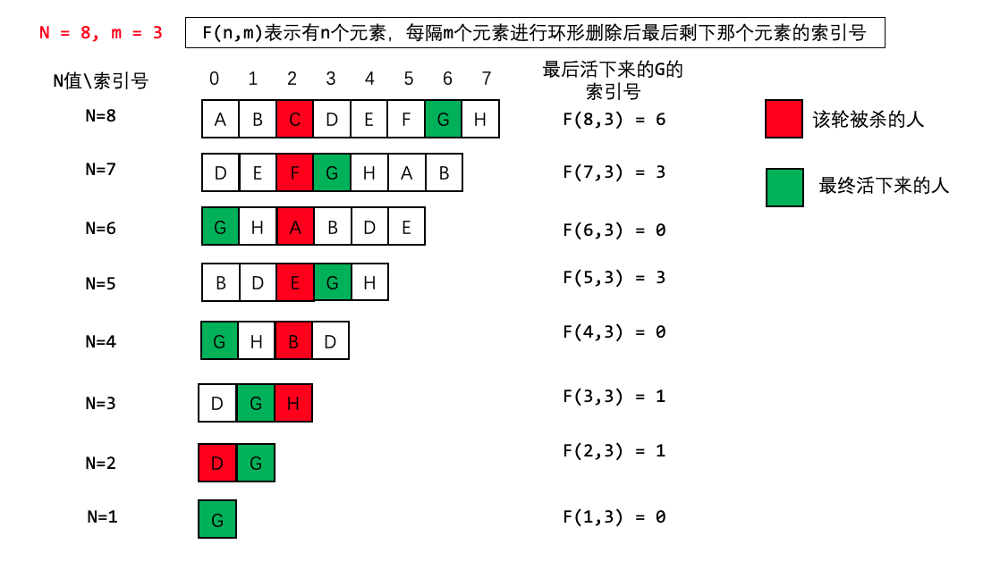

>**剑指offer 62.圆圈中最后剩下的数字**：0,1,···,n-1这n个数字排成一个圆圈，从数字0开始，每次从这个圆圈里删除第m个数字（删除后从下一个数字开始计数）。求出这个圆圈里剩下的最后一个数字。
例如，0、1、2、3、4这5个数字组成一个圆圈，从数字0开始每次删除第3个数字，则删除的前4个数字依次是2、0、4、1，因此最后剩下的数字是3。
示例 1：
输入: n = 5, m = 3
输出: 3
示例 2：
输入: n = 10, m = 17
输出: 2
限制：
1 <= n <= 10^5
1 <= m <= 10^6

#### 解法一：数组解法

下面的解法在牛客网上面能够通过，但是在Leetcode中第26个示例会超时，这里如果在遍历的同时将元素从数组中删除，从而降低后续循环的判断次数，应该不会超时。

```C++{.line-numbers}
class Solution {
public:
    int lastRemaining(int n, int m) {
        if(!n) return -1;
        vector<int> temp(n, -1);
        int num = n;
        int cur = 0;
        for(; n > 1; n--)
        {
            int index = 0;
            while(index < m)
            {
                if(temp[cur] == -1)
                {
                    if(index == m - 1)
                        temp[cur] = cur;
                    index++;
                    cur = (cur + 1) % num;
                }
                else
                {   
                    cur = (cur + 1) % num;
                }
            }
        }
        
        int i = 0;
        for(; temp[i] != -1; i++);
        return i;
    }
};
```

#### 解法二：数学推导

转自：
- [换个角度举例解决约瑟夫环——作者aspenstarss](https://leetcode-cn.com/problems/yuan-quan-zhong-zui-hou-sheng-xia-de-shu-zi-lcof/solution/huan-ge-jiao-du-ju-li-jie-jue-yue-se-fu-huan-by-as/)
- [约瑟夫环——公式法（递推公式）](https://blog.csdn.net/u011500062/article/details/72855826)

##### 解题思路

阅前提示（全文最重要的点）：**只关心最终活着那个人的序号变化。**

##### 1. 约瑟夫问题

这个问题实际上是约瑟夫问题，这个问题描述是：
>N个人围成一圈，第一个人从1开始报数，报M的将被杀掉，下一个人接着从1开始报。如此反复，最后剩下一个，求最后的胜利者。

这里换了个角度举例，或许会更清晰一些，欢迎大家讨论，并不吝赐教！

##### 2. 问题转换

既然约塞夫问题就是用人来举例的，那我们也**给每个人一个编号（索引值）**，每个人用**字母**代替。

下面这个例子是 `N=8 m=3`的例子。我们定义 `F(n,m)` 表示最后剩下那个人的索引号，因此我们只关系最后剩下来这个人的索引号的变化情况即可：



从8个人开始，每次杀掉一个人，去掉被杀的人，然后把杀掉那个人之后的第一个人作为开头重新编号。

- 第一次C被杀掉，人数变成7，D作为开头，（最终活下来的G的编号从6变成3）
- 第二次F被杀掉，人数变成6，G作为开头，（最终活下来的G的编号从3变成0）
- 第三次A被杀掉，人数变成5，B作为开头，（最终活下来的G的编号从0变成3）
- 以此类推，当只剩一个人时，他的编号必定为0！（重点！）

##### 3. 最终活着的人编号的反推

现在我们知道了G的索引号的变化过程，那么我们反推一下从N = 7 到N = 8 的过程。如何才能将N = 7 的排列变回到N = 8 呢？

我们先把被杀掉的C补充回来，然后右移m个人，发现溢出了，再把溢出的补充在最前面。神奇了，经过这个操作就恢复了N = 8 的排列了！


因此我们可以推出递推公式：
$$
f(8,3) = [f(7, 3) + 3] \% 8
$$进行推广泛化，即
$$
f(n,m) = [f(n-1, m) + m] \% n
$$

##### 4. 递推公式的导出

再把n=1这个最初的情况加上，就得到递推公式

$$
f(n,m)=
\begin{cases}
0,&n \text{ = 1} \\
[f(n-1, m) + m] \% n,&n \text{ > 1}
\end{cases}
$$

为了更好理解，这里是拿着约瑟夫环的结论进行举例解释，具体的数学证明请参考维基百科。

##### 5. 代码

照着递推公式写即可，也可写成递归的形式

```C++{.line-numbers}
//作者：aspenstarss
class Solution {
public:
    int lastRemaining(int n, int m) {
        int pos = 0; // 最终活下来那个人的初始位置
        for(int i = 2; i <= n; i++){
            pos = (pos + m) % i;  // 每次循环右移
        }
        return pos;
    }
};


//作者：dou-bi-5
class Solution {
public:
    int lastRemaining(int n, int m) {
        return n==1?0:(lastRemaining(n-1,m)+m)%n;
    }
};
```
