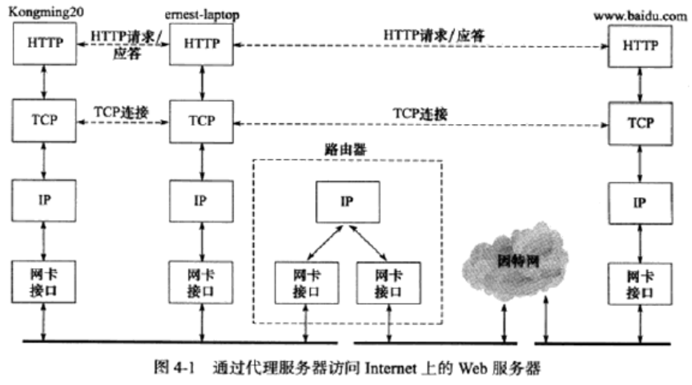
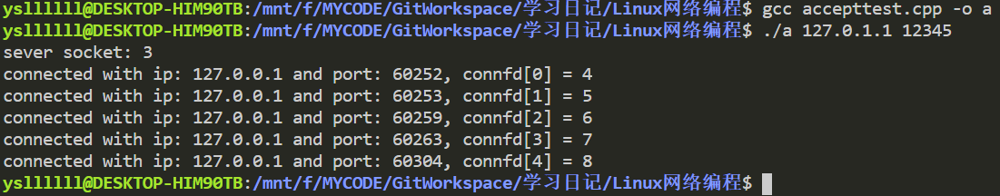
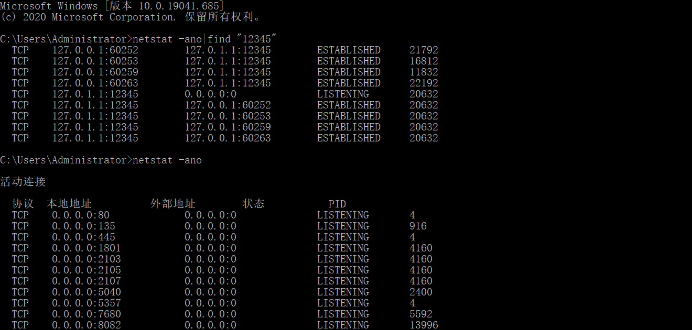
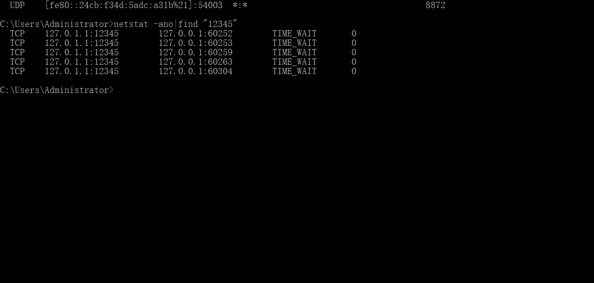
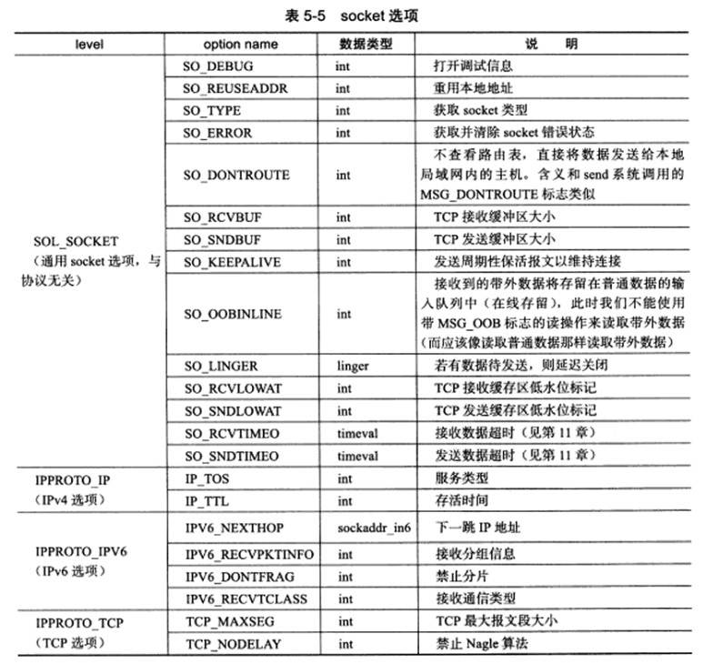

### Linux 高性能服务器编程：tcp 协议详解

> tcp 服务的特点

- 面向连接、字节流和可靠传输  
- tcp 的连接是一对一的，基于广播和多播的应用程序不能使用 tcp 服务，而无连接协议 udp 则非常适合于广播和多播

> tcp 头部结构  
> 用于指定通信的源端端号，目的端号，管理 tcp 的连接

- tcp 固定头部结构  
  **16 位源端口号/16 位目的端口号**：客户端通常使用系统自动选择的临时端口号，而服务器则使用知名服务端口号  
  **32 位序号**：一个传输方向上的字节流的每个字节的编号  
  **32 位确认号**：其值是收到的 tcp 报文段的 32 位序号值加 1  
  **4 位头部长度**：单位为字节，表示 tcp 头部的大小  
  **6 位标志位**：区分紧急指针、确认报文段、复位报文段、同步报文段、结束报文段  
  **16 为窗口大小**：告诉对方本端的 tcp 接收缓冲区还能容纳多少字节  
  **16 位校验和**：  
  **16 位紧急指针**：  
- tcp 头部选项  
  kind = 0 是选项表结束选项  
  kind = 1 是空操作，无含义  
  kind = 2 是最大报文段长度选项，通信双方使用该选项来协商最大报文段长度  
  kind = 3 是窗口扩大因子  
  kind = 4 是选择性确认选项  
  kind = 5 是选择性确认实际工作的选项  
  kind = 8 是时间戳选项  
- 使用 tcpdump 观测 tcp 头部信息  
  无

> tcp 连接的建立和关闭

- 使用 tcpdump 观测 tcp 连接的建立和关闭
- 半关闭状态  
  如果请求端关闭或者异常终止了连接，而对方没有接收到结束报文段，这时，对方仍然维持着原来的连接，而请求端将丢失这个连接的相关信息。这时这个连接就是半打开连接  
  使用半关闭的应用程序很少见
- 连接超时  
  每次重连的超时时间都增加一倍，在 5 次重连均失败的情况下，tcp 模块放弃连接并通知应用程序

> tcp 状态转移  
> tcp 端口的状态可以使用 netstat 命令查看

- tcp 状态转移总图  
  
- time_wait 状态  
  time_wait状态在经过2MSL时间后才进入close状态
  可靠地终止tcp连接：防止报文段7丢失后无法接收到服务端重新发送的报文段6  
  保证让迟来的tcp报文段有足够的时间被识别丢弃：若立即将该接口让给其它应用程序A使用，则可能让A接收到一个迟到的发送给上一个应用程序的报文段（例如网络比较拥堵，这个报文段走了很长的路程）

> 复位报文段  
> 通知对方关闭连接或重新建立连接

- 访问不存在的端口  
  访问不存在的端口或者访问的端口处于被time_wait状态的连接所占用时，目标端会回复一个复位报文段，收到该复位报文段后，请求端就应该关闭连接或者重新进行连接，而不能回应这个复位报文段。  
- 异常终止连接  
  发送复位报文段后，发送端所有排队等待发送的数据都将被丢弃。
- 处理半打开连接  
  往处于半打开状态的连接写入数据，对方会回应一个复位报文段。

> tcp 交互数据流  

- 使用交互数据的应用程序对实时性要求较高。  
- 延迟确认：即高速的一端发送给低速的一端的确认报文段中包含有数据，这样可以减少发送tcp报文段的数量。因为服务器对客户请求处理速度快，所以它发送确认报文段的时候总是有数据一起发送。同时由于用户的输入速度明显慢于客户端程序的处理速度，所以客户端的确认报文段总是不携带任何应用程序数据。  
- 另外由于携带交互数据的微小tcp报文段数量一般很多，这些可能会导致拥塞发生，解决该问题的一个简单有效的算法是使用Nagle算法。

> tcp 成块数据流

- 使用成块数据的应用程序对传输效率要求较高
- 需要注意的参数包括：接收窗口大小、成块数据大小

> 带外数据（紧急数据）

- 带外数据就是比较紧急的数据，它的传输可以使用独立的传输层连接，也可以复用普通数据的传输连接。
- udp没有带外数据传输，tcp也没有真正意义上的带外数据传输，但是tcp可以利用紧急指针标志和紧急指针两个字段给应用程序提供一种紧急方式。
- tcp复用普通数据的传输连接来传输紧急数据。
- tcp模块发送和接收带外数据的过程参考书上的过程，比较详细。

> tcp 超时重传

- tcp在多次超时重传均失败的情况下，底层的ip和arp开始接管，直到telnet客户端放弃连接为止。
- Linux有两个重要的内核参数与tcp超时重传相关：
  - /proc/sys/net/ipv4/tcp_retries1（指定在底层ip接管前tcp最少执行的重传次数，默认值为3）
  - /proc/sys/net/ipv4/tcp_retries2（指定连接放弃tcp最多可以执行的重传次数，默认值为15，一般对应13~30min）

> 拥塞控制

- 拥塞控制概述
  - 拥塞控制的四个部分：慢启动、拥塞避免、快速启动、快速恢复。
  - Linux使用的哪种拥塞控制算法，可以在/proc/sys/net/ipv4/ tcp_congestion_control中查看。
  - 拥塞控制的最终受控变量是发送端向网络一次连续写入（收到其中第一个数据的确认之前）的数据量，我们称为 SWND（send window，发送窗口），SWND = min(RWND, CWND)；
    - 接收方有一个接收通告窗口RWND。
    - 发送端引入的一个拥塞窗口（CWND）。
  - SMSS(sender maximum segment size，发送者最大段大小)，是指tcp报文段的最大长度。

- 慢启动和拥塞避免
- 快速重传和快速恢复

### Linux 高性能服务器编程：tcp/ip通信案例：访问Internet上的web服务器

> 简介：实例总图


Kongming20为客户端，在该客户端与Internet上的服务器的访问之间，为了观察客户端与服务器之间交互内容的方便，我们添加一个中间层：代理服务器（实例中是ernest-laptop），当然这里并不是说不观察就不需要这个代理服务器，实际上它还有其它用途，例如缓存服务器返回的客户端所请求的目标资源，这样用户下次访问同一资源时速度将很快。

有了这个代理服务器之后，我们所有的客户端对Internet上的服务器的请求都会首先被发送到该代理服务器，然后该代理服务器对这个请求进行简单的修改，然后再发送给Internet上的服务器。反过来同样，Internet上的服务器对该请求的回答报文首先发送给代理服务器，然后代理服务器再返还给客户端。  

说完了代理服务器的作用，再说说客户端将会在应用层使用到的两个东西：HTTP协议和DNS服务。

HTTP协议：在客户端程序与代理服务器之间，以及代理服务器与服务器之间通信时，应用层协议都是使用的HTTP，该应用层协议默认使用的传输层协议是TCP协议。

DNS服务：通信就意味着我们必需给定一个目标，这个目标在人的层面是一个目标主机名，在机器的层面就是一个IP地址。在给定目标的时候，我可以直接给定IP地址，但如果我给定的是目标主机名，那么机器就会主动将该目标主机名变换到IP地址，这就涉及了DNS服务和/etc/hosts静态文件。其中DNS服务使用的传输层协议是UDP协议，后面有关于将目标主机名转换为IP地址的详细介绍。

> 部署代理服务器

- HTTP代理服务器的工作原理
  - 正向代理：客户端
  - 反向代理：服务器端
  - 透明代理：网关，是正向代理的一种特例
- 部署squid代理服务器
  - 通过命令行的方式部署

> 使用tcpdump抓取传输数据包

> 第一部分：访问DNS服务器 && 本地名称查询

- 在客户端访问本地的主机（目标主机名填充为主机名）或网络上的主机（目标主机名填充为域名）时，都需要优先查询目标主机名对应的IP地址。

- 通过域名来访问Internet上的某台主机时，客户端需要使用DNS服务来获取该主机的IP地址。自然而然的在这之前，客户端也需要获得DNS服务器的IP地址，这比较简单，通过读取/etc/resolv.conf文件就可以获得。

- 通过主机名来访问本地局域网上的机器，客户端可通过本地的静态文件来获得该机器的IP地址，这个静态文件就是/etc/hosts。例如客户端访问同网段的代理服务器就会查询这个静态文件（该静态文件记录有代理服务器的主机名和对应的IP地址）。

- 通过前面两点，我们知道可以在两个地方查询目标主机名对应的IP地址：/etc/hosts和DNS服务器。更进一步，根据描述似乎如果访问的是域名就直接选择DNS服务获取IP地址地址，如果访问的是本地局域网的主机名就直接选择查找静态文件/etc/hosts。但实际上，获取目标主机名（不论给出的是域名还是主机名）的IP地址将优先查找/etc/hosts，如果程序在etc/hosts文件中未找到目标机器名对应的IP地址，它才求助于DNS服务。同时这种优先级是可以配置的，你可以配置为优先访问DNS，再查找静态文件/etc/hosts，这个配置保存在/etc/host.conf中。如下所示。
  - 第一行表示优先使用/etc/hosts文件来解析主机名（hosts），失败后再使用DNS服务器（bind）。
  - 第二行表示如果/etc/hosts文件中一个主机名对应多个IP地址，那么解析的结果就包含多个IP地址。

```shell
$ cat /etc/host.conf
order hosts, bind
multi on
```

> 第二部份：HTTP通信，这部分比较重要，面试可能会问

- HTTP请求
  
  - 请求行，行以< CR >< LF >结束  
    - GET：以只读的方式获取资源  
    - HEAD：与GET方法类似，不过只要求服务器返回头部信息，不必返回任何实际内容  
    - TRACE：要求目标服务器返回原始内容，而不是经过代理服务器修改过的内容  
    - CONNECT：用于某个代理服务器，让它把请求的连接转化为一个安全隧道  
    - OPTIONS：查看服务器针对特定的URL支持哪些请求方法，如果为*，表示获取服务器支持的所有请求方法  
    - POST：客户端向服务器提交数据  
    - PUT：上传某个资源  
    - DELETE：删除某个资源  
    - PATCH：对某个资源作部分修改
  - 头部字段：每行以< CR >< LF >结束
    - User-Agent  
    - Host：必须包含该字段。  
    - Connection：短连接 / 长连接
  - 末尾必须以< CR >< LF >结束

- HTTP应答
  - 状态行，行以< CR >< LF >结束
    - 1xx 信息  
    100 Continue  
    - 2xx 成功  
    200 OK  
    - 3xx 重定向  
    301 Moved Permanently  
    302 Found  
    303 Not Modified  
    307 Temporary Redirect
    - 4xx 客户端错误  
    400 Bad Request  
    401 Unauthorized  
    403 Forbidden  
    404 Not Found  
    407 Proxy Authentication Required  
    - 5xx 服务器错误  
    500 Internal Server Error  
    503 Service Unavailable  
  - 头部字段，每行以< CR >< LF >结束
    - Server  
    - Content-Length  
    - Content-Type  
    - Set-Cookie：弥补Http协议的无状态性所带来的缺点。由于无状态性，客户端需要重复把自己的信息告诉给服务器，服务器利用这些信息才能知道客户端是谁，这就导致了HTTP必须传输更多的数据。如果使用了Cookie，服务器就能够记住客户端，之后客户端在和服务器交流时附带上Cookie（头部字段），就能让服务器知道客户端是谁了，相对来说避免了冗余的客户端自我介绍的信息。  
    - Via：表示HTTP应答在返回的过程中经历过的所有代理服务器的地址和名称。
  - 末尾必须以< CR >< LF >结束

> 实例总结

### Linux 高性能服务器编程：Linux网络编程基础API

>**主机字节序和网络字节序**

- 字节序分为`大端字节序`和`小端字节序`
- 小端字节序：由于PC多数采用小端字节序，所以小端字节序又被称为**主机字节序**。
- 大端字节序：网络中流动的字节，其格式总是大端字节序，所以大端字节序也称为**网络字节序**。
- 上述是一种**默认方式**。这样发送主机往网络中发送字节时，总是要将其转换为大端字节序。接收主机从网络中接收字节时，就知道这些字节的格式一定是大端字节序，如果自己就是大端字节序就不同转换，如果自己是小端字节序就需要对这个接收大的大端字节序进行转换。
- 相关的函数
  
    ```C
    #include <netinet/in.h>
    unsigned long int htonl (unsigned long int hostlong); // host to network long
    unsigned short int htons (unsigned short int hostlong); // host to network short

    unsigned long int ntohl (unsigned long int netlong);
    unsigned short int ntohs (unsigned short int netlong);
    ```

#### 1. 基础数据结构struct 和 格式转换API

> 通用**socket地址**结构体
  
**socket地址**是通过一个**结构体**来进行表达，结构体为sockaddr，注意这是一个通用的socket地址，可以表达多个协议族。

```C
#include <bits/socket.h>
struct sockaddr
{
    sa_family_t sa_family; // 地址族类型的变量
    char sa_data[14];
}
```

尽管为了通用的目的，sockaddr结构体还是存在无法完全容纳多数协议族的地址的问题，为此添加了另外一个升级版：sockaddr_storage结构体，它能够容纳更长的地址且内存对齐。

```C
#include <bits/socket.h>
struct sockaddr_storage
{
    sa_family_t sa_family; // 地址族类型的变量
    unsigned long int __ss_align;
    char __ss_padding[128-sizeof(__ss_align)];
}
```

地址族变量sa_family可以取值如下：
|  协议族  |  地址族  |       描述       |
| :------: | :------: | :--------------: |
| PF_UNIX  | AF_UNIX  | UNIX本地域协议族 |
| PF_INET  | AF_INET  |  TCP/IPv4协议族  |
| PF_INET6 | AF_INET6 |  TCP/IPv6协议族  |

> 专用**socket地址** 结构体

通用的socket由于其表达性较差，Linux针对三种地址族提供了各自专用的socket地址结构体：

- 针对UNIX

  ```C
  #include <sys/un.h>
  struct sockaddr_un
  {
      sa_family_t sin_family;/*地址族：AF_UNIX*/
      char sun_path[108];/*本地文件路径名*/
  }
  ```

- 针对IPv4

  ```C
  struct sockaddr_in
  {
      sa_family_t sin_family;/*地址族：AF_INET*/
      u_int16_t sin_port;/*端口号，要用网络字节序，因为要传输到网络上去，而且从网络上接收时也是接收的网络字节序*/
      struct in_addr sin_addr;/*IPv4地址结构体，见下面*/
  }
  struct in_addr
  {
      u_int32_t s_addr;/*IPv4地址，要用网络字节序，因为要传输到网络上去，而且从网络上接收时也是接收的网络字节序*/
  }
  ```

- 针对IPv6

  ```C
  struct sockaddr_in6
  {
      sa_family_t sin6_family;/*地址族：AF_INET6*/
      u_int16_t sin6_port;/*端口号，要用网络字节序，因为要传输到网络上去，而且从网络上接收时也是接收的网络字节序*/
      u_int32_t sin6_flowinfo;/*流信息，应设置为0*/
      struct in6_addr sin6_addr;/*IPv6地址结构体，见下面*/
      u_int32_t sin6_scope_id;/*scope ID ,尚处于实验阶段*/
  }
  struct in6_addr
  {
      unsigned char sa_addr[16];/*IPv6地址，要用网络字节序，因为要传输到网络上去，而且从网络上接收时也是接收的网络字节序*/
  }
  ```

- **值得注意的是**：专用socket地址结构体在初始化完成后，在进行实际使用的时候要转化为通用socket地址结构体sockaddr，这是因为socket编程接口使用的地址参数都是sockaddr。即：

  ```C
  (struct sockaddr*) &sockaddr_storage;
  (struct sockaddr*) &sockaddr_un;
  (struct sockaddr*) &sockaddr_in;
  (struct sockaddr*) &sockaddr_in6;
  ```

> **整数IP地址和字符串IP地址之间的转换**

- IPv4地址转换函数：在点分十进制字符串表示的IPv4地址和用网络字节序整数表示的IPv4之间转化。

  ```C
  // IP地址转换函数
    #include <arpa/inet.h>
    struct in_addr//表示一个32位的IPv4地址。in_addr_t一般为32位的unsigned int，其字节顺序为网络字节序
    {
    in_addr_t s_addr;
    };

    // 将点分十进制字符串的IPv4地址, 转换为网络字节序整数表示的IPv4地址. 失败返回INADDR_NONE
    in_addr_t  inet_addr( const char* strptr);

    // 功能相同不过转换结果存在 inp指向的结构体中. 成功返回1 反之返回0
    int inet_aton( const char* cp, struct in_addr* inp);

    // 将网络字节序字符串转化为字符串，函数返回一个静态变量地址值, 所以多次调用会导致覆盖
    char* inet_ntoa(struct in_addr in); 
  ```

- IPv4和IPv6转换函数

  ```C
    // src为 点分十进制字符串的IPv4地址 或 十六进制字符串表示的IPv6地址 
    // dst指定结果存放的内存
    // af指定地址族，可以为 AF_INET AF_INET6 
    // 成功返回1 失败返回-1
    int inet_pton(int af, const char * src, void* dst);
    // 协议名, 需要转换的ip, 存储地址, 长度
    // 长度有两个常量 INET_ADDRSTRLEN = 16, INET6_ADDRSTRLEN = 46
    const char* inet_ntop(int af, const void*  src, char* dst, socklen_t cnt);
  ```

#### 2. 基础API

- **服务器端**

  ```C
  //创建socket：创建一个文件，创建的过程中只指定这个socket的协议族
  # include <sys/types.h>
  # include <sys/socket.h>
  // domain指定使用那个协议族 PF_INET PF_INET6，区别地址族
  // type指定服务类型 SOCK_STREAM (TCP协议) SOCK_DGRAM(UDP协议)
  // protocol设置为默认的0
  // 成功返回socket文件描述符(linux一切皆文件), 失败返回-1
  int socket(int domain, int type, int protocol);

  //命令socket：（服务器端特有）创建时只指定了协议族，但是未分配一个该协议族下的地址，命名就是分配一个地址。（客户端又系统自动分配）
  // socket为socket文件描述符
  // my_addr 为地址信息
  // addrlen为socket地址长度
  // 成功返回0 失败返回 -1 并设置errno（EACCES、EADDRINUSE）
  int bind(int socket, const struct sockaddr* my_addr, socklen_t addrlen);

  //监听socket：使该socket处于可接受客户连接状态，并指定可以连接客户数量。可以看出这是——一对多——的情形
  //服务器通过listen调用来被动接受连接，客户端使用connect系统调用来主动与服务器建立连接，
  // backlog表示队列最大的长度
  int listen(int socket, int backlog);

  //接受客户端连接
  // sockfd 执行过listen的监听socket
  // addr 远端socket地址
  // addrlen 远端socket地址长度
  // 接受连接 失败返回-1 成功时返回新的连接socket
  int accept(int sockfd, struct sockaddr* addr, socklen_t* addrlen)
  ```

- **客户端**
  
  ```C
  //创建socket：创建一个文件，创建的过程中只指定这个socket的协议族
  # include <sys/types.h>
  # include <sys/socket.h>
  // domain指定使用那个协议族 PF_INET PF_INET6，区别地址族
  // type指定服务类型 SOCK_STREAM (TCP协议) SOCK_DGRAM(UDP协议)
  // protocol设置为默认的0
  // 成功返回socket文件描述符(linux一切皆文件), 失败返回-1
  int socket(int domain, int type, int protocol);

  #include <sys/types.h>
  #include <sys/socket.h>

  //客户端主动连接：客户端使用connect系统调用来主动与服务器建立连接，服务器通过listen调用来被动接受连接
  // sockfd 客户端创建的用于通信的socket
  // serv_addr 服务器监听的socket地址
  // addrlen 该地址从长度
  // 成功返回0 失败返回-1并设置error（ECONNREFUSED ETIMEOUT）
  int connect( int sockfd, const struct sockaddr *serv_addr, socklen_t addrlen)

  // 关闭连接：多进程程序中，一次fork系统调用默认将父进程中打开的socket的引用计数加1，所以close作为一种常规的关闭普通文件系统调用，只是将该socket的引用计数减1。
  #include <unistd.h>
  // 参数为保存的socket
  // 并非立即关闭, 将socket的引用计数-1, 当fd的引用计数为0, 才能关闭
  int close(int fd);

  // 立即关闭：如果要立即关闭该连接，而不是在它的引用次数上减1，就需要使用这个专用的系统调用：shutdown。
  #include <sys/socket.h>
  // 第二个参数为可选值 
  //    SHUT_RD 关闭读, socket的接收缓冲区的数据全部丢弃
  //    SHUT_WR 关闭写 socket的发送缓冲区全部在关闭前发送出去
  //    SHUT_RDWR 同时关闭读和写
  // 成功返回0 失败为-1 设置errno
  int shutdown(int sockfd, int howto)
  ```

- **实验：**
  
  由于书上是使用的两台Linux系统，我这里使用的是vscode中的WSL，但是也可以做实验，只不过另外一个端要使用cmd。相关指令包括：

  ```shell
  # wsl中：
  cat /etc/hosts # 查看WSL使用的远程Linux系统的IP地址：127.0.1.1
  gcc backlog.c -o backlog
  ./backlog 127.0.1.1 12345 5

  # 以下7个命令分别输入7个cmd中：
  telnet 127.0.1.1 12345
  telnet 127.0.1.1 12345
  telnet 127.0.1.1 12345
  telnet 127.0.1.1 12345
  telnet 127.0.1.1 12345
  telnet 127.0.1.1 12345
  netstat -aon|findstr "12345"
  ```

  由于系统差异，这里就算我设置为了5也没啥作用。

- 关于**accept接受连接** 的一些细节

  之前提到过，监听socket处在**一对多**的状态，但是服务器和客户端通信时使用的运输层协议可能是TCP协议，我们的TCP协议是**一对一**的协议，那么这是不是就矛盾了呢？

  答案是没有，我们服务端的监听socket通过accept来接收一个客户端的连接请求，然后该监听socket会重新分配一个socket来记录这个连接（这个socket就是连接socket）。所以**一对多**是**一个监听socket**对**多个客户端**，TCP连接的一对一是**一个连接socket**对**一个客户端**，而这个连接socket就是由监听socket通过accept创建出来的。

  验证如下，程序参考`accepttest.cpp`。
  运行结果解释如下：

  - socket 3为**服务端监听socket**。
  - 有5个客户端与服务器建立了连接，socket 4、5、6、7、8均为**服务端连接socket**

  
  

  

#### 3. 数据读写API

- **TCP数据读写**
  
  ```C
  #include<sys/socket.h>
  #include<sys/types.h>

  //读取
  // sockfd 本端待读取数据的socket
  // buf 指定读缓冲区的位置
  // len 指定读缓冲区的大小
  // flags 参数较多, 只对send和recv的当前调用有效, 不影响socket属性
  // 成功的时候返回读取到的长度, 可能小于预期长度, 需要多次读取
  // 读取到0 通信对方已经关闭连接, 错误返回-1并设置error
  ssize_t recv(int sockfd, void *buf, size_t len, int flags);
  
  // 发送
  // sockfd 本端待发送数据的socket
  // buf 指定写缓冲区的位置
  // len 指定写缓冲区的大小
  // flags 参数较多, 只对send和recv的当前调用有效, 不影响socket属性
  // 成功时返回实际写入的数据, 失败返回-1并设置error
  ssize_t send(int sockfd, const void *buf, size_t len, int flags);
  ```

- **UDP数据读写**
  
  ```C
  #include <sys/types.h>
  #include <sys/socket.h>

  // 由于UDP不保存状态, 每次发送数据都需要 加入目标地址.
  // 不过recvfrom和sendto 也可以用于 面向STREAM的连接, 这样可以省略发送和接收端的socket地址
  
  //接收
  // sockfd 本端待读取数据的socket
  // buf 指定读取缓冲区位置
  // len 指定读取缓冲区大小
  // flag 与TCP的send/recv含义一致, 只对recvfrom和sendto的当前调用有效, 不影响socket属性
  // src_addr 数据发送端的socket地址
  // addrlen 指定该地址长度
  ssize_t recvfrom(int sockfd, void *buf, size_t len, int flags, struct sockaddr* src_addr, socklen_t* addrlen);

  //发送
  // sockfd 本端待发送数据的socket
  // buf 指定读取缓冲区位置
  // len 指定读取缓冲区大小
  // flag 与TCP的send/recv含义一致, 只对recvfrom和sendto的当前调用有效, 不影响socket属性
  // dest_addr 数据接收端的socket地址
  // addrlen 指定该地址长度
  ssize_t sendto(int sockfd, const void* buf, size_t len, ing flags, const struct sockaddr* dest_addr, socklen_t addrlen);
  ```

- **通用数据读写**

  ```C
  #inclued <sys/socket.h>

  // flags 与TCP的send/recv含义一致
  ssize_t recvmsg(int sockfd, struct msghdr* msg, int flags);
  ssize_t sendmsg(int sockfd, struct msghdr* msg, int flags);

  struct msghdr
  { 
      void* msg_name; //指向socket地址结构变量, 对于TCP连接需要设置为NULL

      socklen_t msg_namelen;//socket地址的长度
      
      // 分散读：对recvmsg来说数据被读取后将存放在这里的块内存中, 内存的位置和长度由msg_iov指向的数组指定, 称为分散读(scatter read)
      // 集中写：对于sendmsg而言, msg_iovlen块的分散内存中的数据将一并发送称为集中写(gather write);
      struct iovec* msg_iov;// 分散的内存块
      int msg_iovlen; // 分散内存块的数量
      void* msg_control; // 指向辅助数据的起始位置
      socklen_t msg_controllen; // 辅助数据的大小
      int msg_flags; // 复制函数的flags参数, 并在调用过程中更新,
  };

  struct iovec
  {
      void* iov_base /* 内存起始地址*/
      size_t iov_len /* 这块内存长度*/
  }
  ```

- **flag取值**

  |    选项名     | 含义                                                                                          | send  | recv  |
  | :-----------: | --------------------------------------------------------------------------------------------- | :---: | :---: |
  |  MSG_CONFIRM  | 指示链路层协议持续监听, 直到得到答复.(仅能用于SOCK_DGRAM和SOCK_RAW类型的socket)               |   √   |       |
  | MSG_DONTROUTE | 不查看路由表, 直接将数据发送给本地的局域网络的主机(代表发送者知道目标主机就在本地网络中)      |   √   |       |
  | MSG_DONTWAIT  | 非阻塞                                                                                        |   √   |   √   |
  |   MSG_MORE    | 告知内核有更多的数据要发送, 等到数据写入缓冲区完毕后一并发送.减少短小报文的发送，提高传输效率 |   √   |       |
  |  MSG_WAITALL  | 读操作一直等待到读取到指定数量的字节后才会返回                                                |       |   √   |
  |   MSG_PEEK    | 看一下内缓存数据, 并不会将数据删除                                                            |       |   √   |
  |    MSG_OOB    | 发送或接收紧急数据                                                                            |   √   |   √   |
  | MSG_NOSIGNAL  | 向读端关闭的管道或者socket连接中写入数据不会触发SIGPIPE信号                                   |   √   |       |

#### 4. socket 属性设置专用 API

```C
//getsockopt()读取socket文件描述符信息
//setsockopt()设置socket文件描述符信息
#include <sys/socket.h>
// sockfd 目标socket 
// level执行操作协议(IPv4, IPv6, TCP) 
// option_name 参数指定了选项的名字
// option_value 选项的值
// option_len 选项的长度
// 成功时返回0 失败返回-1并设置error
int getsockopt(int sockfd, int level, int option_name, void* option_value, socklen_t restrict option_len);
int setsockopt(int sockfd, int level, int option_name, void* option_value, socklen_t restrict option_len);
```

- **socket属性选项**

  

- **socket重要属性选项分析**
  - **SO_REUSEADDR　重用本地地址**
    sock被设置此属性后, 即使sock处于TIME_WAIT状态，与之绑定的socket地址也可以立即被重用
  - **SO_RCVBUF　TCP接收缓冲区大小**
    最小值为256字节，设置完后系统会自动加倍你所设定的值，多出来的一倍将用作空闲缓冲区处理拥塞
  - **SO_SNDBUF　TCP发送缓冲区大小**
    最小值为2048字节，设置完后系统会自动加倍你所设定的值，多出来的一倍将用作空闲缓冲区处理拥塞
  - **SO_RCVLOWAT　接收的低水位标记**
    默认为1字节, 当TCP接收缓冲区中可读数据的总数大于其低水位标记时, IO复用系统调用将通知应用程序可以从对应的socket上读取数据
  - **SO_SNDLOWAT　发送的高水位标记**
    默认为1字节, 当TCP发送缓冲区中空闲空间大于低水位标记的时，IO复用系统调用将通知应用程序可以往对应的socket上写入数据
  - **SO_LINGER　控制socket关闭行为**
    默认情况下，`close`系统调用关闭`socket`后立即返回，同时TCP模块会将发送缓冲区中残留的数据发送给对方。
    我们也可以通过设置这个选项来改变这一行为，在设置这个选项时还需要传递一个`linger`类型的结构体，解释如下：

    ```c
    struct linger
    {
        int l_onoff /* 开启非0, 关闭为0*/
        int l_linger; /* 滞留时间*/
        
        //当onoff为0的时候此项不起作用, close调用默认行为关闭socket
        //当onoff不为0 且linger为0, close将立即返回, TCP将丢弃发送缓冲区的残留数据, 同时发送一个复位报文段
        //当onoff不为0 且linger大于0。当socket阻塞的时候close将会等待TCP模块发送完残留数据并得到确认后关闭, 如果是处于非阻塞则立即关闭
    };
    ```

#### 5. 其它API

```C
// sockatmark()用于判断 sockfd 是否处于带外标记, 即下一个被读取到的数据是否是带外数据
#include <sys/socket.h>
// 是带外标记返回1，不是返回0，此时我们可以选择带MSG_OOB标志的recv调用来接收带外数据
int sockatmark(int sockfd);


//getsocknam()获取连接socket的本端socket地址
//getpeername()获取连接socket的远端socket地址

#include <sys/socket.h>
// getsockname 获取sockfd对应的本端socket地址, 存入address指定的内存中, 长度存入address_len中 
// 若socket.addrlen > address_len，socket.addr将被截断
// 成功返回0失败返回-1
int getsockname(int sockfd, struct sockaddr* address, socklen_t* address_len);
// getpeername 获取远端的信息, 同上
int getpeername(int sockfd, struct sockaddr* address, socklen_t* address_len);
```

#### 6. 网络信息 API

```C
// gethostbyname()根据主机名称获取主机的完整信息，通常先查找/etc/hosts，如果找不到，再求助于DNS服务
// gethostbyaddr()根据ip获取主机完整信息 

#include <netdb.h>
// name 目标主机的主机名
struct hostent* gethostbyname(const char* name);
// addr 目标主机的IP地址
// len 指定addr所指IP地址的长度
// type 指定addr所指的IP地址的类型 AF_INET和AF_INET6
struct hostent* gethostbyaddr(const void* addr, size_t len, int type);
// 返回类型
struct hostent
{
  char *h_name;         /* 主机名*/
  char **h_aliases;     /* 主机别名列表，可能有多个 */
  int h_addrtype;       /* 地址类型（地址族） */
  int h_length;         /* 地址长度 */
  char **h_addr_list;   /* 按网络字节序列出的主机IP地址列表 */
}


// getservbyname()根据  名称  获取某个服务的完整信息
// getservbyport()根据 端口号 获取某个服务的完整信息

#include <netdb.h>
// name 指定目标服务的名字
// proto 指定服务类型
struct servent getservbyname(const char* name, const char* proto);
// port 指定目标服务对应的端口号
// proto 指定服务类型
struct servent getservbyport(int port, const char* proto);
// 返回类型
struct servent
{
    char* s_name;       /* 服务名称*/
    char ** s_aliases;  /* 服务的别名列表*/
    int s_port;         /* 端口号*/
    char* s_proto;      /* 服务类型, 通常为TCP或UDP*/
}


// getaddrinfo()
//    通过主机名获得IP地址（内部使用的gethostbyname）
//    通过服务名获得端口号（内部使用的getserverbyname）
// getnameinfo()通过socket地址同时获得：
//    以字符串表示的主机名（内部使用的gethostbyaddr）
//    以字符串表示的服务名（内部使用的getservbyport）
// gai_strerror()
//    将上述两个函数调用的错误信息以字符串的形式

#include <netdb.h>
// hostname 用于接收主机名, 也可以用来接收字符串表示的IP地址(点分十进制, 十六进制字符串)
// service 用于接收服务名, 也可以接收字符串表示的十进制端口号
// hints参数 对getaddrinfo的输出进行更准确的控制, 可以设置为NULL, 允许反馈各种有用的结果
// result 指向一个链表, 用于存储getaddrinfo的反馈结果
int getaddrinfo(const char* hostname, const char* service, const struct addrinfo* hints, struct addrinfo** result)
// 最后一个结构体参数细节如下
struct addrinfo
{
    int ai_flags;
    int ai_family;
    int ai_socktype; /* 服务类型, SOCK_STREAM或者SOCK_DGRAM*/
    int ai_protocol;
    socklen_t ai_addrlen;
    char* ai_canonname; /* 主机的别名*/
    struct sockaddr* ai_addr; /* 指向socket地址*/
    struct addrinfo* ai_next; /* 指向下一个结构体*/
}
// 需要手动的释放堆内存
void freeaddrinfo(struct addrinfo* res);

#include <netdb.h>
// host 存储返回的主机名
// hostlen 指定host缓存的长度
// serv 存储返回的服务名
// servlen 指定serv缓存的长度
int getnameinfo(const struct sockaddr* sockaddr, socklen_t addrlen, char* host, socklen_t hostlen, char* serv socklen_t servlen, int flags);

#include <netdb.h>
const char* gai_strerror(int error);
```
