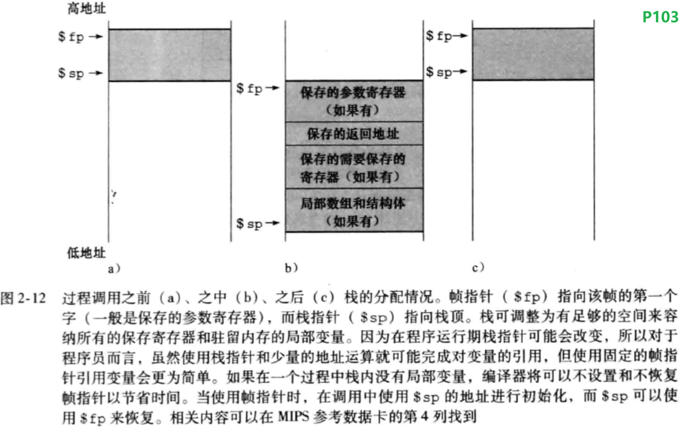
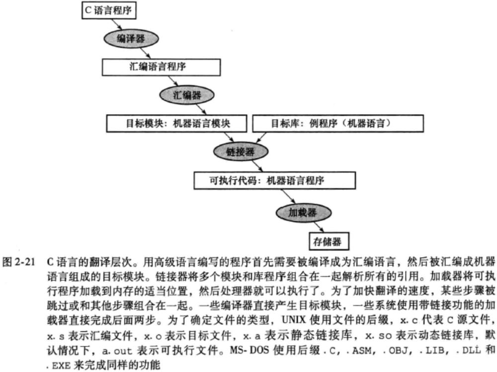

## Leetcode 编程：
> **剑指offer 12.矩阵中的路径**：请设计一个函数，用来判断在一个矩阵中是否存在一条包含某字符串所有字符的路径。路径可以从矩阵中的任意一格开始，每一步可以在矩阵中向左、右、上、下移动一格。如果一条路径经过了矩阵的某一格，那么该路径不能再次进入该格子。例如，在下面的3×4的矩阵中包含一条字符串“bfce”的路径（路径中的字母用加粗标出）。  
[ ["a",　"b",　"c",　"e"],  
  ["s",　"f",　"c",　"s"],  
  ["a",　"d",　"e",　"e"] ]  
但矩阵中不包含字符串“abfb”的路径，因为字符串的第一个字符b占据了矩阵中的第一行第二个格子之后，路径不能再次进入这个格子。  
示例 1：  
　　输入：board = [ ["A","B","C","E"],["S","F","C","S"],["A","D","E","E"] ], word = "ABCCED"  
　　输出：true  
示例 2：  
　　输入：board = [ ["a","b"],["c","d"] ], word = "abcd"  
　　输出：false  
提示：  
1 <= board.length <= 200  
1 <= board[i].length <= 200  
注意：[本题与主站 79 题相同](https://leetcode-cn.com/problems/word-search/)

今天把代码背了一遍，还是想不明白为啥同样是可以过的代码，昨天笔记中的代码段运行只需要20ms，而精选给出的代码段运行需要200~300ms。这之间的差异应该在res上面，抽空闲时间再想一下。

并没有看懂这里的复杂度分析，但是复制如下：
- 复杂度分析：
  M, N分别为矩阵行列大小，K为字符串word长度。
  - 时间复杂度O((3^K) MN)：最差情况下，需要遍历矩阵中长度为K字符串的所有方案，时间复杂度为O(3^K)；矩阵中共有MN个起点，时间复杂度为O(MN)。
    - 方案数计算：设字符串长度为K，搜索中每个字符有上、下、左、右四个方向可以选择，舍弃回头（上个字符）的方向，剩下3种选择，因此方案数的复杂度为O(3^K) 。
  - 空间复杂度O(K)： 搜索过程中的递归深度不超过K，因此系统因函数调用累计使用的栈空间占用O(K)（因为函数返回后，系统调用的栈空间会释放）。最坏情况下K=MN，递归深度为MN，此时系统栈使用 O(MN) 的额外空间。


今天翻看评论区找到了一个很对我胃口的代码段：
```
class Solution {
    //dir 数组定义四个方向, 当前位置的上下左右
    vector<vector<int>> dir = {{0, 1}, {0, -1}, {1, 0}, {-1, 0}};
    //其中 vis 数组用于标识进入过的格子, idx 表示要找的下一个坐标, 也就是 word 的前 idx 个字母已经找到了
    bool dfs(vector<vector<char>>& board, vector<vector<int>>&vis, int i, int j, string& word, int idx){
        //标识 (i, j) 位置被寻找过了
        vis[i][j] = 1;
        if(idx == word.size()) return true;
        idx ++;
        //向四个方向寻找
        for(auto xy : dir){
            int x = i + xy[0], y = j + xy[1];
            //如果不满足条件, 换其他方向寻找
            if(x < 0 || x >= board.size() || y < 0 || y >= board[0].size() || vis[x][y] || board[x][y] != word[idx - 1]) continue;
            else{
                //满足条件, 继续深搜
                if(dfs(board, vis, x, y, word, idx)) return true;
            }
        }
        //回溯
        vis[i][j] = 0;
        return false;
    }
public:
    bool exist(vector<vector<char>>& board, string word) {
        int m = board.size(), n = board[0].size();
        vector<vector<int>>vis(m, vector<int>(n, 0));
        for(int i = 0; i < m; i ++)
            for(int j = 0; j < n; j ++)
                //找寻等于 word[0] 的位置作为搜索的入口
                if(board[i][j] == word[0])
                    if(dfs(board, vis, i, j, word, 1))  
                        return true;

        return false;
    }
};
```
>剑指offer 13.机器人的运动范围：地上有一个m行n列的方格，从坐标 [0,0] 到坐标 [m-1,n-1] 。一个机器人从坐标 [0, 0] 的格子开始移动，它每次可以向左、右、上、下移动一格（不能移动到方格外），也不能进入行坐标和列坐标的数位之和大于k的格子。例如，当k为18时，机器人能够进入方格 [35, 37] ，因为3+5+3+7=18。但它不能进入方格 [35, 38]，因为3+5+3+8=19。请问该机器人能够到达多少个格子？  
示例 1：  
　输入：m = 2, n = 3, k = 1  
　输出：3  
示例 2：  
　输入：m = 3, n = 1, k = 0  
　输出：1  
提示：  
　1 <= n,m <= 100  
　0 <= k <= 20  

这道题是模仿12题写出来的，再参照题解评论把多余的地方简化了下。除了用深度优先遍历，还可以用广度优先遍历，其实就是看成一棵树然后层序遍历。

```
class Solution {
public:
    int movingCount(int m, int n, int k) {
        vector<vector<bool>>vis(m, vector<bool>(n, false));
        return DFS(m, n, vis, 0, 0, k);//从（0，0）出发
    }

    int getNum(int num)
    {
        int sum = 0;
        while(num)
        {
            sum = sum + num % 10;
            num /= 10;
        }
        return sum;
    }

    int DFS(const int m, const int n, vector<vector<bool>> &vis, int i, int j, const int k)
    {
        if(i >= 0 && j >= 0 && i < m && j < n && !vis[i][j] && ((getNum(i) + getNum(j)) <= k))
        { 
            vis[i][j] = 1;
            int moveDown = DFS(m, n, vis, i + 1, j, k);
            int moveRight = DFS(m, n, vis, i, j + 1, k);
            int moveUp = DFS(m, n, vis, i - 1, j, k);
            int moveLeft = DFS(m, n, vis, i, j - 1, k);
            return moveDown + moveRight + moveUp + moveLeft + 1;
            //这里并没有vis[i][j] = 0，不回溯，就是病毒式感染整个数组，感染了多少就是多少。
        }
        else
            return 0;
    }
};
```

> **剑指offer 14-I.剪绳子**：给你一根长度为 n 的绳子，请把绳子剪成整数长度的 m 段（m、n都是整数，n>1并且m>1），每段绳子的长度记为 k[0],k[1]...k[m-1] 。请问 k[0]*k[1]*...*k[m-1] 可能的最大乘积是多少？例如，当绳子的长度是8时，我们把它剪成长度分别为2、3、3的三段，此时得到的最大乘积是18。  
>示例 1：  
>　　输入: 2  
>　　输出: 1  
>　　解释: 2 = 1 + 1, 1 × 1 = 1  
>示例 2:  
>　　输入: 10  
>　　输出: 36  
>　　解释: 10 = 3 + 3 + 4, 3 × 3 × 4 = 36  
>提示：2 <= n <= 58  
>注意：[本题与主站 343 题相同](https://leetcode-cn.com/problems/integer-break/)  

这道题拿到第一瞬间很懵逼，就算是暴力解法发现自己也想不到。然后看了些评论，感觉自己现在的解题习惯不好，没有学会走就开始跑。在没有太多的积累的情况下，应该先从最简单粗暴的方法开始。

大概规划下这道题的解题路线：暴力解法->记忆化搜索->动态规划->优化动态规划->数学解法（没时间就忽略掉数学解法）。

- **暴力解法**：虽然明白暴力解法就是将所有的可能遍历一遍，但是还是不知道应该如何下手，这个遍历究竟是一个循环就完了呢还是要递归呢，循环的话好像没法构造，递归的话也不明白递归式是什么，这个时候就只有学习了。
  
  > 分治思想：分治是将原问题划分成若干个规模较小而结构与原问题相同或相似的子问题，然后分别解决这些子问题，然后合并子问题的解，即可得到原问题的解。分治法的三个步骤：
  > - 分解：将原问题分解为若干和原问题拥有相同或相似结构的子问题。
  > - 解决：递归求解所有子问题。如果存在子问题的规模小到可以直接解决，就直接解决它。
  > - 合并：将子问题的解合并为原问题的解。
  >
  >分治可以用递归的手段实现，也可以用非递归的手段实现。但是递归比较适合实现分治思想。递归中最重要的两个概念是：递归边界和递归式。
  > ——摘自《算法笔记》P111 

  设f(n)为长度为n的绳子可以得到的最大乘积，对于每一个f(n)，可以得到如下分解：
  从上图看出我们可以把F(n)问题分解为F(n-1)的问题，以此类推，直到求解f(2)=1（**递归边界**），然后递归回去，问题就得到了解决，这用到的就是分治的思想。注意到我们每次将一段绳子剪成两段时，剩下的部分可以继续剪，也可以不剪。因此**递归式**就是：
  ```
  f(n) = max(i * (n - i), i * f(n - i)), i = 1,2,...,n-2。
  ```
  - 复杂度分析
    - 时间复杂度：O(2^n)， 即C(1,n)+C(2,n)+...+C(n-1,n)=2^n
    - 空间复杂度：O(2^n)。

```
//代码段
class Solution {
public:
    int cuttingRope(int n) {
        if(n == 2)//递归边界
            return 1;

        int maxValue = 0;

        for(int i = 1; i < n - 1; i++)
            maxValue = max(maxValue, max(i * (n - i), i * cuttingRope(n-i)));//递归式
        
        return maxValue;
    }
};
```

- **记忆化搜索**：上述的暴力解法会超时，这个时候就需要进行优化，注意到超时的主要原因是重复计算了F(n)，为了避免重复计算，我们可以使用记忆化搜索：我们把已经计算过的内容记录下来，于是下次碰到需要计算相同的内容时，就能直接使用上次计算的结果，这可以省去大半无效计算。
    -  复杂度分析
       - 时间复杂度：O(n)， 只要dp[i]计算过的地方都不会再计算。
       - 空间复杂度：O(n)。
```
class Solution {
public:

    vector<int> dp;
    int cuttingRope(int n)
    {
        dp.assign(n+1, 0);
        return F(n);
    }
    int F(int n) {
        if(dp[n]!=0) return dp[n];//递归边界

        for(int i = 1; i < n; i++)
            dp[n] = max(dp[n], max(i * (n - i), i * F(n-i)));//递归式
        
        return dp[n];
    }
};
```

- **背包型动态规划**：
  


---
## 基础知识学习 

### C++基础：C语言变量的存储方式

参考：
[C语言变量的存储类别](http://c.biancheng.net/cpp/html/63.html)

认真找了些文章，在看的过程中，发现我对操作系统的堆和栈太不了解了，即使我做了ucore实验。。。明天再整理。

将程序变量和寄存器对应起来是编译器的工作

使用寄存器编译C赋值语句编译一个操作数在存储器中的C赋值语句

C语言中的一个变量通常对应存储中的一个位置，其解释取决于其类型和存储方式。这方面的例子包括整型和字符型。C语言包括两种存储方式：动态的和静态的。动态变量位于过程中，当过程退出时失效。静态变量在进入和退出过程时始终存在。在所有过程之外声明的C变量，以及声明时使用关键字static的变量都被视作静态的，其余的变量都被视作动态的。为了简化静态数据的访问，MIPS软件保留了另外一个寄存器，称为全局指针：即$gp，它是一个指向静态数据区的保留寄存器。

栈的最后一点复杂性是栈还需要存储过程的局部变量但是这些变量不适合于寄存器，例如局部的数组或结构体，栈中包含过程所保存的寄存器和局部变量的片段称为过程帧或活动记录。



在栈中为新数据分配空间。
某些MIPS软件使用帧指针指向过程帧的第一个字。在过程中栈指针可能会发生改变，因此存储器中对局部变量的引用在过程中的不同位置可能具有不同的偏移量，这使得过程更加难以理解。所以，帧指针在一个过程中为局部存储器引用提供一个固定的基址寄存器，以方便我们对局部变量的引用，我们可以通过这个基址寄存器来获取这些局部变量，而不用通过栈指针来引用。注意，无论是否使用显式的帧指针，活动记录都出现在栈中，我们避免在过程中修改$sp来避免使用$fp。也就是说我们不修改sp，那么对局部变量的引用就可以依赖sp，这样就避免了使用fp。

过程帧：也称作活动记录，栈中包含过程所保存的寄存器以及局部变量的片段。
帧指针：指向给定过程中保存的寄存器和局部变量。帧指针的方便性在于对过程中所有栈内的变量引用都具有相同的偏移

在堆中为新数据分配空间
C语言通过显式的函数调用在堆上分配和释放空间。malloc()在堆上分配空间并返回指向它的指针，free()释放指针指向的堆空间。内存分配由C程序控制，这是很多错误产生的根源。忘记释放空间会导致“内存泄露”，它会逐渐耗尽大量内存以至于操作系统开年崩溃。过早释放空间会导致“悬摆指针”，会造成指针指向程序不想访问的位置。java使用自动的内存分配和无用单元回收机制来防止类似的错误发生。


字符通常被组合为字符数目可变的字符串。表示一个字符串的方式有三种选择：保留字符串的第一个位置用于给出字符串的长度；附加一个带有字符串长度的变量；字符串最后的位置用一个字符来标识其结尾。C语言使用第三种选择，用一个值为0的字节来结束字符串。所以，字符串“Cal”在C中用4字节表示，用十进制表示分别为：67、97、108、0。java采用第一种表示方法。


---

### Linux 高性能服务器编程：Linux网络编程基础API
> 高级IO函数

> 用于创建文件描述符的函数
- pipe函数
- dup函数和dup2函数
  
> 用于读写数据的函数
- readv函数和writev函数
- sendfile函数
- mmap函数和munmap函数
- splice函数
- tee函数

> 用于控制IO行为和属性的函数
- fcntl函数

### Linux 高性能服务器编程：Linux服务器程序规范
> 日志


> 用户信息

> 进程间关系

> 系统资源限制

> 改变工作目录和根目录

> 服务器程序后台化